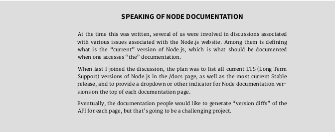
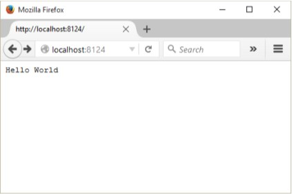
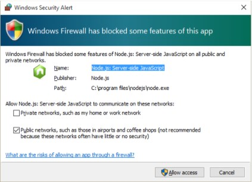
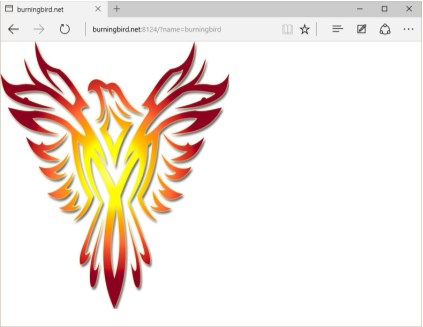
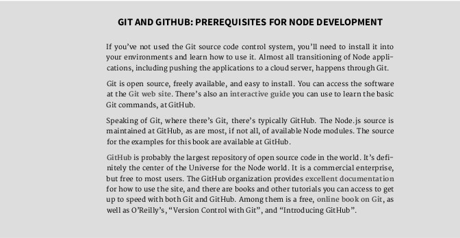

# Preface

Learning Node Second Edition Author Name

Learning Node

by Shelley Powers

Copyright © 2016 Shelly Powers. All rights reserved.

Printed in the United States of America.

Published by O’Reilly Media, Inc. , 1005 Gravenstein Highway North, Sebasto-pol, CA 95472.

O’Reilly books may be purchased for educational, business, or sales promotion-al use. Online editions are also available for most titles ( **http://safaribookson-line.com** ). For more information, contact our corporate/institutional sales de-partment: 800-998-9938 or corporate@oreilly.com .

- Editor: Meg Foley
- Production Editor: FILL IN PRODUCTION EDITOR
- Copyeditor: FILL IN COPYEDITOR
- Proofreader: FILL IN PROOFREADER
- Indexer: FILL IN INDEXER
- Interior Designer: David Futato
- Cover Designer: Karen Montgomery
- Illustrator: Rebecca Demarest
- January -4712: Second Edition

Revision History for the Second Edition

- 2016-03-15: First Early Release

See http://oreilly.com/catalog/errata.csp?isbn=9781491943052 for release details.

The O’Reilly logo is a registered trademark of O’Reilly Media, Inc. Learning Node, the cover image, and related trade dress are trademarks of O’Reilly Me-dia, Inc.

While the publisher and the author(s) have used good faith eforts to ensure that the information and instructions contained in this work are accurate, the publisher and the author(s) disclaim all responsibility for errors or omissions, including without limitation responsibility for damages resulting from the use of or reliance on this work. Use of the information and instructions contained in this work is at your own risk. If any code samples or other technology this work contains or describes is subject to open source licenses or the intellectual prop-erty rights of others, it is your responsibility to ensure that your use thereof complies with such licenses and/or rights.

# Preface

Node.js has been around long enough to have achieved adoption by some ma-jor players (LinkedIn, Yahoo!, and Netflix), but is still young enough to be cause for concern from your typical corporate middle manager. It’s become a driving force for a more sophisticated JavaScript, as well as the only safe place one can then use the newly improved scripting language. And, since turn-about is fair play, the cutting edge JavaScript has now become the driver for a newly re-vamped Node.js organization and release paradigm.

Node.js has also redefined what we do with JavaScript. Nowadays, an em-ployer is just as likely to demand that JavaScript developers work in a server environment, as well as the more familiar browser. In addition, Node.js has cre-ated a new server language that’s generating attention from Ruby, C++, Java, and PHP server-side developers. Especially if these same developers also know JavaScript.

To me, Node.js is fun. Compared to so many other environments, it takes lit-tle efort to get started, to create and host an application, and to try out new things. The scafolding necessary for a Node project just isn’t as complex, or pe-dantic, as what’s required for other environments. Only PHP has as simple an environment, and even it requires tight integration with Apache to create outward-facing applications.

As simple as it is, though, Node.js has its bits that can be hard to discover. Learning Node.js requires obtaining a mastery of its environment and the core APIs, true. But it’s also about finding and mastering these hard-to-discover bits.

## The Learning Node Audience

I see two audiences for this book.

The first audience is the developer who has been creating front-end applica-tions using a variety of libraries and frameworks, who now wants to take their JavaScript skills to the server.

The second audience is the server-side developer who wants to try some-thing new, or needs to make a shif to a newer technology. They’ve worked with

Java or C++, Ruby or PHP, but now they want to take the JavaScript they’ve picked up over time, and their knowledge of the server environment, and merge the two.

Two seemingly separate audiences with one shared knowledge: JavaScript. Or ECMAScript if you want to be more precise. This book does require that you are very comfortable with working with JavaScript. Another commonality is that both audiences need to learn the same Node basics, including the core Node API.

However, each audience brings a diferent perspective, and skills, to the learning experience. To enhance the usefulness, I’ll work to incorporate both perspectives into the material. For instance, a C++ or Java developer might be interested in creating C++ Node add-ons, which might not be interesting to the front-end developer. At the same time, some concepts like *big-endian may be* very familiar to the server-side developer, but unknown to the front-end per-son. I can’t dive too deeply into either viewpoint, but I will work to ensure all readers don’t come away frustrated or bored.

One thing I’m not going to do is force rote memorization on you. We’ll get into the core module APIs, but I’m not going to cover every object and function, because these are documented at the Node web site. What I’ll do instead is touch on important aspects of each core module or specific Node functionality I think is essential in order to, hopefully, give you a baseline so you can hold your own with other Node developers. Of course, practice makes mastery, and this book is a learning tool. Once you’re finished with the book you’ll need to con-tinue on for more in-depth introductions to specific types of functionality, such as working the MEAN (Mongo-Express-Angular-Node) stack. But you’ll have the grounding you need to branch out in any of the many Node directions.




N O D E . J S B E C O M E S N O D E

The formal name is Node.js, but no one uses it. Everyone uses “Node”. End of story. And that’s what we’ll be using, for the most part, from this point on.

## Book Structure

Learning Node is a back-to-basics book. It’s focus is on Node, and the modules that make up Node core. I do lightly touch on some third-party modules, and provide extensive coverage of npm, of course, but the primary goal of this book is to bring you, the reader, up to speed on basic Node functionality. From this solid platform, you can then move in the directions you need to move.

**Chapter 1 includes an introduction to Node, including a brief section on** how to install it. You’ll also get a chance to take Node out for a spin, first by cre-ating the web server listed in the Node documentation, and then by creating a bit more advanced server using the code I provide. In addition, I’ll also touch on creating Node add-ons, for the C/C++ coders among you. And what would an introduction to Node be without an overview of the history of this application, that actually released at version 4.0, rather than version 1.0.

**Chapter 2 covers essential Node functionality including how events are han-**dled, the global objects underlying the necessary functionality to create Node applications, and the asynchronous nature of Node. In addition, I also cover the *bufer* object, which is the data structure transmitted via most network services in Node.

**Chapter 3 dives into the nature of Node’s module system, as well as provid-**ing an in-depth look at npm, a Node third-party module management system. In this chapter, you’ll discover how your application finds the Node modules you’re using, and how you can create a Node module of your own to use. Lastly, I get into the more advanced aspects of Node functionality by exploring the support for sandboxing. Just for fun, I also cover three popular Node third-party modules: Async, Commander, and Underscore.

The interactive console that comes with Node, and which goes by the name of REPL, is an invaluable learning tool and environment, and it gets its own chapter in **Chapter 4** . I cover how to use the tool, in detail, as well as how to create your own custom REPL.

We explore developing Node applications for the web in **Chapter 5** , includ-ing taking a much closer look at the Node modules that support web develop-ment. You’ll get a chance to see what it takes to create a fully functional static web server, as well as learning how you can run a Node application alongside Apache, via the use of an Apache proxy.

Node works in a variety of environments, including both Windows and Unix-based systems such as the Mac OS X, and Linux. It does so by providing a set of functionality that normalizes system diferences, and this functionality is ex-plored in **Chapter 6** . In addition, I also cover the fundamental nature of Node streams and pipes—essential elements of all input/output—as well as exploring Node’s file system support.

**Chapter 7 is all about networks, and you can’t touch on networking without** also touching on security. The two should go hand-in-hand, like peanut butter and jelly, or chocolate with anything. I’ll introduce you to Node’s TCP and UDP support, as well as cover how to implement an HTTPS server, in addition to the HTTP server you learned how to create in Chapter 5. I’ll also cover the mechan-ics behind digital certificates and the fundamentals of SSL (Secure Sockets Lay-er), and its upgrade, TLS (Transport Layer Security). Lastly, we’ll look at the Node crypto module, or storing encrypted data.

One of my favorite aspects of Node is its ability to work with operating sys-tem functionality via *child processes* . Some of my favorite Node applications are small utility programs for working with compressed files, the popular graphics application, ImageMagick, and creating a screenshot application for grabbing screenshots from web sites. They’re not big-time applications with sophistica-ted cloud interfaces, but they are a fun way to learn to work with child process-es. Child processes are covered in **Chapter 8** .

Most of the examples in the book are using the same JavaScript you’ve been using for years. However, one of the main impetuses behind the io.js split, and the new, merged release schedule, is support for the newer ECMAScript ver-sions, such as ES 6 (or ECMAScript 2015, if you prefer). In **Chapter 9** , I’ll cover what’s currently supported in Node, the impact of the new functionality, and when to use new functionality over old, and why. I’ll also cover the gotchas re-lated to using the newer JavaScript capabilities. One specific ES 6 functionality we’ll look at is the concept of *promises* , for asynchronous development.

**Chapter 10 takes a look at the frameworks and functionality that make up** what is known as *full stack Node development* . We’ll take a look at Express, a now ubiquitous component of most Node development, as well as trying out both MongoDB and Redis. We’ll also explore a couple of the frameworks that make up the “full stack” in full stack Node Development: AngularJS and Back-bone.js.

Once you’ve coded your Node application, you’ll want to push it to produc-tion. **Chapter 11 covers tools and techniques for Node development and pro-**duction support, including unit, load, and benchmark testing, as well as essen-tial debugging skills and tools. You’ll also learn how to run your Node applica-tion forever, and restore it if it fails.

**Chapter 12 is dessert. In this chapter, I’ll introduce you to the ways of taking** your mad Node skills to all new worlds, including Node in microcontrollers/ microcomputers, as a part of the Internet-of-Things, and a version of Node that does not run on V8.

The Node Environment 1 Forget what you’ve heard about Node being a server-side tool only. Node is pri-marily used in server applications, true. But Node can be installed on almost any machine and used for any purpose, including running applications on your PC or even your tablet, smartphone, or microcomputer.

I have Node installed on my Linux-based server, but I also have it installed on my Windows 10-based PCs, as well as a microcomputer (Raspberry Pi). I have an extra Android tablet that I’m thinking of trying Node on, can use Node to program my Adruino Uno microcontroller, and am currently playing around with incorporating Node into my smart home setup thanks to IFTTT’s Maker Channel. On my PC, I use Node as a test environment for JavaScript, as well as an interface to ImageMagick for batch photo editing. Node is my go-to tool for any batch operation on my PCs or my server.

And yes, I use Node for server-side processing when I want a web interface that bypasses my Apache server, or provides a back-end server process for a web application.

The point is, the Node environment is rich in functionality and reach. To start exploring this environment, we have to start at the beginning: installing Node.

I F T T T

IFTTT is a marvelous site that allows you to connect triggers and actions from a host of companies, services, and products using simple if-then logic. Each end point of the equation is a channel, including the afore-mentioned **Maker Channel** .

## Installing Node

The best place to start when installing Node is the **Node.js Downloads page** . From here, you can download binaries (pre-compiled executables) for Win-dows, Mac OS, SunOS, Linux, and ARM architectures. The page also provides ac-cess to installers for a specific architecture that can greatly simplify the installation process—particularly with Windows. If your environment is set up for build-ing, download the source code and build Node, directly. That’s my preference for my Ubuntu server.

You can also install Node using a package installer for your architecture. This is a helpful option not only for installing Node, but also keeping it up to date (as we’ll discuss further, in the section on Upgrading Node).

If you decide to compile Node directly on your machine, you’ll need to set up the proper build environment, and install the proper build tools. For instance, on Ubuntu (Linux), you’ll need to run the following command to install the tools needed for Node:

```bash
apt-get install make g++ libssl-dev git
```

There are some diferences in behavior when first installing Node in the vari-ous architectures. For instance, when installing Node in Windows, the installer not only installs Node, it also creates a Command window you’ll use to access Node on your machine. Node is a command-line application, and doesn’t have a graphical UI like the typical Windows application. If you want to use Node to program an Arduino Uno, you’ll install Node and **Johnny-Five** , and use both to program the connected device.

A C C E P T D E F A U L T S I N W I N D O W S W O R L D

You’ll want to accept the default location and feature installation when installing Node in Windows. The installer adds Node to the PATH vari-able, which means you can type “node” without having to provide the entire Node installation path.

If you’re installing Node on Raspberry Pi, download the appropriate ARM version, such as ARMv6 for the original Raspberry Pi, and ARMv7 for the newer Raspberry Pi 2. Once downloaded, extract the binary from the compressed tar-ball, and then move the application to /usr/local:

wget https://nodejs.org/dist/v4.0.0/node-v4.0.0-linux-armv7l.tar.gz tar -xvf node-v4.0.0-linux-armv7l.tar.gz

```bash
cd node-v4.0.0-linux-armv7l

sudo cp -R * /usr/local/
```

You can also set up a build environment and build Node directly. N E W N O D E E N V I R O N M E N T S

Speaking of Node with Arduino and Raspberry Pi, I cover Node in non-traditional environments, such as the Internet of Things, in Chapter 12.

## Saying Hello to the World with Node

You’ve just installed Node and you naturally want to take it for a spin. There is a tradition among programmers that the first application in a language is the well-known “Hello, World” application. The application typically writes out the words “Hello, World” to whatever is the output stream, demonstrating how an application is created, run, and can process input and output.

The same holds for Node: it is the application that the Node.js includes in the Synopsis in the application’s documentation. And it is the first application we’ll create in this book, but with a few tweaks.

### A Basic Hello World Application

First, let’s take a look at the “Hello, World” application included in the Node documentation. To re-create the application, create a text document with the following JavaScript, using your favorite text editing tool. I use Nodepad++ in Windows, and Vim in Linux.

```jsx
var http = require('http');

http.createServer(function (request, response) {
    response.writeHead(200, { 'Content-Type': 'text/plain' }); response.end('Hello World\n');
}).listen(8124);

console.log('Server running at http://127.0.0.1:8124/');
```

Save the file as hello.js. To run the application, open a terminal if you’re using Mac OS or Linux, or the Node Command window with Windows. Change to the directory where your saved file is located and type the following to run the application:

```bash
node hello.js
```

The result is printed out to the command line, via the console.log() function call in the application:

Server running at http://127.0.0.1:8124/

Now open a browser and type either http://localhost:8124/ or http://127.0.0.1:8124 into the address bar (or your domain, if you’re host-ing Node on your server). What appears is a simple unadorned web page with “Hello World” in text at the top, as shown in Figure 1-1.



FIGURE 1-1

Figure 1-1: Your first Node application

If you’re running your application in Windows, you’ll most likely receive a Windows Firewall alert, as shown in Figure 1-2. Uncheck the Public Network op-tion, check the Private network option, and then click the button to Allow ac-cess.



FIGURE 1-2

Figure 1-2: Allowing access to Node application in Windows

figure1-2.png

You won’t have to repeat this process in Windows: the system remembers your choice.

To end the program, you can either close the terminal/Command window ( just terminal from this point), or type CTRL-C. When you ran the application, you did so in the foreground. This means you can’t type any other command in the terminal. It also means when you closed the terminal, you stopped the Node process.

R U N N I N G N O D E F O R E V E R

For now, running Node in the foreground is a good thing. You’re learning how to use the tool, you don’t yet want your applications to be externally available to everyone, and you want it to terminate when you’re finished for the day. In Chapter 11, I’ll cover how you can create a more robust Node runtime environment.

To return to the Hello World code, the JavaScript creates a web server that displays a web page with the words, “Hello World” when accessed via a brows-er. It demonstrates several key components of a Node application.

First, it includes the module necessary to run a simple HTTP server: the appropriately named HTTP module. External functionality for Node is incorporated via modules that export specific types of functionality that can then be used in an application (or another module). They’re very similar to the libraries you’ve used in other languages.

var http = require('http');

N O D E M O D U L E S , C O R E M O D U L E S , A N D T H E H T T P M O D U L E

The HTTP module is one of Node’s core modules, all of which are the primary focus of this book. I’ll cover Node modules and module manage-ment thoroughly in Chapter 3, and the HTTP module in Chapter 5.

The module is imported using the Node require statement, and the result assigned to a local variable. Once imported, the local variable can be used to instantiate the web server, via the http.createServer() function. In the function parameters, we see one of the fundamental constructs of Node: the *callback* (bold text in the code). It’s the anonymous function that’s passing the web request and response into the code to process the web request and pro-vide a response.

```jsx
http.createServer(function (request, response) {

    response.writeHead(200, { 'Content-Type': 'text/plain' }); response.end('Hello World\n');

}).listen(8124);
```

Since JavaScript is single-threaded, the way Node emulates an asynchro-nous environment in a single-threaded environment is via an *event loop* , with associated *callback* functions that are called once a specific event has been triggered. In the example, when a web request is received, the callback function is called.

The console.log() message is output to the terminal as soon as the call to create the server is made. The program doesn’t stop and block, waiting for a web request to be made.

console.log('Server running at http://127.0.0.1:8124/');

M O R E O N T H E E V E N T L O O P A N D C A L L B A C K F U N C T I O N

I’ll be covering the Node event loop, its support for asynchronous pro-gramming, and the callback function in more detail in Chapter 2.

Once the server is created and has received a request, the callback function writes a plain text header with server status of 200 back to the browser, writes out the Hello World message, and then ends the response.

Saying Hello to the World with Node

Congratulations, you’ve created your first web server in Node in just few lines of code. Of course, it’s not particularly useful, unless your only interest is in greeting the world. Throughout the book you’ll learn how to make more use-ful Node applications, but before we leave Hello World, let’s make some modifi-cations to the basic application to make it a little more interesting. **Hello World, Tweaked**

Just printing out a static message does demonstrate that the application is, first of all, working and, second, how to create a simple web server. The basic example also demonstrated several key elements of a Node application. But it could be just a little richer, a little more fun to play with. So I tweaked it to pro-vide you a second application you can try out that has a few more moving parts.

The tweaked code is in Example 1-1. In it, I modified the basic application to parse the incoming request to look for a query string. The name in the string is extracted and used to determine the type of content returned. Almost any name will return a personalized response, but if you use name=burningbird as the query, you’ll get an image. If no query string is used, or no name passed, the name variable is set to “world”.

EXAMPLE 1-1. Hello World, Tweaked

```jsx
var http = require('http');

var fs = require('fs');

http.createServer(function (req, res) {
    var name = require('url').parse(req.url, true).query.name; if (name === undefined) name = 'world';
    if (name == 'burningbird') {
        var file = 'phoenix5a.png';
        fs.stat(file, function (err, stat) {
            if (err) {
                console.error(err);
                res.writeHead(200, { 'Content-Type': 'text/plain' });
                res.end("Sorry, Burningbird isn't around right now \n");
            } else {
                var img = fs.readFileSync(file);
                res.contentType = 'image/png';
                res.contentLength = stat.size;
                res.end(img, 'binary');
            }

        });

    } else {
        res.writeHead(200, { 'Content-Type': 'text/plain' });
        res.end('Hello ' + name + '\n');
    }

}).listen(8124);

console.log('Server running at port 8124/');
```

The result of accessing the web-based application with a query string of ? name=burningbird is shown in Figure 1-3.



FIGURE 1-3

Hello, Burningbird

Not much extra code, but there are several differences between the basic Hello World application and the tweaked version. From the top, a new module is included in the application, named fs . This is the File System module, one you will become very familiar with in the next several chapters. But there’s also another module imported, but not in the same way as the other two:

var name = require('url').parse(req.url, true).query.name; Exported module properties can be chained, so we can both import the

module and use its functions in the same line. This frequently happens with the URL module, whose only purpose is to provide a URL utility.

Saying Hello to the World with Node

The response and request parameter variable names are shortened to res and req make them easier to access. Once we parse out the request to get the name value, we first test to see if it’s undefined . If not, the value is set to the fallback result, world . If name does exist, it’s tested again to see if it’s equal to burningbird . If it isn’t, then the response is close to what we had in the basic application, except inserting the supplied name into the return message.

If the name is burningbird , though, we’re dealing with an image rather than text. The fs.stat() method not only verifies that the file exists, but also returns an object with information about the file, including its size. This value is used in creating the content header.

If the file doesn’t exist, the application handles the situation gracefully: it is-sues a friendly message that the bird has flown the coop, but also provides er-ror information at the console, using the console.error() method this time:

{ [Error: ENOENT: no such file or directory, stat 'phoenix5a.png'] errno: -2,

code: 'ENOENT',

syscall: 'stat',

path: 'phoenix5a.png' }

If the file does exist, then we’ll read the image into a variable and return it in the response, adjusting the header values accordingly.

The fs.stats() method uses the standard Node callback function pattern with the error value as the first parameter—frequently called an *errback* . How-ever, the part about reading the image may have you scratching your head. It doesn’t look right, not like other Node functions you’ve seen in this chap-ter (and most likely in other online examples). What’s diferent is that I’m using a synchronous function, readFileSync() , rather than the asynchronous ver-sion, readFile() .

Node does support both synchronous and asynchronous versions of most File System functions. Normally, using a synchronous operation in a web re-quest in Node is taboo, but the capability is there. An asynchronous version of the same bit of code is the following:

fs.readFile(file, function(err,data) {

res.contentType = 'image/png';

res.contentLength = stat.size;

res.end(data, 'binary');

});

Why use one over the other? In some circumstances, file I/O may not impact on performance regardless of which type of function you use, and the synchro-nous version can be cleaner and easier to use. It can also lead to less nested code—a particular problem with Node’s callback system, and one in which I’ll cover in more detail in Chapter 2.

Additionally, though I don’t use exception handling in the example, you can use try...catch with synchronous functions. You can’t use this more tradi-tional error handling with asynchronous functions (hence the error value as the first parameter to the anonymous callback function).

The important fact to take away from this second example, though, is that not all Node I/O is asynchronous.

F I L E S Y S T E M A N D U R L M O D U L E S , B U F F E R S , A N D

A Y N C H R O N O U S I / O

I’ll cover URL in more detail in Chapter 5, and File System is explored in Chapter 6. Note, though, that File System is used all throughout the book. Buffers and asynchronous processing are covered in Chapter 2.

## Node Command-Line Options

In the last two sections, Node is invoked at the command line without the use of any command-line options. I wanted to briefly introduce some of these op-tions before we move on. Others will be introduced when needed throughout the book.

To discover all the available options and arguments, use the help option, written as either -h or --help :

$ node --help

This option will list out all of the options and provides the syntax to follow when running the Node application:

Usage: node [options] [ -e script | script.js ] [arguments] node debug script.js [arguments]

To find the version of Node, use the following command:

$ node -v or --version

To check the syntax of a Node application, use the -c option. This checks the syntax without running the application:

$ node -c or --check script.js

To discover the V8 options, type the following:

Saying Hello to the World with Node

$ node --v8-options

This returns several diferent options, including the --harmony option, used to enable all completed Harmony JavaScript features. This includes all ES6 functionality that’s been implemented but not yet staged into either the LTS or Stable release.

A favorite Node option of mine is -p or --print , which can evaluate a line of Node script and print the results. This is especially helpful if you’re checking out the Process environmental properties, discussed more fully in Chapter 2. An ex-ample is the following, which prints out all of the values for the process.env property:

$ node -p "process.env"

Node Hosting Environments

As you learn Node, you’ll want to become familiar with it in your own local envi-ronment, be it Windows, Mac OS, or Linux. When you’re ready to start providing greater access to your applications, you’ll either need to find an environment where you can run a Node application, such as a virtual private network (VPN), which is what I use, or a host that specifically provides for Node application support. The former requires that you have significant experience running a internet-faced server, while the latter may limit what you can or cannot do with your Node application.

## Hosting Node on Your Server, VPS, or Managed Host

Hosting Node on the same server you have your WordPress weblog is likely go-ing to be a dead end, because of Node’s requirements. You don’t *have* to have root or administrative access to run Node, but you should. In addition, many hosting companies are not going to be happy with you hosting an application on various ports that may or may not play havoc with their systems.

Hosting Node on a virtual private server (VPS), like my VPN at Linode, is a simple matter. You do have root access for your VPS and can pretty much do whatever you want, as long as you don’t endanger other users who may be on the same machine. Most companies that provide VPSs ensure that each individ-ual account is isolated from the others, and that no one account can hog all the available resources either.

The issue, though, with a VPS is the same issue you’d have if you hosted your own server: you have to maintain the server. This includes setting up an email system, and alternative web server, most likely Apache or **Nginx** , handle fire-walls and other security, email, etc. It’s not trivial.

Still, if you’re comfortable with managing all aspects of a internet-faced en-vironment, a VPS can be an afordable option for hosting a Node application. At least until you’re ready to push it into production, in which case you may want to look at hosting the application in the *cloud* .

## Cloud Hosting

Nowadays, an application is just as likely to reside in a cloud server rather than an individual or group’s own computers. Node applications are well-suited to cloud-based implementations.

When you host a Node application in the cloud, what you’re really doing, typically, is creating the application on your own server or PC, testing it, making sure it’s what you want, and then pushing the application out to the cloud serv-er. A cloud server for Node allows you to create the Node application you want to create, using the resources of whatever database system or other system you wish, but without having to manage the server, directly. You can focus specifi-cally on the Node application without having to worry about FTP or email servers, or general server maintenance.



The Node LTS and Upgrading Node

The paradigm for hosting a Node application in the cloud is fairly similar across all of the hosts. First, create the Node application, either locally or on your own server. When you’re ready to start testing a deployment environment, then it’s time to look for a cloud server. For most I’m familiar with, you sign up for an account, create a new project, and specify that is Node-based, if the cloud is capable of hosting many environments. You may or may not need to specify which other resources are needed, such as database access.

Once ready to deploy, you’ll push the application to the cloud. You’ll either use Git to push the application, or you may need to use a toolset provided by the cloud provider. As an example, Microsof’s Azure cloud utilizes Git to push the application from your local environment to the cloud, while Google’s Cloud Platform provides a toolset to perform the same process.

F I N D I N G A H O S T

Though not completely up to date, a good place to start looking for a Node host is a **GitHub page devoted to the topic** .

## The Node LTS and Upgrading Node

In 2014, the Node world was stunned (or at least some of us were taken by sur-prise) when a group of Node maintainers split from the rest and formed their own fork of Node.js called io.js. The reason for the split is that the io.js folks felt that Joyent, the company that had been maintaining Node, wasn’t moving fast enough to open governance of Node. The group also felt that Joyent was be-hind in its support of the latest V8 engine updates.

Thankfully the two groups resolved the issues leading to the split, merging their eforts back to one product, still named Node.js. Node is now managed through a governing non-profit, the Node Foundation, managed under the aus-pices of the Linux Foundation. As a result, the codebase for both groups was combined, and rather than the first oficial release of Node being Node 1.0, it became Node 4.0: representing Node’s original slow pace to Node 1.0, and io.js’s faster 3.0 version.

## Node’s New Semantic Versioning

One result of the merge is a strict timeline of Node releases, based on **semantic versioning** (Semver), familiar to Linux users. Semver releases feature three groups of numbers, each with a specific meaning. For instance, as I’m writing this, I’m currently using Node.js version 4.3.2 on my server. This translates to:

- The major release is 4. This number will only increase when a major, backwardly incompatible change is made to Node.
- The minor release is 3. This number increases when new functionality is added, but the functionality is still backwards compatible.
- The patch release is 2. This number changes when security or other bug fixes require a new release of the application. It is also backwards com-patible.

I’m using the Stable release of 5.7.1 on my Windows machine.

The Node Foundation also supports a much more cohesive, albeit some-what problematic, release cycle than the hit-or-miss releases we had become familiar with. It started with the first LTS (long-term support) release of Node.js v4, which will be supported until April of 2018. The Node Foundation then re-leased its first Stable release, Node.js v5, the end of October. Node 5.x.x will on-ly be supported until April of 2016, when it will be replaced by Node.js v6. The strategy is for a new Stable release every six months, but only every other one goes LTS, like Node v4.

Afer April 2018, Node v4 enters maintenance mode. In the meantime, there will be new backwards compatible updates (known as *semver-major bumps* ), as well as bug and security patches.

W H A T V E R S I O N I S T H E B O O K C O V E R I N G ?

The book is covering the long-term stable release of Node.js v4, with an-notation marking differences between it an Node.js v5, wherever appro-priate. When Node.js v6 releases, we’ll annotate the book with relevant updates, if possible.

Regardless of which LTS major release you decide to use, you’ll need to up-grade to each new bug/security fix, as soon as it releases. However, how you handle each new semver-major bump is up to you and/or your organization. The upgrade should be backwards compatible, though, with only underlying engine improvements impacted. Still, you’ll want to incorporate any new re-lease into an upgrade and testing plan.

Which version should you use? In a business or corporate environment, you’ll most likely want to stick with the LTS release, which is, at this time, Node.js v4. However, if your environment can more quickly adapt to breaking changes, you can get access to the latest V8 and other goodies with the latest Node Stable release.

T H E J O Y S O F T E S T I N G A N D P R O D U C T I O N

I cover Node debugging and testing, as well as other development pro-cess and production procedures in Chapter 11.

The Node LTS and Upgrading Node

## Upgrading Node

With the increased schedule of releases, keeping Node up-to-date is even more critical. Thankfully, the upgrade process is painless, and you have alternatives.

You can check your version with the following:

node -v

If you’re using a package installer, then running the package update proce-dure updates Node, as well as any other sofware on your server ( sudo is not required in Windows):

sudo apt-get update

sudo apt-get upgrade --show-upgraded

Do note that if you are using a package installer, follow the instructions asso-ciated with it that are provided at the Node web site. Otherwise, you’ll end up out-of-sync with releases.

You can also use npm to upgrade Node, using the following sequence of commands:

sudo npm cache clean -f

sudo npm install -g

sudo n stable

To install the latest version of Node on Windows, Mac OS, or your Raspberry Pi, grab the installer from the Node.js downloads, and run it. It installs the new version over the old.

N O D E V E R S I O N M A N A G E R

In a Linux or OSX environment, you can also use a tool, the **Node Version Manager (nvm)** , to keep Node up to date.

The **Node package manager** (npm) updates more frequently than Node. To upgrade just it, run the following command:

sudo npm install npm -g n

This command installs the latest version of the necessary application. You can check the version using:

npm -v