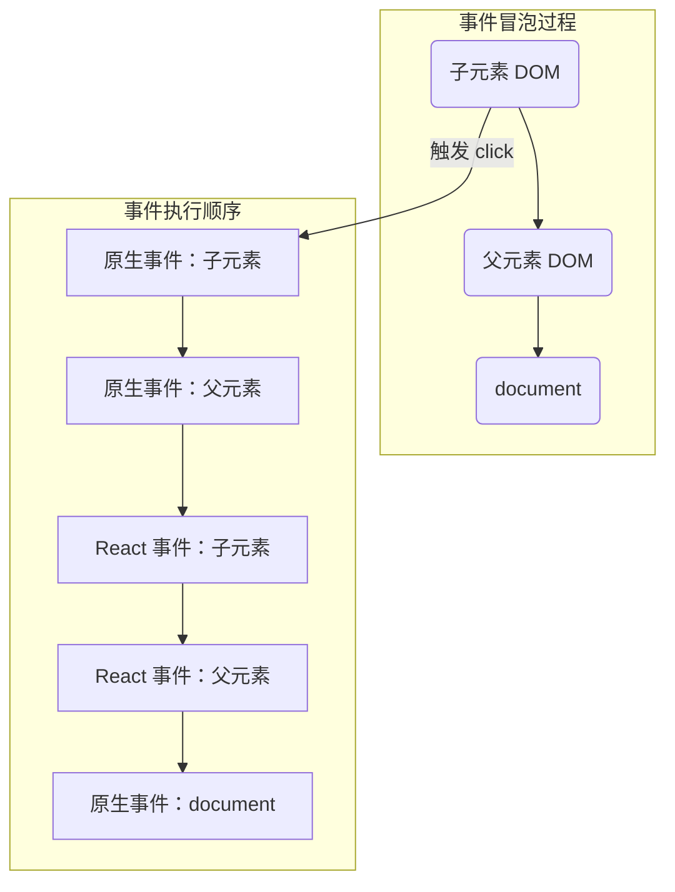

# React 事件机制

`React`基于浏览器的事件机制自身实现了一套事件机制，包括事件注册、事件的合成、事件冒泡、事件派发等。在`React`中这套事件机制被称之为合成事件。

## 合成事件（SyntheticEvent）

合成事件是 `React`模拟原生 `DOM`事件所有能力的一个事件对象，即浏览器原生事件的跨浏览器包装器。它根据 `W3C`规范来定义合成事件，兼容所有浏览器，拥有与浏览器原生事件相同的接口。

组件注册的事件最终会绑定在`document`这个 `DOM`上，而不是 `React`组件对应的 `DOM`，从而节省内存开销。

```jsx
const button = <button onClick={handleClick}>按钮</button>
```

如果想要获得原生`DOM`事件，可以通过`e.nativeEvent`属性获取。

```jsx
const handleClick = (e) => console.log(e.nativeEvent);
const button = <button onClick={handleClick}>按钮</button>
```

`React`事件和原生事件的区别：

-   **事件名称命名方式不同**: 原生是 `onclick`，React 是 `onClick`。
-   **事件处理函数书写不同**: 原生是字符串，React 是函数。

虽然`onclick`看似绑定到`DOM`元素上，但实际并不会把事件代理函数直接绑定到真实的节点上，而是把所有的事件绑定到结构的最外层，使用一个统一的事件去监听。当事件发生时，首先被这个统一的事件监听器处理，然后在映射里找到真正的事件处理函数并调用。这样做简化了事件处理和回收机制，效率也有很大提升。

## 事件绑定

在`react`应用中，事件名都是用小驼峰格式进行书写，例如`onclick`要改写成`onClick`。

最简单的事件绑定如下：

```jsx
class ShowAlert extends React.Component {
  showAlert() {
    console.log("Hi");
  }

  render() {
    return <button onClick={this.showAlert}>show</button>;
  }
}
```

但是，当处理函数中使用了 `this` 时，例如 `console.log(this)`，点击按钮会发现控制台输出`undefined`。这是因为类的方法默认不会绑定 `this`。

为了解决`this`的指向问题，有以下几种常见的绑定方式：

-   render方法中使用bind
-   render方法中使用箭头函数
-   constructor中bind
-   定义阶段使用箭头函数绑定

### render方法中使用bind

在事件函数后使用`.bind(this)`将`this`绑定到当前组件中。

```jsx
class App extends React.Component {
  handleClick() {
    console.log('this > ', this);
  }
  render() {
    return (
      <div onClick={this.handleClick.bind(this)}>test</div>
    )
  }
}
```

这种方式在组件每次`render`渲染的时候，都会重新进行`bind`的操作，影响性能。

### render方法中使用箭头函数

通过`ES6`的箭头函数来将`this`的指向绑定给当前组件。同样在每一次`render`的时候都会生成新的方法，影响性能。

```jsx
class App extends React.Component {
  handleClick() {
    console.log('this > ', this);
  }
  render() {
    return (
      <div onClick={e => this.handleClick(e)}>test</div>
    )
  }
}
```

### constructor中bind

在`constructor`中预先`bind`当前组件，可以避免在`render`操作中重复绑定，是官方推荐的方式之一。

```jsx
class App extends React.Component {
  constructor(props) {
    super(props);
    this.handleClick = this.handleClick.bind(this);
  }
  handleClick() {
    console.log('this > ', this);
  }
  render() {
    return (
      <div onClick={this.handleClick}>test</div>
    )
  }
}
```

### 定义阶段使用箭头函数绑定

这是目前最常用和推荐的方式，能够避免在`render`操作中重复绑定，实现也非常的简单。

```jsx
class App extends React.Component {
  constructor(props) {
    super(props);
  }
  handleClick = () => {
    console.log('this > ', this);
  }
  render() {
    return (
      <div onClick={this.handleClick}>test</div>
    )
  }
}
```

### 区别总结

-   **编写方面**：`render`中使用`bind`和箭头函数写法简单，但在`constructor`中`bind`的编写过于冗杂。
-   **性能方面**：`render`中的两种方式在每次组件`render`的时候都会生成新的方法实例，性能较差。若该函数作为属性值传给子组件，会导致子组件额外的渲染。而`constructor`中`bind`和定义阶段使用箭头函数都只会生成一个方法实例。

综合来看，**定义阶段使用箭头函数绑定**是目前最优的事件绑定方式。

## 执行顺序

`React`自身实现了一套事件冒泡机制。关于`React`合成事件与原生事件执行顺序，可以看看下面一个例子：

```jsx
import  React  from 'react';
class App extends React.Component{

  constructor(props) {
    super(props);
    this.parentRef = React.createRef();
    this.childRef = React.createRef();
  }
  componentDidMount() {
    console.log("React componentDidMount！");
    this.parentRef.current?.addEventListener("click", () => {
      console.log("原生事件：父元素 DOM 事件监听！");
    });
    this.childRef.current?.addEventListener("click", () => {
      console.log("原生事件：子元素 DOM 事件监听！");
    });
    document.addEventListener("click", (e) => {
      console.log("原生事件：document DOM 事件监听！");
    });
  }
  parentClickFun = () => {
    console.log("React 事件：父元素事件监听！");
  };
  childClickFun = () => {
    console.log("React 事件：子元素事件监听！");
  };
  render() {
    return (
      <div ref={this.parentRef} onClick={this.parentClickFun}>
        <div ref={this.childRef} onClick={this.childClickFun}>
          分析事件执行顺序
        </div>
      </div>
    );
  }
}
export default App;
```

输出顺序为：

```text
原生事件：子元素 DOM 事件监听！
原生事件：父元素 DOM 事件监听！
React 事件：子元素事件监听！
React 事件：父元素事件监听！
原生事件：document DOM 事件监听！
```

可以得出以下结论：

-   React 所有事件都挂载在 document 对象上（React 17 之后挂载在 root 节点上）。
-   当真实 DOM 元素触发事件，会冒泡到 document 对象后，再处理 React 事件。
-   所以会先执行原生事件，然后处理 React 事件。
-   最后真正执行 document 上挂载的事件。

对应过程如图所示：



所以想要阻止不同时间段的冒泡行为，对应使用不同的方法：

-   阻止合成事件间的冒泡，用`e.stopPropagation()`
-   阻止合成事件与最外层 document 上的事件间的冒泡，用`e.nativeEvent.stopImmediatePropagation()`
-   阻止合成事件与除最外层document上的原生事件上的冒泡，通过判断`e.target`来避免。

```jsx
document.body.addEventListener('click', e => {
  if (e.target && e.target.matches('div.code')) {
    return;
  }
  this.setState({ active: false });
})
```

### 参考文献

- [React事件绑定的几种方式对比](https://segmentfault.com/a/1190000011317515)
- [web前端面试 - 面试官系列](https://vue3js.cn/interview/)
- [合成事件 – React](https://zh-hans.reactjs.org/docs/events.html)
- [React讲解 - 事件系统](https://segmentfault.com/a/1190000015725214?utm_source=sf-similar-article)
- [探索 React 合成事件](https://segmentfault.com/a/1190000038251163)
