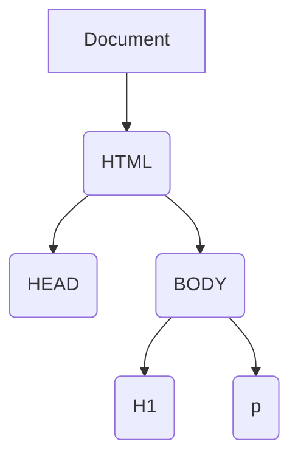
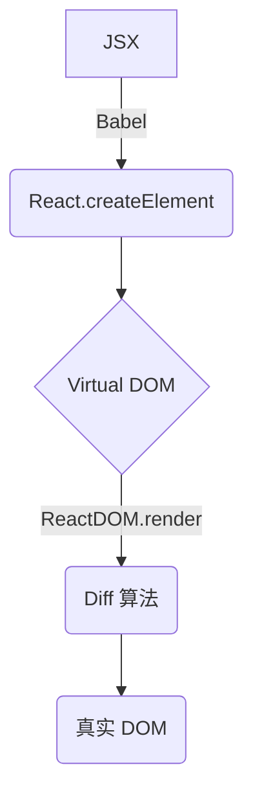
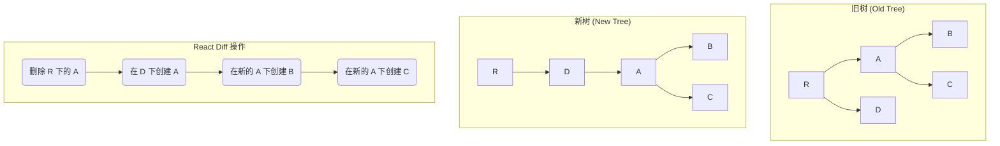
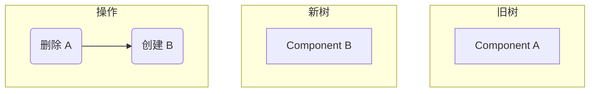
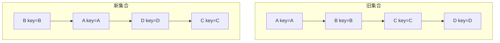
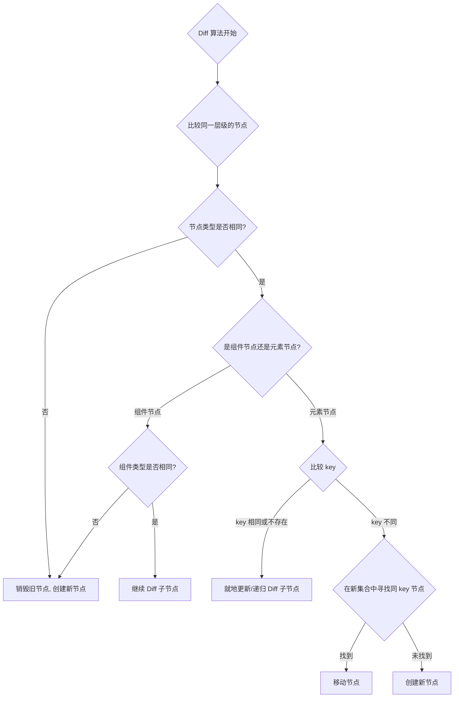

# Virtual Dom

## Real DOM vs Virtual DOM

### 一、是什么

Real DOM，真实 `DOM`，意思为文档对象模型，是一个结构化文本的抽象，在页面渲染出的每一个结点都是一个真实 `DOM` 结构。



`Virtual Dom`，本质上是以 `JavaScript` 对象形式存在的对 `DOM` 的描述。

创建虚拟 `DOM` 目的就是为了更好将虚拟的节点渲染到页面视图中，虚拟 `DOM` 对象的节点与真实 `DOM` 的属性一一照应。

在 `React` 中，`JSX` 是其一大特性，可以让你在 `JS` 中通过使用 `XML` 的方式去直接声明界面的 `DOM` 结构。

```jsx
// 创建 h1 标签，右边千万不能加引号
const vDom = <h1>Hello World</h1>;
// 找到 <div id="root"></div> 节点
const root = document.getElementById("root");
// 把创建的 h1 标签渲染到 root 节点上
ReactDOM.render(vDom, root);
```

`JSX` 实际是一种语法糖，在使用过程中会被 `babel` 进行编译转化成 `JS` 代码，上述 `VDOM` 转化为如下：

```jsx
const vDom = React.createElement(
  'h1',
  { className: 'hClass', id: 'hId' },
  'hello world'
)
```

`React.createElement()` 的返回值是一个对象，也就是虚拟 `DOM`。打印出来如下：

```json
{
  "type": "h1",
  "key": null,
  "ref": null,
  "props": {
    "className": "hClass",
    "id": "hId",
    "children": "hello world"
  },
  "_owner": null,
  "_store": {}
}
```

### 二、区别

两者的区别如下：

-   虚拟 DOM 不会进行排版与重绘操作，而真实 DOM 会频繁重排与重绘。
-   虚拟 DOM 的总损耗是“虚拟 DOM 增删改+真实 DOM 差异增删改+排版与重绘”，真实 DOM 的总损耗是“真实 DOM 完全增删改+排版与重绘”。

传统的原生 `api` 或 `jQuery` 去操作 `DOM` 时，浏览器会从构建 `DOM` 树开始从头到尾执行一遍流程。当你在一次操作时，需要更新 10 个 `DOM` 节点，浏览器会马上执行流程，最终执行 10 次流程。

而通过 `VNode`，同样更新 10 个 `DOM` 节点，虚拟 `DOM` 不会立即操作 `DOM`，而是将这 10 次更新的 `diff` 内容保存到本地的一个 `js` 对象中，最终将这个 `js` 对象一次性 `attach` 到 `DOM` 树上，避免大量的无谓计算。

### 三、优缺点

**真实 `DOM` 的优势：**

-   易用

**缺点：**

-   效率低，解析速度慢，内存占用量过高
-   性能差：频繁操作真实 DOM，易于导致重绘与回流

**使用虚拟 `DOM` 的优势如下：**

-   简单方便：如果使用手动操作真实 `DOM` 来完成页面，繁琐又容易出错，在大规模应用下维护起来也很困难
-   性能方面：使用 Virtual DOM，能够有效避免真实 DOM 数频繁更新，减少多次引起重绘与回流，提高性能
-   跨平台：React 借助虚拟 DOM，带来了跨平台的能力，一套代码多端运行

**缺点：**

-   在一些性能要求极高的应用中虚拟 DOM 无法进行针对性的极致优化
-   首次渲染大量 DOM 时，由于多了一层虚拟 DOM 的计算，速度比正常稍慢

---

## JSX 转换成真实 DOM 过程

`react`通过将组件编写的`JSX`映射到屏幕，以及组件中的状态发生了变化之后 `React`会将这些「变化」更新到屏幕上。

`JSX`通过`babel`最终转化成`React.createElement`这种形式，例如：

```jsx
<div>
  
  <Hello />
</div>
```

会被`babel`转化成如下：

```javascript
React.createElement(
  "div",
  null,
  React.createElement("img", {
    src: "avatar.png",
    className: "profile"
  }),
  React.createElement(Hello, null)
);
```

在转化过程中，`babel`在编译时会判断 JSX 中组件的首字母：

-   当首字母为小写时，其被认定为原生 `DOM` 标签，`createElement` 的第一个变量被编译为字符串
-   当首字母为大写时，其被认定为自定义组件，`createElement` 的第一个变量被编译为对象

最终都会通过`ReactDOM.render(...)`方法进行挂载。

### 渲染过程

在`react`中，节点大致可以分成四个类别：

-   原生标签节点
-   文本节点
-   函数组件
-   类组件

这些类别最终都会被转化成`React.createElement`这种形式，生成一个虚拟`Dom`对象。

虚拟`DOM`会通过`ReactDOM.render`进行渲染成真实`DOM`。`render`大致实现方法如下：

```javascript
function render(vnode, container) {
    // vnode -> node
    const node = createNode(vnode, container);
    container.appendChild(node);
}

// 创建真实DOM节点
function createNode(vnode, parentNode) {
    let node = null;
    const {type, props} = vnode;

    // 根据vnode的type不同，创建不同的真实DOM
    if (type === TEXT) { // 文本节点
        node = document.createTextNode("");
    } else if (typeof type === "string") { // 原生标签
        node = document.createElement(type);
    } else if (typeof type === "function") { // 组件
        node = type.isReactComponent
            ? updateClassComponent(vnode, parentNode)
            : updateFunctionComponent(vnode, parentNode);
    } else {
        node = document.createDocumentFragment();
    }

    reconcileChildren(props.children, node); // 递归渲染子节点
    updateNode(node, props); // 更新节点属性
    return node;
}

// ... 其他辅助函数
```

在`react`源码中，虚拟`Dom`转化成真实`Dom`整体流程如下图所示：



其渲染流程如下所示：

-   使用React.createElement或JSX编写React组件，实际上所有的 JSX 代码最后都会转换成React.createElement(…)，Babel帮助我们完成了这个转换的过程。
-   createElement函数对key和ref等特殊的props进行处理，并获取defaultProps对默认props进行赋值，并且对传入的孩子节点进行处理，最终构造成一个虚拟DOM对象。
-   ReactDOM.render将生成好的虚拟DOM渲染到指定容器上，其中采用了批处理、事务等机制并且对特定浏览器进行了性能优化，最终转换为真实DOM。

---

## Diff 算法

跟`Vue`一致，`React`通过引入`Virtual DOM`的概念，极大地避免无效的`Dom`操作，使我们的页面的构建效率提到了极大的提升。而`diff`算法就是更高效地通过对比新旧`Virtual DOM`来找出真正的`Dom`变化之处。

传统diff算法通过循环递归对节点进行依次对比，效率低下，算法复杂度达到 O(n^3)，`react`将算法进行一个优化，复杂度将为`O(n)`。

`react`中`diff`算法主要遵循三个层级的策略：

### 1. Tree 层级 (Web Diff)

-   **策略**：DOM 节点跨层级的操作不做优化，只会对相同层级的节点进行比较。
-   **说明**：如果一个节点从父节点 A 移动到了父节点 D，React 不会智能地识别为移动，而是会先删除原来的节点，再在新的位置创建一个节点。



### 2. Component 层级

-   **策略**：如果是同一个类的组件，则会继续往下`diff`运算；如果不是一个类的组件，那么直接删除这个组件下的所有子节点，创建新的。
-   **说明**：当 `Component D` 换成了 `Component G` 后，即使两者的结构非常类似，也会将`D`删除再重新创建`G`。



### 3. Element 层级

-   **策略**：对于同一层级的一组子节点，通过唯一的 `key` 属性进行区分。
-   **说明**：提供了 3 种节点操作，分别为 `INSERT_MARKUP`(插入)、`MOVE_EXISTING` (移动)和 `REMOVE_NODE` (删除)。

例如，将 `A,B,C,D` 更新为 `B,A,D,C`：



通过`key`可以准确地发现新旧集合中的节点都是相同的节点，因此无需进行节点删除和创建，只需要将旧集合中节点的位置进行移动，更新为新集合中节点的位置。

---

## Key 的作用

`key` 帮助 React 识别哪些元素改变了，比如被添加或删除。因此你应当给数组中的每一个元素赋予一个确定的标识。

一个元素的 `key` 最好是这个元素在列表中拥有的一个独一无二的字符串。通常，我们使用数据中的 id 来作为元素的 `key`。

### 作用

`key`属性的作用是用于判断元素是新创建的还是被移动的元素，从而减少不必要的元素渲染。

-   **无 `key` 或使用 `index` 作为 `key`**：
    -   如果只是在列表末尾添加/删除元素，性能影响不大。
    -   如果在列表的开头或中间插入/删除元素，React 会默认进行“就地更新”，即只更新内容，而不是移动 DOM 元素。这可能导致非受控组件（如表单 `input`）的状态混乱，或不必要的重新渲染。
-   **使用稳定且唯一的 `key` (如 `item.id`)**：
    -   React 可以精确地知道哪个元素被移动、添加或删除了。
    -   在列表重排时，React 会移动 DOM 元素而不是销毁重建，性能更高，且能保持组件的状态。

### 总结

良好使用`key`属性是性能优化的非常关键的一步，注意事项为：

-   `key` 在兄弟节点之间必须是唯一的。
-   `key` 不要使用随机值（随机数在下一次 render 时，会重新生成一个数字）。
-   **避免使用数组的 `index` 作为 `key`**，尤其是当列表的顺序会改变时。这会导致性能问题和组件状态的 bug。

`react`判断`key`的流程具体如下图：



### 参考文献

-   [列表 & Key – React](https://zh-hans.reactjs.org/docs/lists-and-keys.html#gatsby-focus-wrapper)
-   [react中key的作用](https://segmentfault.com/a/1190000017511836)
-   [虚拟DOM和真实DOM的区别 - 掘金](https://juejin.cn/post/6844904052971536391)
-   [手把手教你学会react-diff原理](https://zhuanlan.zhihu.com/p/140489744)
-   [React 源码剖析系列 － 不可思议的 react diff](https://zhuanlan.zhihu.com/p/20346379)
-   [说说React Jsx转换成真实DOM过程？](https://vue3js.cn/interview/react/jsx_render.html)
