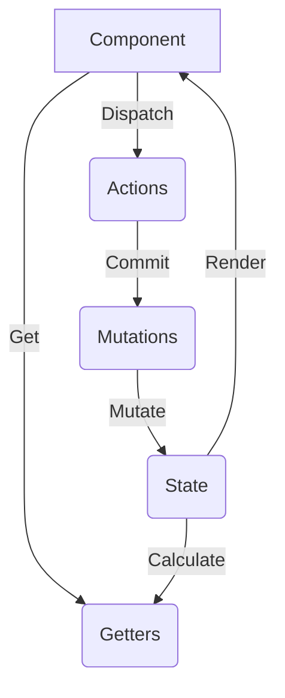

# Vuex

## Vuex是什么，每个属性是干嘛的，如何使用

### Vuex是什么？

Vuex是专门为Vue.js应用程序设计的**状态管理工具**。它采用集中式存储管理应用的所有组件的状态，并以相应的规则保证状态以一种可预测的方式发生变化。

具体工作：vuex是一种状态管理机制，将全局组件的共享状态抽取出来为一个store，以一个单例模式存在，应用任何一个组件中都可以使用。vuex更改state的唯一途径是通过mutation，mutation需要commit触发, action实际触发是mutation，其中mutation处理同步任务，action处理异步任务。

### Vuex每个属性是干嘛的？



Vuex的属性包含以下几个核心部分：

1.  **State**: 存储的单一状态，是存储的基本数据。
2.  **Getters**: store的计算属性，对state的加工，是派生出来的数据。就像computed计算属性一样，getter返回的值会根据它的依赖被缓存起来，且只有当它的依赖值发生改变才会被重新计算。
3.  **Mutations**: 更改 Vuex 的 store 中的状态的唯一方法是提交 mutation。每个 mutation 都有一个字符串的 **事件类型 (type)** 和 一个 **回调函数 (handler)**。这个回调函数就是我们实际进行状态更改的地方，并且它会接受 state 作为第一个参数。**Mutation 必须是同步函数**。
4.  **Actions**: Action 类似于 mutation，不同在于：
    -   Action 提交的是 mutation，而不是直接变更状态。
    -   Action 可以包含任意异步操作。
5.  **Module**: Module是store分割的模块，每个模块拥有自己的state、getters、mutations、actions。

### mutation和action有什么区别？

-   **Mutation**: 更改 Vuex 的 store 中的状态的**唯一**方法是提交 mutation。Mutation 必须是**同步**的。
    ```javascript
    const store = new Vuex.Store({
        state: {
            count: 1
        },
        mutations: {
            increment(state) {
                // 变更状态
                state.count++
            }
        }
    })

    // 唤醒一个 mutation handler
    store.commit('increment')
    ```
-   **Action**: Action 提交的是 mutation，而不是直接变更状态。Action 可以包含任意**异步**操作。
    ```javascript
    const store = new Vuex.Store({
        state: {
            count: 0
        },
        mutations: {
            increment(state) {
                state.count++
            }
        },
        actions: {
            increment(context) {
                // 可以在这里执行异步操作
                setTimeout(() => {
                    context.commit('increment')
                }, 1000)
            }
        }
    })

    // 分发 action
    store.dispatch('increment')
    ```

**总结**:
- Action 用于处理异步操作和复杂的业务逻辑，最终通过提交 mutation 来改变状态。
- Mutation 用于直接、同步地修改状态，保证状态变更的可追溯性。

## Vuex实现原理

Vuex 的实现核心是利用了 Vue 的混入（mixin）机制和响应式系统。

1.  **Store的注册 (install)**:
    -   Vuex 通过 `Vue.use(Vuex)` 安装，`install` 方法会执行。
    -   `install` 方法通过 `Vue.mixin({ beforeCreate: vuexInit })` 将 `vuexInit` 函数混入到所有组件的 `beforeCreate` 生命周期钩子中。
    -   `vuexInit` 函数会判断组件的 `options` 中是否有 `store` 对象。根组件会有，它会将 `store` 对象挂载到 `this.$store` 上。
    -   子组件会从父组件 (`this.$options.parent.$store`) 中继承 `$store` 对象，从而实现所有组件共享一个 `store` 实例。

2.  **State 的响应式**:
    -   Vuex 的 `store` 内部会创建一个隐藏的 `Vue` 实例。
    -   `state` 数据会作为这个 `Vue` 实例的 `data`。
    -   利用 Vue 实例的 `data` 是响应式的特性，当 `state` 发生变化时，所有依赖 `state` 的组件都会自动更新。

3.  **Commit 和 Dispatch**:
    -   `commit` 的作用是触发 `mutations` 中对应的方法。它会根据传入的 `type` 找到对应的 `mutation` 函数，然后执行它，并传入 `state` 和 `payload`。
    -   `dispatch` 的作用是触发 `actions` 中对应的方法。它会找到对应的 `action` 函数，执行它，并传入一个 `context` 对象（包含 `commit`, `dispatch`, `state`, `getters` 等）和 `payload`。

## vuex页面刷新数据丢失问题

Vuex 的状态是存储在内存中的，当页面刷新时，内存中的数据会丢失。

**解决方案**:

-   **`localStorage` / `sessionStorage`**:
    -   在 `store` 中监听 `state` 的变化（例如使用 `store.subscribe`）。
    -   当 `state` 变化时，将其存入 `localStorage` 或 `sessionStorage`。
    -   在 `store` 初始化时，从 `localStorage` 或 `sessionStorage` 中读取数据，并用它来初始化 `state`。
-   **`vuex-persistedstate` 插件**:
    -   这是一个专门用于 Vuex 状态持久化的插件，可以非常方便地将 `store` 的状态保存到 `localStorage` 或 `sessionStorage` 中。

```javascript
// 手动实现示例
const store = new Vuex.Store({
  // ...
})

// 在 state 变化后，保存到 localStorage
store.subscribe((mutation, state) => {
  localStorage.setItem('vuex', JSON.stringify(state));
});

// 在 store 初始化时，从 localStorage 读取
const savedState = localStorage.getItem('vuex');
if (savedState) {
  store.replaceState(Object.assign({}, store.state, JSON.parse(savedState)));
}
```
