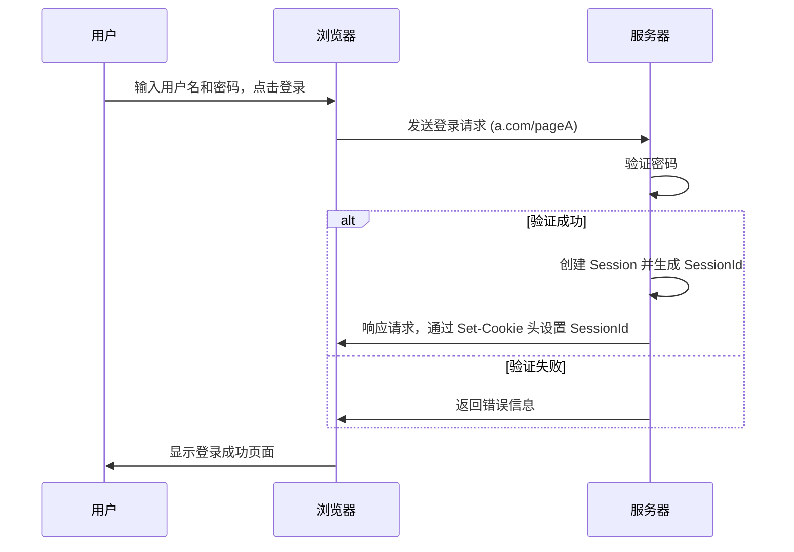
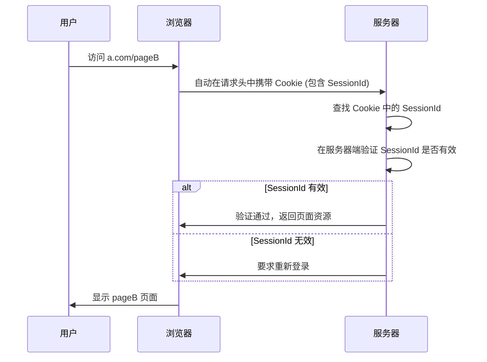
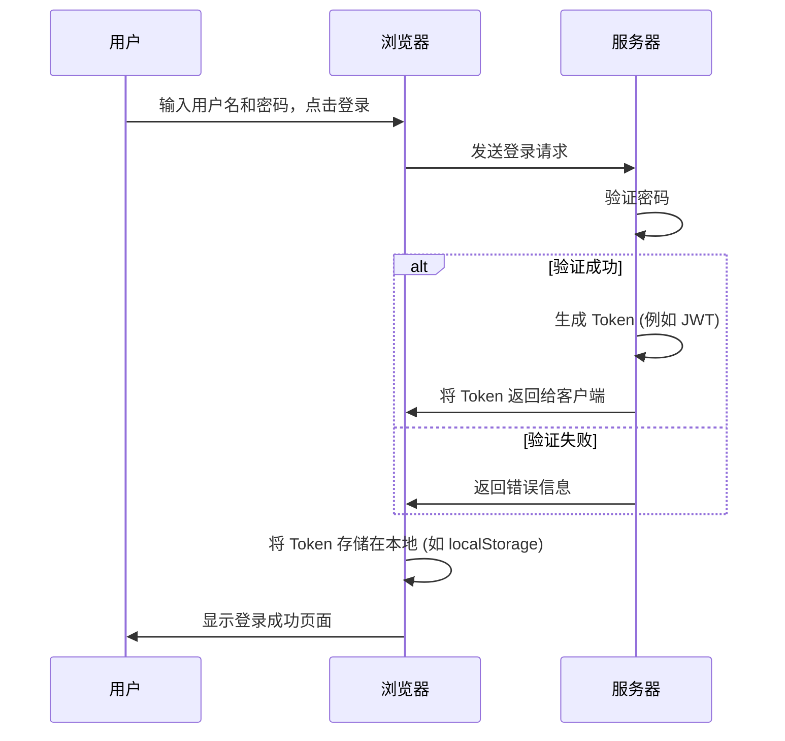
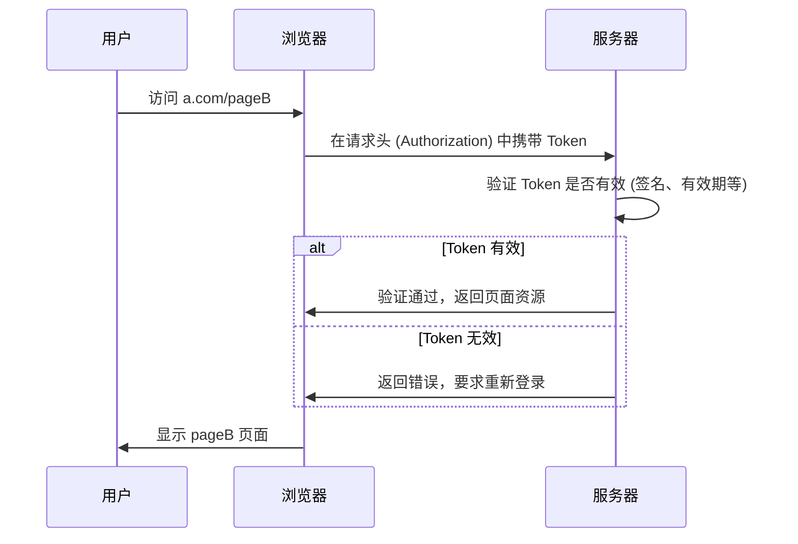
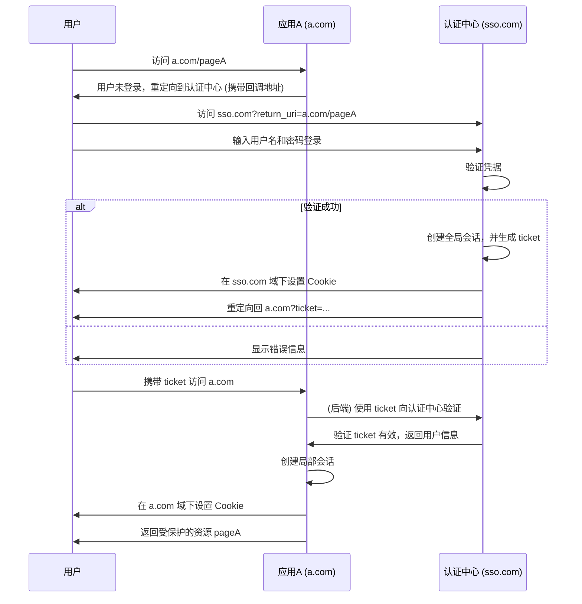
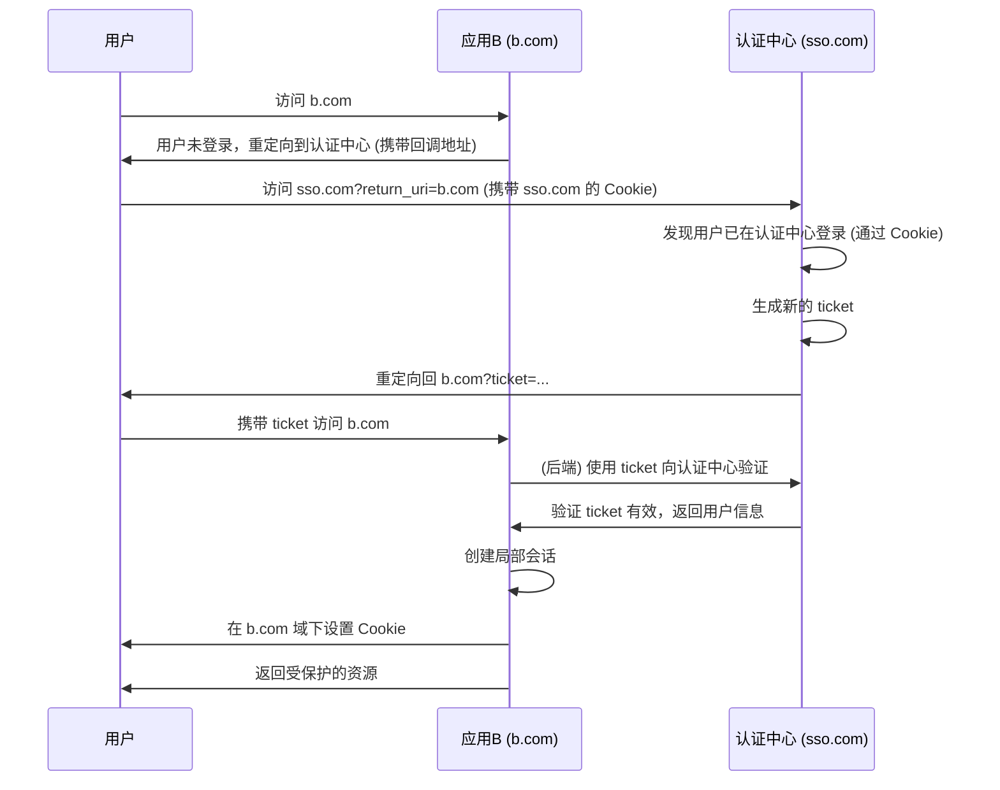
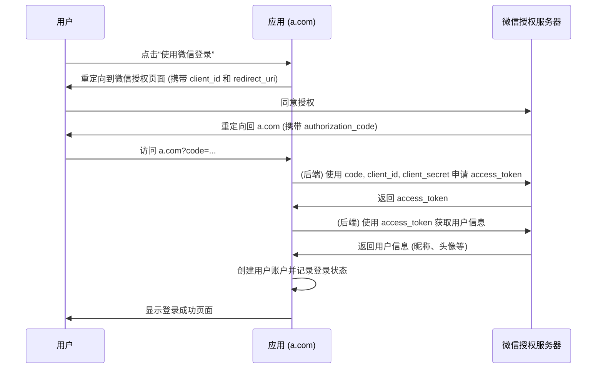

# Web 应用场景

## 用户认证

### 1. Cookie + Session 登录

HTTP 协议本身是无状态的，这意味着服务器无法区分连续的请求是否来自同一个用户。为了解决这个问题，`Cookie` 和 `Session` 机制应运而生。

- **Cookie**: 服务器发送给客户端的一小段文本信息，存储在客户端。浏览器在后续的每次请求中都会携带此信息。
- **Session**: 服务器为每个用户会话维护的一块内存空间，用于存储用户的状态信息。

**登录流程:**

这种方式是最经典的网站登录验证流程。

**首次登录:**



1.  用户在浏览器中输入凭据并提交。
2.  服务器验证凭据。
3.  验证成功后，服务器创建一个 `Session` 来存储用户信息，并生成一个唯一的 `SessionId`。
4.  服务器通过 HTTP 响应的 `Set-Cookie` 头将 `SessionId` 发送给浏览器，浏览器将其存储起来。

**后续访问:**



1.  当用户访问该网站的其他页面时，浏览器会自动在请求的 `Cookie` 头中附加 `SessionId`。
2.  服务器接收到请求后，从 `Cookie` 中解析出 `SessionId`，并在服务器端进行验证。
3.  如果验证通过，服务器则认为用户已登录，并返回相应资源。

**存在的问题:**

- **服务器开销**: 每个用户的 `Session` 都需要存储在服务器上，当用户量巨大时，会显著增加服务器的内存开销。
- **集群同步问题**: 在分布式或集群环境中，`Session` 需要在多个服务器之间同步，增加了系统的复杂性和维护成本。
- **CSRF 攻击风险**: 由于身份验证依赖于 `Cookie`，因此容易受到跨站请求伪造（CSRF）攻击。

### 2. Token 登录 (JWT)

为了解决 `Cookie-Session` 机制的问题，引入了基于 `Token` 的认证方式。`Token` 是服务器生成并返回给客户端的一串加密字符串，作为客户端的访问令牌。

**登录流程:**

**首次登录:**



1.  用户提交登录凭据。
2.  服务器验证成功后，生成一个 `Token`（通常是 JWT）。
3.  服务器将 `Token` 返回给客户端。
4.  客户端（浏览器）将 `Token` 存储在本地，例如 `localStorage` 或 `sessionStorage`。

**后续访问:**



1.  客户端在后续的请求中，通常在 `Authorization` 请求头中携带 `Token`。
2.  服务器接收到请求后，对 `Token` 进行解码和验证。
3.  验证通过后，处理请求并返回资源。

**Token 的优势:**

- **无状态**: 服务器不需要存储 `Token`，减轻了服务器的存储压力。
- **跨域支持**: `Token` 可以轻松地用于跨域场景。
- **安全性**: `Token` 不存储在 `Cookie` 中，可以有效避免 CSRF 攻击。
- **可扩展性**: 在分布式系统中，无需同步 `Session`，易于扩展。

**JWT (JSON Web Token) 结构:**

JWT 是 `Token` 的一种流行实现，它由三部分组成：

1.  **Header (头部)**: 包含 `Token` 的类型和所使用的签名算法。
    ```json
    { "alg": "HS256", "typ": "JWT" }
    ```
2.  **Payload (载荷)**: 包含声明信息，如用户信息、权限、过期时间等。
    ```json
    { "sub": "1234567890", "name": "John Doe", "iat": 1516239022 }
    ```
3.  **Signature (签名)**: 对前两部分进行签名，防止数据篡改。
    ```
    HMACSHA256(
      base64UrlEncode(header) + "." +
      base64UrlEncode(payload),
      secret)
    ```

服务器通过验证签名来确认 `Token` 的真实性，并通过解析 `Payload` 中的过期时间来确认其有效性。

### 3. SSO (单点登录)

单点登录 (Single Sign-On) 允许用户在多个应用系统中，只需登录一次，就可以访问所有相互信任的应用系统。它通常涉及一个独立的**认证中心 (Authentication Center)**。

**登录流程:**

**首次访问应用:**



**访问其他应用:**



**单点登出:**

1.  用户在某个应用（如 `a.com`）上点击登出。
2.  `a.com` 清除自己的局部会话和 `Cookie`。
3.  `a.com` 向认证中心发起登出请求。
4.  认证中心清除自己的全局会话，并通知所有已注册的应用执行登出操作。

### 4. OAuth (第三方登录)

OAuth 是一个开放标准，允许用户授权第三方应用访问他们存储在另外的服务提供者上的信息，而不需要将用户名和密码提供给第三方应用。例如，使用微信或 GitHub 账号登录其他网站。

**授权流程 (以微信为例):**



### 总结

| 方案 | 优点 | 缺点 | 适用场景 |
| --- | --- | --- | --- |
| **Cookie + Session** | 原理简单，历史悠久 | 占用服务器资源，分布式扩展困难，有 CSRF 风险 | 简单的单体后端应用 |
| **Token (JWT)** | 无状态，对服务器压力小，易于扩展，天然防 CSRF | Token 一旦签发，在有效期内无法撤销 | 分布式、微服务架构，前后端分离应用 |
| **SSO 单点登录** | 一次登录，处处通行，提升用户体验 | 需要独立的认证中心，架构复杂 | 拥有多个内部产品线的中大型企业 |
| **OAuth 第三方登录** | 简化用户注册登录流程，安全便捷 | 依赖第三方平台，可能需要支付费用 | 希望集成主流平台登录功能的应用 |

---

## 懒加载 (Lazy Loading)

懒加载是一种优化技术，用于延迟加载非关键资源（如图片、视频），直到这些资源进入或接近可视区域时才进行加载。

**为什么需要懒加载？**

- **节省带宽**: 避免加载用户可能永远不会看到的离屏内容，节省用户流量。
- **提升性能**: 减少初始页面加载的资源数量，加快页面渲染速度，提升用户体验。
- **降低资源消耗**: 减少不必要的解码和渲染，节省 CPU 和内存资源。

**实现方式:**

通常使用一张轻量级的占位图代替实际图片，当图片滚动到视口时，再将 `src` 属性替换为真实的图片 URL。

```html
<!-- 初始 HTML -->


<!-- JavaScript 监听滚动事件，当图片进入视口时 -->
<script>
  const lazyImages = document.querySelectorAll('.lazy');
  // ... 监听滚动 ...
  lazyImages.forEach(img => {
    if (isInViewport(img)) {
      img.src = img.dataset.src;
      img.classList.remove('lazy');
    }
  });
</script>
```

现代浏览器也提供了原生的懒加载支持：

```html

```

---

## 页面性能与体验优化

### 图片优化

1.  **图片压缩**: 使用工具（如 `ImageOptim`, `TinyPNG`）或构建脚本对图片进行无损或有损压缩，减小文件体积。
2.  **选择合适的格式**:
    - **JPEG**: 适用于照片等色彩丰富的图片。
    - **PNG**: 适用于需要透明背景的图片。
    - **WebP**: 提供比 JPEG 和 PNG 更好的压缩效果，但需注意浏览器兼容性。
    - **SVG**: 适用于图标和简单的几何图形，可无限缩放且体积小。
3.  **Base64 编码**: 将小图标或背景图转换为 Base64 字符串嵌入 CSS 或 HTML，减少 HTTP 请求。适用于体积非常小的图片。
4.  **图片预加载**: 对于关键但非首屏的图片，可以在浏览器空闲时提前加载，提升后续展示速度。
5.  **使用 CDN**: 将图片托管到 CDN，利用其边缘节点加速全球用户的访问。
6.  **响应式图片**: 使用 `<picture>` 元素或 `srcset` 属性，根据不同的屏幕尺寸和分辨率加载不同大小的图片。

### 数据展示优化

1.  **减少 HTTP 请求**: 合并 CSS 和 JavaScript 文件，使用 CSS Sprites。
2.  **使用 HTTP/2**: 利用多路复用、头部压缩等特性提升加载效率。
3.  **服务端渲染 (SSR)**: 加快首屏渲染速度，利于 SEO。
4.  **资源懒加载**: 不仅限于图片，组件、数据等也可以按需加载。
5.  **代码分割 (Code Splitting)**: 利用 Webpack 等工具按需加载代码块，减小初始包体积。
6.  **利用浏览器缓存**: 合理配置 `Cache-Control`, `Expires` 等 HTTP 头，充分利用浏览器缓存。
7.  **减少重绘与回流**:
    - 避免频繁操作 DOM 样式。
    - 使用 `transform` 和 `opacity` 实现动画，触发 GPU 加速。
    - 使用 `requestAnimationFrame`。

### 其他

- **前端国际化 (i18n)**:
    - **方案1 (多目录)**: 为每种语言创建一个版本，简单直接但维护成本高。
    - **方案2 (库)**: 使用 `jquery.i18n.properties`, `i18next`, `vue-i18n` 等库，在前端动态替换文本。
- **海量 IP 查找**: 使用 `Trie` 树（字典树）或 `HashSet` 数据结构可以实现近乎 O(1) 的查找效率。
- **二维码扫描登录原理**:
    1. PC 端生成一个唯一的、有时效性的二维码。
    2. 移动端 App 扫描二维码，获取其中的唯一 ID。
    3. App 将自身登录凭证和二维码 ID 发送给服务器。
    4. 服务器验证 App 凭证，并将二维码 ID 与用户账号绑定。
    5. PC 端通过轮询或长连接，向服务器查询该二维码 ID 的状态。
    6. 服务器通知 PC 端状态已改变（已扫描、已确认登录），PC 端完成登录。
