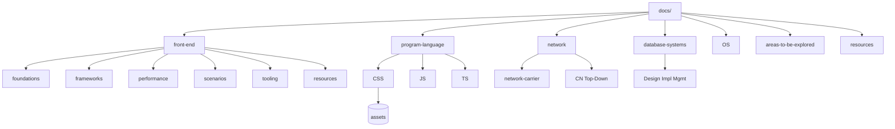

# Knowledge Base Architecture

目的：为整个 `docs/` 目录提供统一的信息架构、命名约定、导航与扩展策略，降低碎片化、提高可发现性与可维护性。

## 顶层结构（Domains）

建议将内容按“领域（Domain）→ 子域（Subdomain）→ 页面（Topic）”组织：

- front-end/ 前端开发
  - foundations/（浏览器、网络、安全）
  - frameworks/（React、Vue 等）
  - performance/、visualization/、scenarios/、tooling/、resources/
- program-language/ 语言与语法
  - css/、html/、js/、ts/（每个子目录以 README.md 为入口）
- network/ 计算机网络
  - network-carrier/（分层模型、应用/传输/网络层等）
  - computer-networking-a-top-down-approach/（读书笔记）
- database-systems/ 数据库
  - database-systems-design-implementation-management/（读书笔记）
- OS/ 操作系统（例如 carrier-os.md）
- areas-to-be-explored/ 待探索主题（AI、Web3、Bywork）
- resources-to-be-organized/ 临时资源收集区（后续并入 resources/）
- assets/（通用静态资源；更推荐各域内 assets 以便就近管理）

现状摘要：front-end 已完成规范化分层；program-language、network、database-systems 结构清晰但图片与资源尚未完全就近化；areas-to-be-explored/ 与 resources-to-be-organized/ 保留为“临时收纳区”。

## 统一约定（Conventions）

- 命名：统一英文 kebab-case；目录内入口文件统一 `README.md`（例：`program-language/js/README.md`）。
- 导航：每个顶层域都有 `README.md` 概览与“进一步阅读”；`docs/README.md` 作为总索引；本文件为架构说明。
- 交叉引用：相对路径、就近链接；同域页末统一添加“延伸阅读”。
- 资源管理：
  - 各域就近 `assets/`（如 `front-end/assets`、`program-language/css/assets`），避免跨域相对路径；
  - 迁移历史散落图片到对应域的 `assets/` 并批量更新链接；
  - 外链集中在各域 `resources/README.md`，正文只保留短清单。
- 图示：优先使用 Mermaid；位图使用 webp/png（控制尺寸与密度）。

## 目录映射与建议（Mapping & Suggestions）

- front-end/ 已完成：foundations/frameworks/performance/scenarios/tooling/resources 等；建议清理空旧目录 `web-framework/`、`web-module/`、`web-resource/`（迁移完成后删除）。
- program-language/
  - 补齐各子域 `README.md` 导航；
  - 将 `css/` 中图片（如 `Untitled 1.png` 等）统一迁移到 `program-language/css/assets/` 并更新引用；
  - 将 `program-resource.md` 合并入 `resources/`（见下）。
- network/
  - 在 `network/` 增设 `README.md` 作为索引；
  - 书籍类内容与通识类内容分层清晰，建议增设 `resources.md` 收集外链；
  - 后续图片也按子域就近收纳。
- database-systems/
  - 增设 `README.md` 作为索引与章节导览；
  - 读书图示文件就近 `assets/`。
- resources/
  - 新建 `docs/resources/README.md` 汇总跨域资源清单；
  - 将顶层 `program-resource.md` 并入此处（或保留为指向 `resources/` 的占位页）。
- areas-to-be-explored/ 与 resources-to-be-organized/
  - 保留作为临时收纳区；当主题成熟后迁入对应域并建立正式导航。

## 导航蓝图（Site Map）

## 渐进式落地（Roadmap）

1) 入口与导航
   - 在 `network/`、`database-systems/`、`program-language/` 新增或完善 `README.md` 入口与目录；
   - 在 `docs/README.md` 中补充到上述入口的链接；
2) 资源归位
   - 将 `program-language/css`、`network/*` 的图片迁至各自 `assets/` 并批量更新引用；
   - 顶层 `assets/` 仅保留通用资源（若有），其余逐步就近化；
3) 清理与别名
   - 清理 `front-end/web-*` 旧目录（确认无引用后删除）；
   - 将 `program-resource.md` 合并到 `resources/README.md`（保留指向说明页或删掉）；
4) 质量与守护
   - 增加链接检查脚本（`rg`/`markdown-link-check`）与图片引用检查；
   - 统一 Lint/格式化（见 `front-end/scenarios/static-code-scanning-design.md`）。

## 统一入口（当前主要入口）

- 总索引：`docs/README.md`
- 架构说明：`docs/architecture.md`（本文）
- 前端索引：`docs/front-end/README.md`
- 语言索引：`docs/program-language/README.md`（建议新增）
- 网络索引：`docs/network/README.md`（建议新增）
- 数据库索引：`docs/database-systems/README.md`（建议新增）
- 全局资源：`docs/resources/README.md`（建议新增）

---

备注：本文件为总体架构与落地指南，不做大规模移动以外的改动说明。若需要，我可以按 Roadmap 逐步创建各域 README 索引、迁移图片并提交链接修复。 

