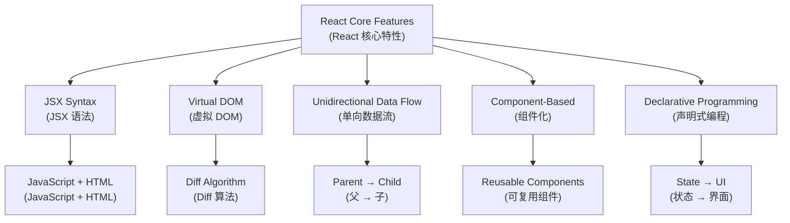
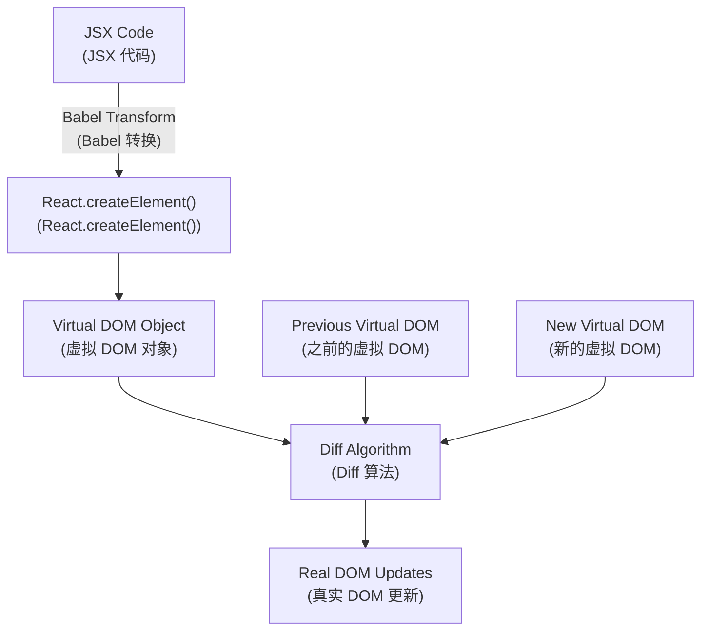
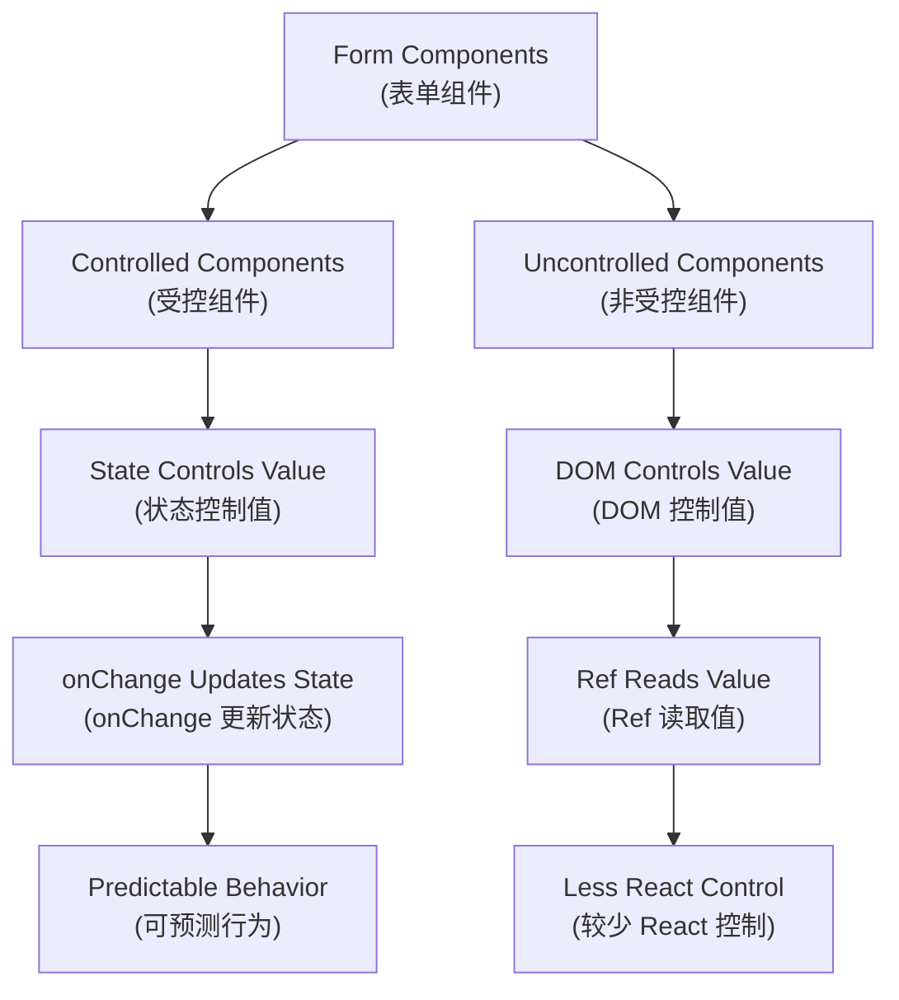
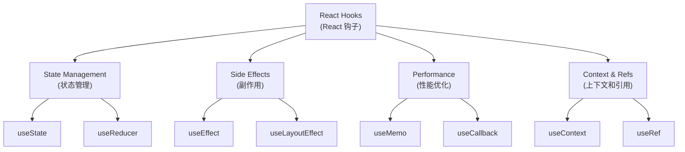
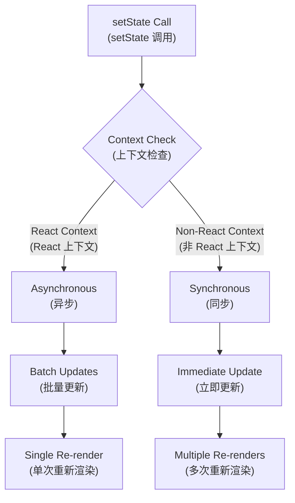
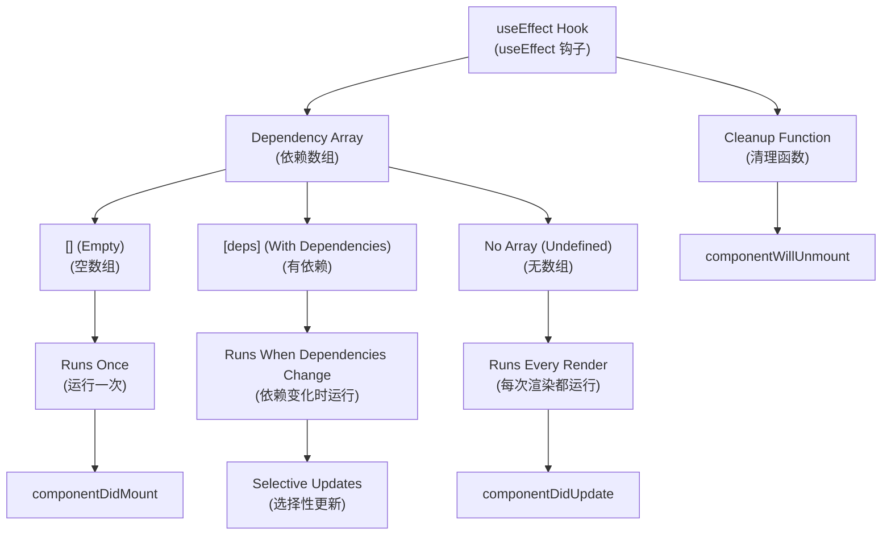
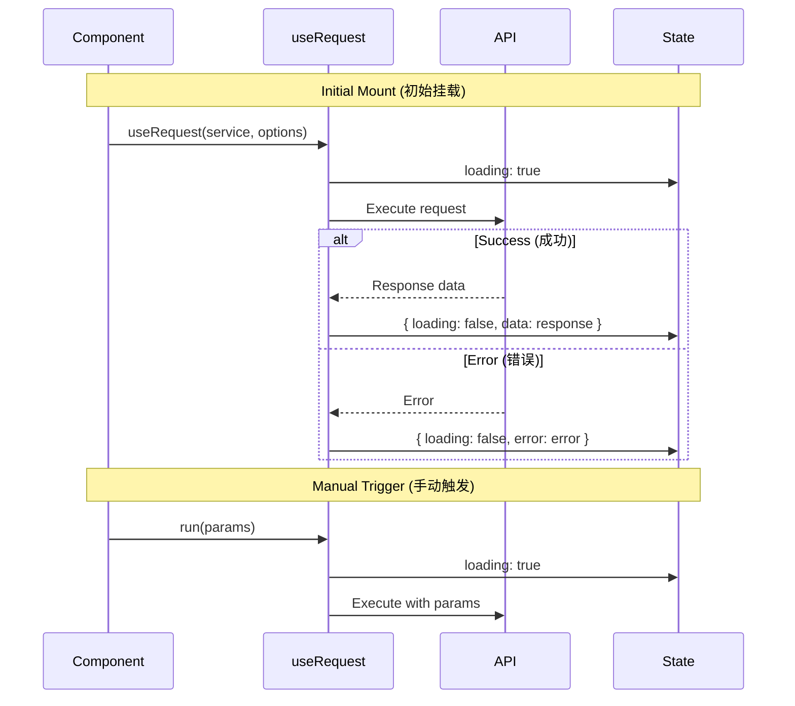
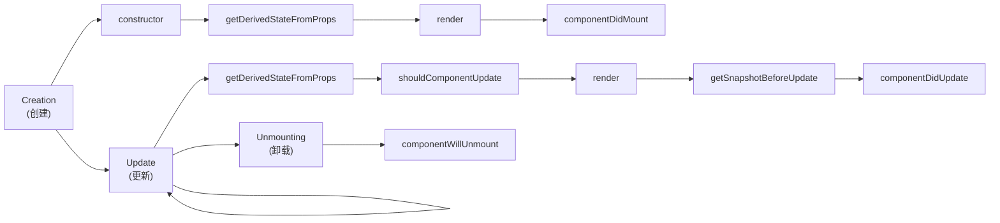
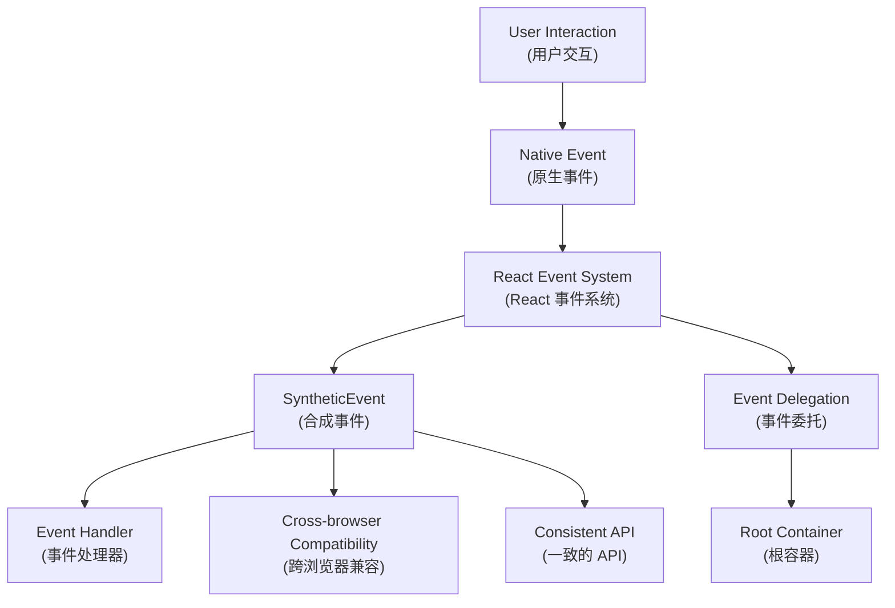
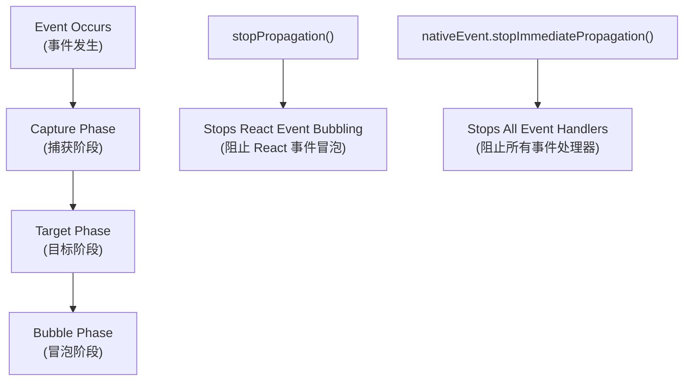

# React Fundamentals (React 基础)
## Complete Guide to React Core Concepts (React 核心概念完整指南)

This comprehensive document covers all fundamental React concepts (本综合文档涵盖所有 React 基础概念): features, components, hooks, virtual DOM, and events (特性、组件、钩子、虚拟 DOM 和事件) in a single, well-structured guide (在一个结构良好的指南中).

---

## Table of Contents (目录)

1. [React Features Overview (React 特性概览)](#react-features-overview-react-特性概览)
2. [Virtual DOM and Diff Algorithm (虚拟 DOM 与 Diff 算法)](#virtual-dom-and-diff-algorithm-虚拟-dom-与-diff-算法)
3. [Component Fundamentals (组件基础)](#component-fundamentals-组件基础)
4. [React Hooks (React 钩子)](#react-hooks-react-钩子)
5. [Component Lifecycle (组件生命周期)](#component-lifecycle-组件生命周期)
6. [Event System (事件系统)](#event-system-事件系统)

---

## React Features Overview (React 特性概览) {#react-features-overview-react-特性概览}

### Core Features Table (核心特性表格)

| Feature (特性) | Description (描述) | Benefits (优势) |
|---|---|---|
| **JSX Syntax (JSX 语法)** | Describe UI structure within JavaScript (在 JavaScript 中描述 UI 结构) | Type safety, better tooling (类型安全，更好的工具支持) |
| **Unidirectional Data Flow (单向数据流)** | Top-down data flow for easier reasoning (自上而下的数据流动，便于推理) | Predictable state changes (可预测的状态变化) |
| **Virtual DOM (虚拟 DOM)** | Efficient updates based on Diff algorithm (基于 Diff 算法的高效更新) | Better performance (更好的性能) |
| **Declarative Programming (声明式编程)** | Describe state, React handles rendering (描述状态，React 负责渲染) | Easier to understand and debug (更容易理解和调试) |
| **Component-Based (组件化)** | Reusability and composition (复用与组合) | Modular development (模块化开发) |

### React Architecture Overview (React 架构概览)



---

## Virtual DOM and Diff Algorithm (虚拟 DOM 与 Diff 算法)

### Real DOM vs Virtual DOM Comparison (真实 DOM 与虚拟 DOM 对比)

| Aspect (方面) | Real DOM (真实 DOM) | Virtual DOM (虚拟 DOM) |
|---|---|---|
| **Nature (本质)** | Browser DOM nodes (浏览器 DOM 节点) | JavaScript objects (JavaScript 对象) |
| **Performance (性能)** | Slow manipulation (操作缓慢) | Fast manipulation (操作快速) |
| **Memory Usage (内存使用)** | High (高) | Low (低) |
| **Update Cost (更新成本)** | Expensive (昂贵) | Cheap (便宜) |
| **Direct Manipulation (直接操作)** | Possible (可能) | Not possible (不可能) |

### Virtual DOM Creation Process (虚拟 DOM 创建过程)



### JSX to Virtual DOM Example (JSX 到虚拟 DOM 示例)

**JSX Code (JSX 代码):**
```jsx
const vDom = <h1 className="title">Hello World</h1>;
```

**Babel Transform (Babel 转换):**
```jsx
const vDom = React.createElement(
  'h1',
  { className: 'title' },
  'Hello World'
);
```

**Virtual DOM Object (虚拟 DOM 对象):**
```json
{
  "type": "h1",
  "key": null,
  "ref": null,
  "props": {
    "className": "title",
    "children": "Hello World"
  }
}
```

### Diff Algorithm Strategies (Diff 算法策略)

| Strategy (策略) | Description (描述) | Example (示例) |
|---|---|---|
| **Same-level Comparison (同层比较)** | Only compare nodes at the same level (只比较同一层级的节点) | Parent-child relationships maintained (维持父子关系) |
| **Component Type Check (组件类型检查)** | Different types trigger complete replacement (不同类型触发完全替换) | `<div>` → `<span>` = full rebuild (完全重建) |
| **Key-based Identification (基于 key 的识别)** | Use `key` prop for list item identification (使用 `key` 属性识别列表项) | Efficient list updates (高效列表更新) |

### Key Selection Best Practices (Key 选择最佳实践)

| Key Type (Key 类型) | Performance (性能) | Stability (稳定性) | Recommendation (推荐度) |
|---|---|---|---|
| **Unique ID (唯一 ID)** | ⭐⭐⭐ Excellent (优秀) | ⭐⭐⭐ Stable (稳定) | ✅ Recommended (推荐) |
| **Array Index (数组索引)** | ⭐ Poor (差) | ⭐ Unstable (不稳定) | ❌ Avoid (避免) |
| **Random Values (随机值)** | ⭐ Poor (差) | ⭐ Unstable (不稳定) | ❌ Never use (永不使用) |

---

## Component Fundamentals (组件基础)

### Component Types Comparison (组件类型对比)

| Aspect (方面) | Function Components (函数组件) | Class Components (类组件) |
|---|---|---|
| **Syntax (语法)** | Simple function (简单函数) | ES6 class (ES6 类) |
| **State Management (状态管理)** | Hooks (useState, useReducer) (钩子) | this.state, this.setState |
| **Lifecycle (生命周期)** | useEffect and other hooks (useEffect 和其他钩子) | Lifecycle methods (生命周期方法) |
| **Performance (性能)** | Better optimization (更好的优化) | Requires manual optimization (需要手动优化) |
| **Bundle Size (包大小)** | Smaller (更小) | Larger (更大) |
| **Learning Curve (学习曲线)** | Easier (更容易) | Steeper (更陡峭) |
| **Future Support (未来支持)** | ✅ Recommended (推荐) | ⚠️ Legacy (遗留) |

### Controlled vs Uncontrolled Components (受控与非受控组件)



### Component Control Comparison (组件控制对比)

| Feature (特性) | Controlled (受控) | Uncontrolled (非受控) |
|---|---|---|
| **Data Source (数据源)** | React state (React 状态) | DOM element (DOM 元素) |
| **Value Access (值访问)** | Direct from state (直接从状态) | Via ref (通过 ref) |
| **Validation (验证)** | Real-time (实时) | On submit (提交时) |
| **Performance (性能)** | More re-renders (更多重新渲染) | Fewer re-renders (更少重新渲染) |
| **Use Case (使用场景)** | Dynamic forms (动态表单) | Simple forms (简单表单) |

### Props vs State Comparison (Props 与 State 对比)

| Aspect (方面) | Props | State |
|---|---|---|
| **Source (来源)** | Parent component (父组件) | Component itself (组件自身) |
| **Mutability (可变性)** | Immutable (不可变) | Mutable (可变) |
| **Purpose (目的)** | Configuration (配置) | Internal data (内部数据) |
| **Triggers Re-render (触发重新渲染)** | ✅ Yes (是) | ✅ Yes (是) |
| **Access Pattern (访问模式)** | `props.propName` | `state.stateName` |
| **Update Method (更新方法)** | Parent updates (父组件更新) | `setState` / `useState` |

---

## React Hooks (React 钩子)

### Hooks Overview (钩子概览)

| Hook | Purpose (用途) | Returns (返回值) | Common Use Cases (常见用例) |
|---|---|---|---|
| **`useState`** | Manage component state (管理组件状态) | `[state, setState]` | Form inputs, toggles (表单输入，切换) |
| **`useEffect`** | Handle side effects (处理副作用) | Cleanup function (清理函数) | API calls, subscriptions (API 调用，订阅) |
| **`useContext`** | Access context values (访问上下文值) | Context value (上下文值) | Theme, user data (主题，用户数据) |
| **`useReducer`** | Complex state logic (复杂状态逻辑) | `[state, dispatch]` | State machines (状态机) |
| **`useMemo`** | Memoize expensive calculations (缓存昂贵计算) | Memoized value (缓存值) | Performance optimization (性能优化) |
| **`useCallback`** | Memoize callback functions (缓存回调函数) | Memoized function (缓存函数) | Prevent re-renders (防止重新渲染) |
| **`useRef`** | Access DOM or store mutable values (访问 DOM 或存储可变值) | Ref object (引用对象) | DOM manipulation (DOM 操作) |

### Hooks Categories (钩子分类)



### useState Hook Details (useState 钩子详解)

#### setState Behavior in Different Contexts (不同上下文中的 setState 行为)

| Context (上下文) | Behavior (行为) | Batching (批处理) | Example (示例) |
|---|---|---|---|
| **React Lifecycle Methods (React 生命周期方法)** | Asynchronous (异步) | ✅ Yes (是) | `componentDidMount`, `componentDidUpdate` |
| **React Synthetic Events (React 合成事件)** | Asynchronous (异步) | ✅ Yes (是) | `onClick`, `onChange` |
| **setTimeout/setInterval** | Synchronous (同步) | ❌ No (否) | `setTimeout(() => setState(), 0)` |
| **Native DOM Events (原生 DOM 事件)** | Synchronous (同步) | ❌ No (否) | `addEventListener('click', ...)` |
| **Promise callbacks (Promise 回调)** | Synchronous (同步) | ❌ No (否) | `.then(() => setState())` |

#### useState Execution Flow (useState 执行流程)



### useEffect Hook Details (useEffect 钩子详解)

#### useEffect vs Lifecycle Methods (useEffect 与生命周期方法对比)

| Lifecycle Method (生命周期方法) | useEffect Equivalent (useEffect 等价) | Dependency Array (依赖数组) |
|---|---|---|
| `componentDidMount` | `useEffect(() => {}, [])` | Empty array (空数组) |
| `componentDidUpdate` | `useEffect(() => {})` | No dependency array (无依赖数组) |
| `componentWillUnmount` | `useEffect(() => { return () => {} }, [])` | Return cleanup function (返回清理函数) |
| `componentDidMount` + `componentDidUpdate` | `useEffect(() => {}, [dependency])` | Specific dependencies (特定依赖) |

#### useEffect Dependency Patterns (useEffect 依赖模式)



### useRequest (ahooks) Pattern (useRequest 模式)

#### Core Features (核心特性)

| Feature (特性) | Description (描述) | Benefits (优势) |
|---|---|---|
| **Unified State (统一状态)** | `{ loading, data, error }` | Consistent API (一致的 API) |
| **Automatic Execution (自动执行)** | Runs on mount (挂载时运行) | Less boilerplate (更少样板代码) |
| **Manual Trigger (手动触发)** | `run()` method (run() 方法) | On-demand requests (按需请求) |
| **Dependency Refresh (依赖刷新)** | Auto-retry on deps change (依赖变化自动重试) | Reactive updates (响应式更新) |
| **Built-in Optimizations (内置优化)** | Debounce, throttle, polling (防抖、节流、轮询) | Better UX (更好的用户体验) |

#### Request Flow Diagram (请求流程图)



---

## Component Lifecycle (组件生命周期)

### Lifecycle Phases Overview (生命周期阶段概览)



### Lifecycle Methods Comparison (生命周期方法对比)

| Phase (阶段) | Method (方法) | Purpose (用途) | Can setState? | Common Use Cases (常见用例) |
|---|---|---|---|---|
| **Creation (创建)** | `constructor` | Initialize state and bind methods (初始化状态和绑定方法) | ✅ | Set initial state (设置初始状态) |
| | `getDerivedStateFromProps` | Sync state with props (同步状态与属性) | ❌ | Rare edge cases (罕见边缘情况) |
| | `render` | Return JSX (返回 JSX) | ❌ | Define UI structure (定义 UI 结构) |
| | `componentDidMount` | After first render (首次渲染后) | ✅ | API calls, DOM manipulation (API 调用，DOM 操作) |
| **Update (更新)** | `getDerivedStateFromProps` | Sync state with props (同步状态与属性) | ❌ | Rare edge cases (罕见边缘情况) |
| | `shouldComponentUpdate` | Control re-rendering (控制重新渲染) | ❌ | Performance optimization (性能优化) |
| | `render` | Return updated JSX (返回更新的 JSX) | ❌ | Define UI structure (定义 UI 结构) |
| | `getSnapshotBeforeUpdate` | Capture info before DOM update (DOM 更新前捕获信息) | ❌ | Scroll position (滚动位置) |
| | `componentDidUpdate` | After update (更新后) | ✅ | DOM operations, API calls (DOM 操作，API 调用) |
| **Unmounting (卸载)** | `componentWillUnmount` | Cleanup (清理) | ❌ | Remove listeners, cancel requests (移除监听器，取消请求) |

### Key Lifecycle Rules (关键生命周期规则)

| Rule (规则) | Explanation (解释) | Why? (为什么?) |
|---|---|---|
| Never call `setState` in `render` (render 中不要调用 setState) | Causes infinite re-render loop (导致无限重新渲染循环) | Performance and stability (性能和稳定性) |
| Use `getSnapshotBeforeUpdate` carefully (谨慎使用 getSnapshotBeforeUpdate) | Returns value passed to `componentDidUpdate` (返回值传递给 componentDidUpdate) | Maintain scroll position (维护滚动位置) |
| Clean up in `componentWillUnmount` (在 componentWillUnmount 中清理) | Prevent memory leaks (防止内存泄漏) | Resource management (资源管理) |

---

## Event System (事件系统) {#event-system-事件系统}

### Event Architecture (事件架构)



### Synthetic vs Native Events Comparison (合成事件与原生事件对比)

| Aspect (方面) | Synthetic Events (合成事件) | Native Events (原生事件) |
|---|---|---|
| **Browser Compatibility (浏览器兼容性)** | Consistent across browsers (跨浏览器一致) | Browser-specific differences (浏览器特定差异) |
| **Event Delegation (事件委托)** | Automatic (自动) | Manual setup required (需要手动设置) |
| **Performance (性能)** | Optimized by React (React 优化) | Direct browser handling (浏览器直接处理) |
| **Memory Usage (内存使用)** | Event pooling (事件池化) | Individual event objects (独立事件对象) |
| **API Consistency (API 一致性)** | Standardized (标准化) | Varies by browser (因浏览器而异) |

### Event Binding Performance Comparison (事件绑定性能对比)

| Method (方法) | Performance (性能) | Memory Impact (内存影响) | Recommendation (推荐度) | Example (示例) |
|---|---|---|---|---|
| **Constructor Bind (构造器绑定)** | ✅ High (高) | ✅ Low (低) | ✅ Recommended (推荐) | `this.handleClick = this.handleClick.bind(this)` |
| **Class Field Arrow Function (类字段箭头函数)** | ✅ High (高) | ✅ Low (低) | ✅ Recommended (推荐) | `handleClick = () => {}` |
| **Render Method Bind (渲染方法绑定)** | ❌ Low (低) | ❌ High (高) | ❌ Avoid (避免) | `onClick={this.handleClick.bind(this)}` |
| **Render Arrow Function (渲染箭头函数)** | ❌ Low (低) | ❌ High (高) | ❌ Avoid (避免) | `onClick={() => this.handleClick()}` |

### Event Propagation Control (事件传播控制)



### Event Control Methods (事件控制方法)

| Method (方法) | Scope (作用范围) | Use Case (使用场景) |
|---|---|---|
| `e.stopPropagation()` | React synthetic events only (仅 React 合成事件) | Prevent parent React handlers (阻止父级 React 处理器) |
| `e.nativeEvent.stopImmediatePropagation()` | All event handlers (所有事件处理器) | Prevent all handlers including native (阻止包括原生在内的所有处理器) |
| `e.preventDefault()` | Default browser behavior (默认浏览器行为) | Prevent form submission, link navigation (阻止表单提交，链接导航) |

---

## References (参考)

### Official Documentation (官方文档)
- [React Official Documentation (React 官方文档)](https://reactjs.org/)
- [React Hooks Documentation (React Hooks 文档)](https://reactjs.org/docs/hooks-intro.html)

### Additional Resources (其他资源)
- [ahooks - React Hooks Library](https://ahooks.js.org/zh-CN/)
- [React Hooks Tutorial - Ruan Yifeng (React Hooks 入门教程 - 阮一峰)](https://www.ruanyifeng.com/blog/2019/09/react-hooks.html)
- [Understanding React setState (揭密 React setState)](https://juejin.cn/post/6844903667426918408)
- [Everything You Want to Know About Refs (你想知道的关于 Refs 的知识都在这了)](https://segmentfault.com/a/1190000020842342)

---

*This document provides a comprehensive foundation for understanding React fundamentals (本文档为理解 React 基础提供了全面的基础). For advanced topics, see the React Advanced guide (高级主题请参见 React 进阶指南).*
