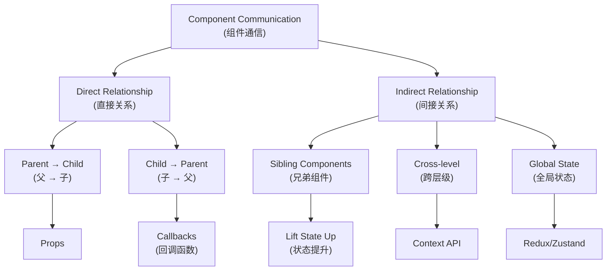
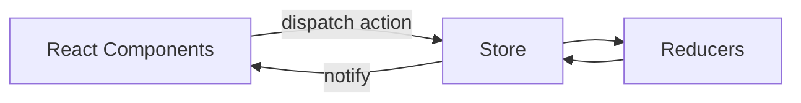
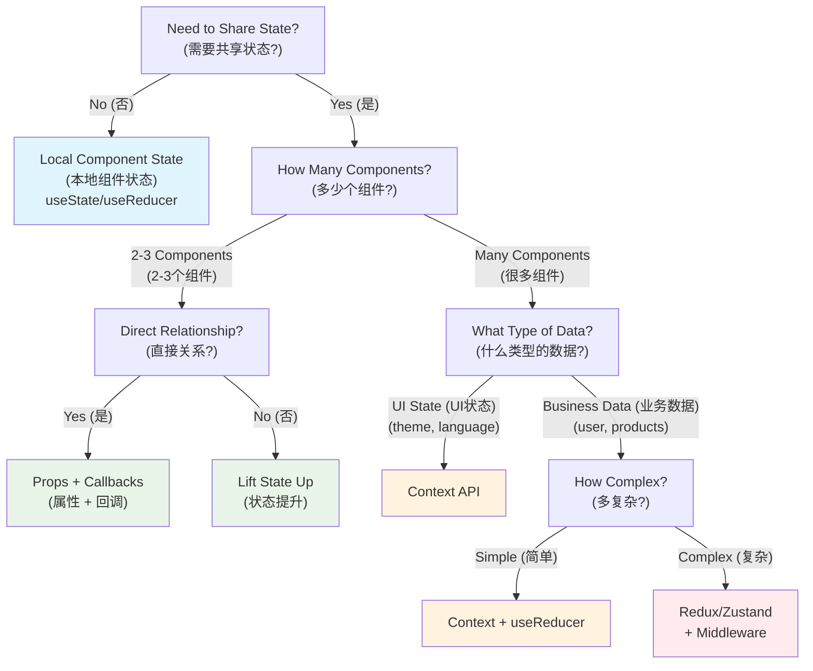
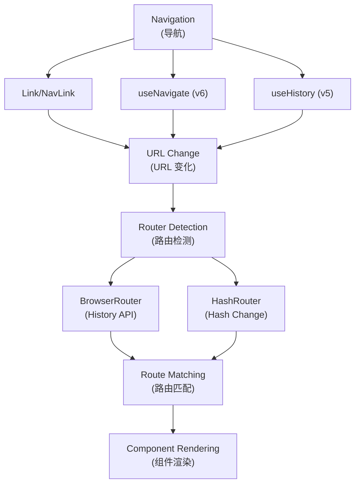

# State Management, Communication and Routing (状态管理、通信与路由)
## Context/Redux/Component Communication/React Router

## Component Communication (组件通信)

### Communication Patterns Overview (通信模式概览)

### Communication Methods Comparison (通信方法对比)

| Pattern (模式) | Complexity (复杂度) | Performance (性能) | Use Case (使用场景) | Example (示例) |
|---|---|---|---|---|
| **Props (属性)** | ⭐ Simple (简单) | ⭐⭐⭐ High (高) | Parent to child (父到子) | `<Child name={name} />` |
| **Callbacks (回调)** | ⭐⭐ Medium (中等) | ⭐⭐⭐ High (高) | Child to parent (子到父) | `<Child onClick={handleClick} />` |
| **State Lifting (状态提升)** | ⭐⭐ Medium (中等) | ⭐⭐ Medium (中等) | Sibling communication (兄弟通信) | Common parent state (共同父级状态) |
| **Context API** | ⭐⭐⭐ Complex (复杂) | ⭐⭐ Medium (中等) | Cross-level sharing (跨层级共享) | Theme, user data (主题，用户数据) |
| **Redux/Zustand** | ⭐⭐⭐⭐ Very Complex (很复杂) | ⭐ Low (低) | Global state management (全局状态管理) | Large applications (大型应用) |

## Context - When to Use (Context 何时用)

- **Global configuration/light sharing (全局配置/轻共享)**: Themes, internationalization, user sessions (主题、国际化、用户会话等)
- **Local scope Provider (局部范围 Provider)**: Avoid global pollution (避免全局污染)

## Redux Essentials (Redux 要点)

- **Three Principles (三原则)**: Single source of truth (单一数据源), read-only state (只读 state), pure function modifications (纯函数修改)
- **react-redux**: Provider + connect/hooks (useSelector/useDispatch)
- **Middleware (中间件)**: thunk, logger; chain-enhanced dispatch (链式增强 dispatch)

## Directory Organization Suggestions (目录组织建议)

- **By feature modules (按功能模块拆分)**: actions/reducer/views in the same directory (actions/reducer/views 同目录), or by role (或按角色) like actions/reducers/...
- **Unified export entry (导出统一入口)**: index.ts for convenient on-demand imports (便于按需引入)

## State Management Decision Tree (状态管理决策树)

### Selection Guidelines Table (选择指南表格)

| Scenario (场景) | Recommended Solution (推荐方案) | Pros (优点) | Cons (缺点) |
|---|---|---|---|
| **Single Component (单个组件)** | `useState` / `useReducer` | Simple, fast (简单，快速) | Not shareable (不可共享) |
| **Parent-Child (父子组件)** | Props + Callbacks (属性 + 回调) | Direct, performant (直接，高性能) | Limited scope (范围有限) |
| **Sibling Components (兄弟组件)** | Lift State Up (状态提升) | Clear data flow (清晰数据流) | May cause prop drilling (可能导致属性钻取) |
| **Theme/Language (主题/语言)** | Context API | Built-in, simple (内置，简单) | Re-renders all consumers (重新渲染所有消费者) |
| **User Session (用户会话)** | Context + `useRequest` | Reactive updates (响应式更新) | Medium complexity (中等复杂度) |
| **Complex Business Logic (复杂业务逻辑)** | Redux/Zustand | Predictable, debuggable (可预测，可调试) | Learning curve (学习曲线) |
| **Real-time Data (实时数据)** | `useRequest` + polling | Automatic updates (自动更新) | Network overhead (网络开销) |

### Performance Comparison (性能对比)

| Solution (方案) | Bundle Size (包大小) | Runtime Performance (运行时性能) | Developer Experience (开发体验) |
|---|---|---|---|
| **Local State (本地状态)** | ⭐⭐⭐ Minimal (最小) | ⭐⭐⭐ Excellent (优秀) | ⭐⭐⭐ Simple (简单) |
| **Props/Callbacks (属性/回调)** | ⭐⭐⭐ Minimal (最小) | ⭐⭐⭐ Excellent (优秀) | ⭐⭐ Good (良好) |
| **Context API** | ⭐⭐⭐ Minimal (最小) | ⭐⭐ Good (良好) | ⭐⭐ Good (良好) |
| **Redux** | ⭐ Large (大) | ⭐ Fair (一般) | ⭐⭐⭐ Excellent (优秀) |
| **Zustand** | ⭐⭐ Small (小) | ⭐⭐ Good (良好) | ⭐⭐⭐ Excellent (优秀) |

---

## React Router (React 路由)

### Router Types Comparison (路由类型对比)

| Router Type (路由类型) | URL Format (URL 格式) | Server Config (服务器配置) | SEO Friendly (SEO 友好) | Use Case (使用场景) |
|---|---|---|---|---|
| **BrowserRouter** | `/about` | Requires fallback (需要回退) | ✅ Yes (是) | Production apps (生产应用) |
| **HashRouter** | `/#/about` | No config needed (无需配置) | ❌ No (否) | Static hosting (静态托管) |

### React Router Architecture (React Router 架构)

### Router Hooks Comparison (路由钩子对比)

| Hook (钩子) | Version (版本) | Purpose (用途) | Return Value (返回值) |
|---|---|---|---|
| **useParams** | v5 & v6 | Get URL parameters (获取 URL 参数) | Object with params (参数对象) |
| **useLocation** | v5 & v6 | Get current location (获取当前位置) | Location object (位置对象) |
| **useHistory** | v5 only | Navigate programmatically (编程式导航) | History object (历史对象) |
| **useNavigate** | v6 only | Navigate programmatically (编程式导航) | Navigate function (导航函数) |

### Parameter Passing Methods (参数传递方法)

| Method (方法) | Syntax (语法) | Use Case (使用场景) | Example (示例) |
|---|---|---|---|
| **Dynamic Routes (动态路由)** | `/user/:id` | Required parameters (必需参数) | `/user/123` |
| **Query Parameters (查询参数)** | `?name=value` | Optional parameters (可选参数) | `/search?q=react` |
| **State Object (状态对象)** | `{ state: data }` | Complex data (复杂数据) | Navigation with data (携带数据导航) |

---

## References (参考)

### Official Documentation (官方文档)
- React/Redux Official Documentation (React/Redux 官方文档)
- React Router Official Documentation (React Router 官方文档)

### Additional Resources (其他资源)
- [ahooks - React Hooks Library](https://ahooks.js.org/zh-CN/)
- [React Hooks Tutorial - Ruan Yifeng (React Hooks 入门教程 - 阮一峰)](https://www.ruanyifeng.com/blog/2019/09/react-hooks.html)
- [Redux Tutorial Part 2: Middleware and Async Operations (Redux 入门教程（二）：中间件与异步操作)](https://www.ruanyifeng.com/blog/2016/09/redux_tutorial_part_two_async_operations.html)
