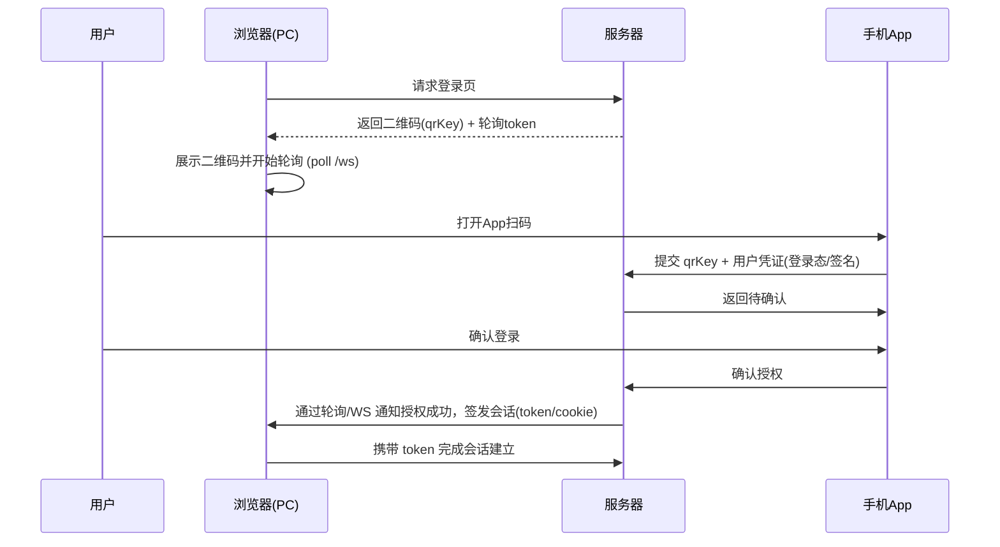

# 扫码登录的原理

## 安全要点
- 一次性 `qrKey`，短时效 + 状态机（未扫描/已扫描待确认/已确认/过期）；
- 绑定设备/用户签名，防止重放；
- HTTPS 全程、CSRF 防护、同源限制；
- 过期/撤销与多端互踢策略。

## 技术实现
- 通道：轮询、长轮询、WebSocket、SSE；
- 存储：`qrKey` 状态存储（Redis）与发布订阅；
- 体验：二维码过期倒计时与刷新；扫描后立即变更为“已扫描，等待确认”。

## 延伸阅读
- [Web 安全](../foundations/security/README.md)
- [前端网络](../foundations/network.md)
