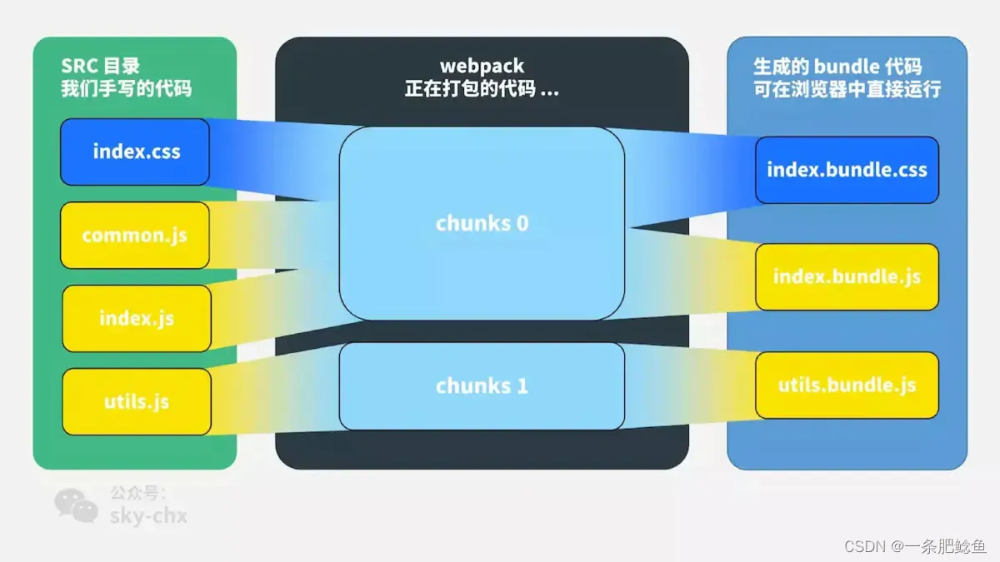
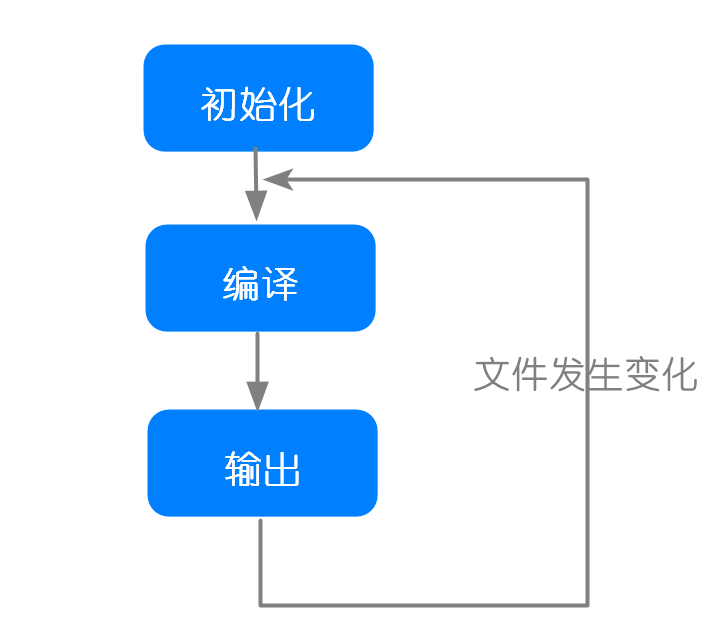

# Web Module

模块化、项目构建 

1. Node.js之CommonJS规范 

2. Node.js之npm、yarn、package.json、node_modules 

3. ES6 Module 

4. Webpack的日常使用、配置 

5. 常见Loader、Plugin 

6. 手写Webpack Plugin、Loader 

7. Webpack的构建流程 

8. Webpack优化前端的手段 

9. 认识rollup 拓展提升

# Webpack

## bundle chunk module 区别

[不会还有人不知道module、bundle和chunk的区别吧？_moduleresolution bundle_jason--slw的博客-CSDN博客](https://blog.csdn.net/Jasonslw/article/details/124028176)

[webpack 中，module，chunk 和 bundle 的区别是什么？ - 卤蛋实验室 - 博客园](https://www.cnblogs.com/skychx/p/webpack-module-chunk-bundle.html)

module，chunk 和 bundle 其实就是同一份逻辑代码在不同转换场景下的取了三个名字：
我们直接写出来的是 module，webpack 处理时是 chunk，最后生成浏览器可以直接运行的 bundle。



## webpack 的打包流程

Webpack的运行流程是一个串行的过程，从启动到结束依次执行以下流程：

1. `初始化`：启动构建，读取与合并配置参数，加载 Plugin，实例化 Compiler。
2. `编译`：从 Entry 发出，针对每个 Module 串行调用对应的 Loader 去翻译文件内容，再找到该 Module 依赖的 Module，递归地进行编译处理。
3. `输出`：对编译后的 Module 组合成 Chunk，把 Chunk 转换成文件，输出到文件系统。

如果只执行一次构建，以上阶段将会按照顺序各执行一次。但在开启监听模式下，流程将变为如下：



下面具体介绍一下webpack的三个大阶段具体的小步。

### 初始化阶段

初始化阶段大致分为：

- 合并shell和**配置文件文件**的参数并且**实例化Complier对象**。
- **加载插件**
- **处理入口**

| 事件名 | 解释 |
| --- | --- |
| 初始化参数 | 从配置文件和 Shell 语句中读取与合并参数，得出最终的参数。 这个过程中还会执行配置文件中的插件实例化语句 new Plugin()。 |
| 实例化 Compiler | 用上一步得到的参数初始化Compiler实例，Compiler负责文件监听和启动编译。Compiler实例中包含了完整的Webpack配置，全局只有一个Compiler实例。 |
| 加载插件 | 依次调用插件的apply方法，让插件可以监听后续的所有事件节点。同时给插件传入compiler实例的引用，以方便插件通过compiler调用Webpack提供的API。 |
| environment | 开始应用Node.js风格的文件系统到compiler对象，以方便后续的文件寻找和读取。 |
| entry-option | 读取配置的Entrys，为每个Entry实例化一个对应的EntryPlugin，为后面该Entry的递归解析工作做准备。 |
| after-plugins | 调用完所有内置的和配置的插件的apply方法。 |
| after-resolvers | 根据配置初始化完resolver，resolver负责在文件系统中寻找指定路径的文件。 |

### 编译阶段

| 事件名 | 解释 |
| --- | --- |
| before-run | 清除缓存 |
| run | 启动一次新的编译。 |
| watch-run | 和run类似，区别在于它是在监听模式下启动的编译，在这个事件中可以获取到是哪些文件发生了变化导致**重新启动**一次新的编译。 |
| compile | 该事件是为了告诉插件一次**新的**编译将要启动，同时会给插件带上compiler对象。 |
| compilation | 当Webpack以开发模式运行时，每当检测到文件变化，一次新的Compilation将被创建。一个Compilation对象包含了当前的模块资源、编译生成资源、变化的文件等。Compilation对象也提供了很多事件回调供插件做扩展。 |
| make | 一个新的Compilation创建完毕，即将从Entry开始读取文件，根据文件类型和配置的Loader对文件进行编译，编译完后再找出该文件依赖的文件，递归的编译和解析。 |
| after-compile | 一次Compilation执行完成。这里会根据编译结果 合并出我们最终生成的文件名和文件内容。 |
| invalid | 当遇到文件不存在、文件编译错误等异常时会触发该事件，该事件不会导致Webpack退出。 |

这里主要最重要的就是compilation过程，compilation实际上就是调用相应的loader处理文件生成chunks并对这些chunks做优化的过程。几个关键的事件（Compilation对象this.hooks中）：

| 事件名 | 解释 |
| --- | --- |
| build-module | 使用对应的Loader去转换一个模块。 |
| normal-module-loader | 在用Loader对一个模块转换完后，使用acorn解析转换后的内容，输出对应的抽象语法树（AST），以方便Webpack后面对代码的分析。 |
| program | 从配置的入口模块开始，分析其AST，当遇到require等导入其它模块语句时，便将其加入到**依赖的模块列表**，同时对新找出的**依赖模块递归分析**，最终搞清所有模块的**依赖关系**。 |
| seal | 所有模块及其**依赖**的模块都通过Loader转换完成后，根据依赖关系开始生成Chunk。 |

### 输出阶段

| 事件名 | 解释 |
| --- | --- |
| should-emit | 所有需要输出的文件已经生成好，询问插件哪些文件需要输出，哪些不需要。 |
| emit | 确定好要输出哪些文件后，执行文件输出，可以在这里获取和修改输出内容。 |
| after-emit | 文件输出完毕。 |
| done | 成功完成一次完成的编译和输出流程。 |
| failed | 如果在编译和输出流程中遇到异常导致Webpack退出时，就会直接跳转到本步骤，插件可以在本事件中获取到具体的错误原因。 |

## 打包，webpack和gulp的区别

**Gulp：**

Gulp是一个自动化构建**工具**，强调的是前端开发的流程，通过配置一系列的task，定义task处理的事物，然后定义执行顺序，来让Gulp执行task，从而构建前端项目的流程，说白了就是用来打包项目。

不管做什么功能，都有一个统一的接口进行管理，必须去注册一个任务，然后去执行，这也是它的特点之一，即“任务化”。

**WebPack：**

WebPack是一个前端模块化**方案**，侧重模块打包，把开发中的所有资源（图片、js文件、css文件等）都看成模块，通过loader（加载器）和plugins（插件）对资源进行处理，打包成符合生产环境部署的前端资源，Gulp也可以配置seajs、requirejs甚至webpack的插件。

它会分析你的项目结构，找到JS模块以及那些浏览器不能够直接运行的扩展语言（如：TypeScript等），然后将其转换和打包为合适的格式供浏览器使用。**它最大的优点就是“模块化”（万物皆模块）。** 相同点：

- 都可以对文件进行合并与压缩（JS、CSS）。

不同点：

- Gulp是构建工具，可以配合各种插件做css.压缩等，解放了双手，实现了自动化。
- Gulp严格上讲，它旨在规范前端开发流程，不包括模块化功能。
- WebPack是文件打包工具，可把各个项目的css.压缩文件等打包合并成一个或多个文件，主要就是应用于模块化操作。
- WebPack更是明显强调模块化开发，而那些文件压缩合并、预处理等功能，只是他附带的功能。
- WebPack整合了Gulp的优点，当我们想要一步一步来配置自己的环境时，那么gulp就可以满足我们的需要，但是如果我们想一下就配备大部分我们所需要的环境，那么此时可以选用WebPack，前提是写好package.json。
- gulp与webpack上是互补的，还是可替换的，取决于你项目的需求，它们可不存在冲突的关系哈。
- Gulp与WebPack可以组合起来使用，以便快速编译（依靠Gulp丰富的组件可以让JS与HTML实现联动，从而控制WebPack应用程序，达到高自动化）

## **vite和webpack**

[vite和webpack的区别 • Worktile社区](https://worktile.com/kb/p/52284)

[简述Webpack和Vite的区别 - 掘金](https://juejin.cn/post/7229314985044951095)

## 常见 plugin

[webpack常用插件，走起~ - 掘金](https://juejin.cn/post/6844903918862860301)

### 1. HTML文件生成插件：html-webpack-plugin

**产生背景**：多入口时，当你的 `index.html` 引入多个js，如果这些生成的js名称构成有 `[hash]` ，那么每次打包后的文件名都是变化的。

**作用**：`HtmlWebpackPlugin` 在此可以用于自动重新生成一个index.html或依据模板生成，帮你把所有生产的js文件引入到html中，最终生成到output目录。

**安装**：

```bash

复制代码
npm install --save-dev html-webpack-plugin

```

**配置**：

```bash

复制代码
//引入
const HtmlWebpackPlugin = require('html-webpack-plugin');
//配置
plugins: [
    new HtmlWebpackPlugin()
]

```

当然，如上是单个页面的配置，如果需要设置多个页面的配置，需要实例化多个HtmlWebpackPlugin对象，另外我们也可以对其进行参数配置：

```bash

复制代码
const htmlWebPackConfig = {
    title: 'Hello Webpack', // 配置模板title
    template: '', // 模板来源html文件
    filename: 'index.html', // 生成的模板文件名
    favicon: '', // 指定页面的图标
    hash: true, // 是否生成hash添加在引入文件地址的末尾 默认为true
    inject: '', // 引入模板的注入位置 取值有（true/false/body/head）
    minify: { // 对生成的html文件进行压缩，默认是false
        collapseWhitespace: true, // 是否去除空格
        removeAttributeQuotes: true, // 去掉属性引用
        caseSensitive: false, // 是否大小写敏感
        removeComments: true, // 去掉注释
    },
    cache: true, // 表示内容变化的时候生成一个新的文件， 默认true
    showErrors: true, // 是否将错误信息写在页面， 默认true
    chunks: ['index'], // 引入模块，指的是entry中设置的多个js,这里是执行js, 否则引入全部
};

```

注意：如上是为了方便表述，横向标写注释，请大家使用的时候使用严谨的json格式哦~

### 2. 图片压缩插件：imagemin-webpack-plugin

**产生背景**：图片过大，加载速度慢，浪费存储空间。

**作用**：批量压缩图片。

**安装**：

```bash

复制代码
npm install --save-dev imagemin-webpack-plugin

```

**配置**：

```bash

复制代码
//引入插件
var ImageminPlugin = require('imagemin-webpack-plugin').default;

//配置
plugins: [
    new ImageminPlugin({
      disable: process.env.NODE_ENV !== 'production', // 开发时不启用
      pngquant: {//图片质量
        quality: '95-100'      }
    })
]

```

### 3. 清空文件夹插件：clean-webpack-plugin

**产生背景**：每次进行打包需要手动清空目标文件夹。

**作用**：每次打包时先清空output文件夹。

**安装**：

```bash

复制代码
npm install --save-dev clean-webpack-plugin

```

**配置**：

```bash

复制代码
//引入
const CleanWebpackPlugin = require('clean-webpack-plugin');
//清空dist文件夹
plugins: [
  new CleanWebpackPlugin(['dist'])
]

```

### 4. 提供全局变量插件

**产生背景**：每次进行import引入全局模块，很麻烦。

**作用**：可以导入到全局，之后不用再在每个页面import。

**无需安装**：

```bash

复制代码
内置插件: webpack.ProvidePlugin

```

**配置**：

```bash

复制代码
//这些变量不必再import了
new webpack.ProvidePlugin({
    jQuery: 'jquery',
    React: 'react',
    ReactDOM: 'react-dom',
    Component: ['react','Component'] // 导出react模块中的Component
})

```

### 5. 公共代码抽取插件

**产生背景**：`CommonsChunkPlugin` 已弃用，使用`optimization.splitChunks`代替，像我们项目中会多次引用到一些公共模块，或者第三方类库，会进行重复打包。

**作用**：提取被重复引入的文件，单独生成一个或多个文件，这样避免在多入口重复打包文件。

**安装**：

```bash

复制代码
无需安装，内置

```

**配置**：

```bash

复制代码
optimization: {
    //打包 第三方库
    //打包 公共文件
    splitChunks: {
        cacheGroups: {
            vendor:{//node_modules内的依赖库
                chunks:"all",
                test: /[\\/]node_modules[\\/]/,
                name:"vendor",
                minChunks: 1, //被不同entry引用次数(import),1次的话没必要提取
                maxInitialRequests: 5,
                minSize: 0,
                priority:100,
                // enforce: true?
            },
            common: {// ‘src/js’ 下的js文件
                chunks:"all",
                test:/[\\/]src[\\/]js[\\/]/,//也可以值文件/[\\/]src[\\/]js[\\/].*\.js/,
                name: "common", //生成文件名，依据output规则
                minChunks: 2,
                maxInitialRequests: 5,
                minSize: 0,
                priority:1
            }
        }
    }
}

```

**配合 runtimeChunk 使用：**

`optimization.runtimeChunk` 用来提取 entry chunk 中的 runtime部分函数，形成一个单独的文件，这部分文件不经常变换，方便做缓存。

`runtimeChunk`将入口提取出来，这样入口文件可以很快加载，并且当哪里有改动的时候，只有改动的地方和这个文件有变化。

**配置：**

```bash

复制代码
runtimeChunk: {
  name: 'manifest'}

```

### 6. css提取插件：mini-css-extract-plugin （生产模式）

**产生背景**：在进行打包时，css代码会打包到JS中，不利于文件缓存。

**作用**：依据每个entry生成单个css文件（将css从js中提取出来）。

**安装**：

```bash

复制代码
npm install --save-dev mini-css-extract-plugin

```

**配置**：

```bash

复制代码
const MiniCssExtractPlugin = require('mini-css-extract-plugin');
plugins: [
  new MiniCssExtractPlugin(),
]

```

**注意：**

- 不要在开发模式使用，因为不支持热加载
- 如果单入口，不需要这个

### 7. css 去除无用的样式

**产生背景**：编写的css可能出现冗余情况。

**作用**：去除冗余的css代码。

**安装**：

```bash

复制代码
npm install --save-dev purifycss-webpack

```

**配置**：

```bash

复制代码
const purifycssWebpack = require('purifycss-webpack');
const glob = require('glob');

// Make sure this is after ExtractTextPlugin!
new purifycssWebpack({
　　paths: glob.sync(path.resolve('./src/*.html'))
}),

```

**注意：**html文件生成 > css提取 > css摇树

### 8. 文件复制插件：copy-webpack-plugin

**产生背景**：一些静态资源（图片、字体等），在编译时，需要拷贝到输出文件夹。

**作用**：用来复制文件或文件夹。

**安装**：

```bash

复制代码
npm install --save-dev copy-webpack-plugin

```

**配置**：

```bash

复制代码
// 引入
const CopyPlugin = require('copy-webpack-plugin');

module.exports = {
  plugins: [
    new CopyPlugin([
      { from: 'source', to: 'dist' },
      { from: 'other/xx.js', to: 'dist' },
    ]),
  ],
};

```

## 动态 import 原理

[webpack | 动态导入语法import - 掘金](https://juejin.cn/post/6899640414446780430?from=search-suggest)

[webpack动态import以及模块联邦 - 掘金](https://juejin.cn/post/7285184691418349587?from=search-suggest)

# Other

### babel

[【建议改成】读完这篇你还不懂Babel我给你寄口罩 - 掘金](https://juejin.cn/post/6844904065223098381)

### CSS module

[CSS Modules入门教程 - 糊糊糊糊糊了](https://rynxiao.com/%E6%8A%80%E6%9C%AF/2018/08/26/css-modules-tutorial.html)

## CommonJS规范

CommonJS规范加载模块是同步的，只有加载完成，才能执行后面的操作。

CommonJS规范中的module、exports和require

- 每个文件就是一个模块，有自己的作用域。每个模块内部，module变量代表当前模块，是一个对象，它的exports属性（即module.exports）是对外的接口。
- module.exports属性表示当前模块对外输出的接口，其他文件加载该模块，实际上就是读取module.exports变量。
- 为了方便，Node为每个模块提供一个exports变量，指向module.exports。

```jsx
let exports = module.exports;
```

- require命令用于加载模块文件。

使用示例：

```jsx
  //name.jsexports.name = function () {    return '李婷婷'}; //导出//getName.jslet getName = require('name'); //引入
```

注：不能直接将exports变量指向一个值，因为这样等于切断了exports与module.exports的联系：如下

```jsx
exports = function (x) {    console.log(x)}
```

如果一个模块的对外接口，就是一个单一的值，不能使用exports输出，只能使用module.exports输出。

CommonJS模块导入用require，导出用module.exports。导出的对象需注意，如果是静态值，而且非常量，后期可能会有所改动的，请使用函数动态获取，否则无法获取修改值。导入的参数，是可以随意改动的，所以使用时要注意

## ES6 module 和 CommonJS module 的区别

- 为**CommonJS**的require语法是同步的，所以就导致了**CommonJS** 模块规范只适合用在服务端，而ES6模块无论是在浏览器端还是服务端都是可以使用的，但是在服务端中，还需要遵循一些特殊的规则才能使用 ；
- **CommonJS** 模块输出的是一个值的拷贝，而ES6 模块输出的是值的引用；
- **CommonJS** 模块是运行时加载，而ES6 模块是编译时输出接口，使得对JS的模块进行静态分析成为了可能
- 因为两个模块加载机制的不同，所以在对待循环加载的时候，它们会有不同的表现。**CommonJS** 遇到循环依赖的时候，只会输出已经执行的部分，后续的输出或者变化，是不会影响已经输出的变量。而ES6模块相反，使用import加载一个变量，变量不会被缓存，真正取值的时候就能取到最终的值；
- 关于模块顶层的this指向问题，在**CommonJS**顶层，this指向当前模块；而在ES6模块中，this指向undefined；
- 关于两个模块互相引用的问题，在ES6模块当中，是支持加载**CommonJS**模块的。但是反过来，**CommonJS** 并不能requireES6模块，在NodeJS中，两种模块方案是分开处理的。

## ES6 module、CommonJS module 循环引用的问题

循环加载指的是a脚本的执行依赖b脚本，b脚本的执行依赖a脚本

1. CommonJS模块是加载时执行。一旦出现某个模块被“循环加载”，就只输出已经执行的部分，没有执行的部分不会输出。
2. ES6模块对导出模块，变量，对象是动态引用，遇到模块加载命令import时不会去执行模块，只是生成一个指向被加载模块的引用。
    
    CommonJS模块规范主要适用于后端Node.js，后端Node.js是同步模块加载，所以在模块循环引入时模块已经执行完毕。推荐前端工程中使用ES6的模块规范，通过安装Babel转码插件支持ES6模块引入的语法。
    

**解析：**

1. CommonJS模块的加载原理

CommonJS模块就是一个脚本文件，require命令第一次加载该脚本时就会执行整个脚本，然后在内存中生成该模块的一个说明对象。

```jsx
{    id: '',  //模块名，唯一        exports:    {  //模块输出的各个接口    ...    },    loaded: true,  //模块的脚本是否执行完毕...}
```

以后用到这个模块时，就会到对象的exports属性中取值。即使再次执行require命令，也不会再次执行该模块，而是到缓存中取值。

CommonJS模块是加载时执行，即脚本代码在require时就全部执行。一旦出现某个模块被“循环加载”，就只输出已经执行的部分，没有执行的部分不会输出。

案例说明：

案例来源于Node官方说明：[nodejs.org/api/modules…](https://nodejs.org/api/modules.html#modules_cycles)

```jsx
//a.jsexports.done = false;var b = require('./b.js');console.log('在a.js中，b.done = %j', b.done);exports.done = true;console.log('a.js执行完毕！')//b.jsexports.done = false;var a = require('./a.js');console.log('在b.js中，a.done = %j', a.done);exports.done = true;console.log('b.js执行完毕！')//main.jsvar a = require('./a.js');var b = require('./b.js');console.log('在main.js中，a.done = %j, b.done = %j', a.done, b.done);
```

输出结果如下：

```
//node环境下运行main.js
node main.js

在b.js中，a.done = false
b.js执行完毕！
在a.js中，b.done = true
a.js执行完毕！
在main.js中，a.done = true, b.done = true
```

JS代码执行顺序如下：

1）main.js中先加载a.js，a脚本先输出done变量，值为false，然后加载b脚本，a的代码停止执行，等待b脚本执行完成后，才会继续往下执行。

2）b.js执行到第二行会去加载a.js，这时发生循环加载，系统会去a.js模块对应对象的exports属性取值，因为a.js没执行完，从exports属性只能取回已经执行的部分，未执行的部分不返回，所以取回的值并不是最后的值。

3）a.js已执行的代码只有一行，exports.done = false;所以对于b.js来说，require a.js只输出了一个变量done，值为false。往下执行console.log(‘在b.js中，a.done = %j’, a.done);控制台打印出：

```
在b.js中，a.done = false
```

4）b.js继续往下执行，done变量设置为true，console.log(‘b.js执行完毕！’)，等到全部执行完毕，将执行权交还给a.js。此时控制台输出：

```
b.js执行完毕！
```

5）执行权交给a.js后，a.js接着往下执行，执行console.log(‘在a.js中，b.done = %j’, b.done);控制台打印出：

```
在a.js中，b.done = true
```

6）a.js继续执行，变量done设置为true，直到a.js执行完毕。

```
a.js执行完毕！
```

7）main.js中第二行不会再次执行b.js，直接输出缓存结果。最后控制台输出：

```
在main.js中，a.done = true, b.done = true
```

总结：

1）在b.js中，a.js没有执行完毕，只执行了第一行，所以循环加载中，只输出已执行的部分。

2）main.js第二行不会再次执行，而是输出缓存b.js的执行结果。exports.done = true;

1. ES6模块的循环加载

ES6模块与CommonJS有本质区别，ES6模块对导出变量，方法，对象是动态引用，遇到模块加载命令import时不会去执行模块，只是生成一个指向被加载模块的引用，需要开发者保证真正取值时能够取到值，只要引用是存在的，代码就能执行。

案例说明：

```jsx
//even.jsimport {odd} from './odd';var counter = 0;export function even(n) {    counter++;    console.log(counter);    return n == 0 || odd(n - 1);}复制代码//odd.jsimport {even} from './even.js';export function odd(n) {    return n != 0 && even(n - 1);}复制代码//index.jsimport * as m from './even.js';var x = m.even(5);console.log(x);var y = m.even(4);console.log(y);
```

**执行index.js，输出结果如下：**

```jsx
babel - nodeindex.js123false456true
```

可以看出counter的值是累加的，ES6是动态引用。如果上面的引用改为CommonJS代码，会报错，因为在odd.js里，even.js代码并没有执行。改成CommonJS规范加载的代码为：

```jsx
//even.jsvar odd = require('./odd.js');var counter = 0;module.exports = function even(n) {    counter++;    console.log(counter);    return n == 0 || odd(n - 1);}//odd.jsvar even = require('./even.js');module.exports = function odd(n) {    return n != 0 && even(n - 1);}//index.jsvar even = require('./even.js');var x = even(5);console.log(x);var y = even(5);console.log(y);
```

**执行index.js，输出结果如下：**

```
$ babel-node index.js
1
/Users/name/Projects/node/ES6/odd.1.js:6
    return n != 0 && even(n - 1);
                     ^

TypeError: even is not a function
    at odd (/Users/name/Projects/node/ES6/odd.1.js:4:22)
```

## ES6 module 动态加载 编译后

## 幽灵依赖

[幽灵依赖所引出的知识！ - 掘金](https://juejin.cn/post/7226610046833442872)

[resource](resource.md)
