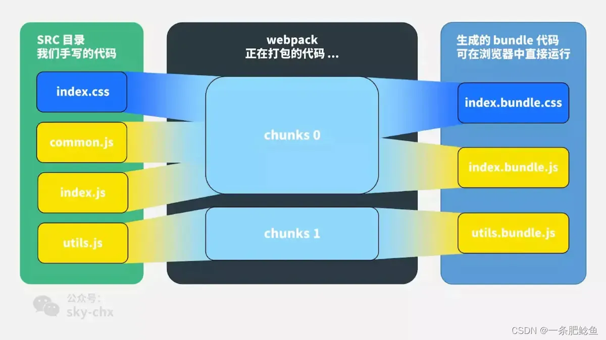

# Webpack 基础

## module / chunk / bundle 的区别

参考：

- https://www.cnblogs.com/skychx/p/webpack-module-chunk-bundle.html
- https://blog.csdn.net/Jasonslw/article/details/124028176

简述：同一份逻辑代码在不同阶段的称谓不同：

- 我们直接编写的是 module
- Webpack 处理过程中形成 chunk
- 最终生成浏览器可直接运行的 bundle

## 打包流程（概览）

Webpack 的运行流程呈串行执行：

1. 初始化：读取与合并配置参数，加载 Plugin，实例化 Compiler。
2. 编译：从 Entry 出发，按 Loader 翻译每个 Module，解析依赖并递归处理。
3. 输出：把编译后的 Module 组合成 Chunk，转换为文件输出到文件系统。

监听模式下的流程：

关键阶段要点：

- 初始化：合并 CLI/配置参数 → 实例化 Compiler → 加载插件 → 处理入口
- 编译期常见钩子：`before-run`、`run`、`watch-run`、`compile`、`compilation`、`make`、`after-compile`、`invalid`
- Compilation 过程：使用 Loader 转换模块、生成 AST、收集依赖、优化、封装为 Chunk、生成产物文件

更多实践与插件：见 `./plugins.md`。

