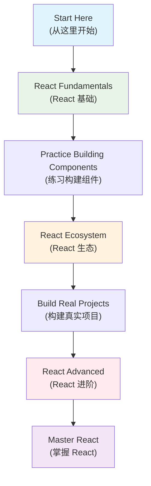

# React Complete Learning Guide (React 完整学习指南)

Comprehensive React documentation organized into well-structured, larger documents (全面的 React 文档，组织成结构良好的大型文档) following modern documentation best practices (遵循现代文档最佳实践).

---

## 📚 Core Documentation (核心文档)

### 🎯 [React Fundamentals (React 基础)](./react-fundamentals.md)
**Complete guide to React core concepts (React 核心概念完整指南)**

Covers all fundamental React concepts in a single comprehensive document (在一个综合文档中涵盖所有 React 基础概念):
- ✅ **React Features Overview (React 特性概览)** - JSX, Virtual DOM, Component-based architecture (JSX、虚拟 DOM、基于组件的架构)
- ✅ **Virtual DOM and Diff Algorithm (虚拟 DOM 与 Diff 算法)** - Internal workings and optimization (内部工作原理和优化)
- ✅ **Component Fundamentals (组件基础)** - Function vs Class components, Props vs State (函数与类组件，Props 与 State)
- ✅ **React Hooks (React 钩子)** - useState, useEffect, and other essential hooks (useState、useEffect 和其他基本钩子)
- ✅ **Component Lifecycle (组件生命周期)** - Complete lifecycle methods reference (完整的生命周期方法参考)
- ✅ **Event System (事件系统)** - Synthetic events and performance optimization (合成事件和性能优化)

### 🚀 [React Advanced (React 进阶)](./react-advanced.md)
**Complete guide to React internal architecture and advanced concepts (React 内部架构与高级概念完整指南)**

Advanced React concepts for experienced developers (面向有经验开发者的高级 React 概念):
- ✅ **React Internal Architecture (React 内部架构)** - Rendering pipeline and architecture layers (渲染管道和架构层次)
- ✅ **Fiber Architecture (Fiber 架构)** - Modern reconciliation algorithm (现代协调算法)
- ✅ **Advanced Component Patterns (高级组件模式)** - HOC, Render Props, Compound Components (HOC、渲染属性、复合组件)
- ✅ **Performance Optimization (性能优化)** - React.memo, useMemo, useCallback, Code Splitting (React.memo、useMemo、useCallback、代码分割)
- ✅ **Error Handling and Boundaries (错误处理与边界)** - Error boundaries and best practices (错误边界和最佳实践)
- ✅ **Animation and Transitions (动画与过渡)** - Animation libraries and performance tips (动画库和性能提示)

### 🔄 [React Ecosystem (React 生态)](./state-and-communication.md)
**State management, communication, and routing (状态管理、通信与路由)**

Complete ecosystem guide covering (完整的生态系统指南，涵盖):
- ✅ **Component Communication (组件通信)** - Props, callbacks, context patterns (Props、回调、上下文模式)
- ✅ **State Management (状态管理)** - Local state, Context API, Redux, Zustand (本地状态、Context API、Redux、Zustand)
- ✅ **React Router (React 路由)** - Navigation, routing patterns, and best practices (导航、路由模式和最佳实践)
- ✅ **Decision Trees (决策树)** - When to use which state management solution (何时使用哪种状态管理解决方案)

---

## 📊 Documentation Features (文档特性)

### 🎨 Rich Visual Content (丰富的视觉内容)
- **15+ Comprehensive Tables (15+ 个综合表格)** - Feature comparisons, method references, best practices (特性对比、方法参考、最佳实践)
- **10+ Mermaid Diagrams (10+ 个 Mermaid 图表)** - Architecture flows, decision trees, lifecycle visualizations (架构流程、决策树、生命周期可视化)
- **Interactive Examples (交互示例)** - Code samples with explanations (带解释的代码示例)

### 🌐 Bilingual Learning Support (双语学习支持)
- **English Technical Terms First (英文技术术语优先)** - Professional terminology in English (专业术语使用英文)
- **Chinese Translations (中文翻译)** - Supporting Chinese explanations in parentheses (括号中的中文解释支持)
- **Consistent Format (一致格式)** - Standardized bilingual presentation (标准化双语呈现)

### 📖 Well-Structured Content (结构良好的内容)
- **Comprehensive Coverage (全面覆盖)** - From basics to advanced topics (从基础到高级主题)
- **Clear Navigation (清晰导航)** - Table of contents and cross-references (目录和交叉引用)
- **Practical Focus (实用重点)** - Real-world examples and best practices (实际示例和最佳实践)

---

## 🔗 Additional Resources (其他资源)

- **[React vs Vue Comparison (React vs Vue 对比)](../comparisons-renamed.md)** - Framework comparison guide (框架对比指南)
- **[Reference Resources (参考资源)](./resource.md)** - External links and documentation (外部链接和文档)

---

## 📈 Learning Path Recommendation (学习路径推荐)

### Recommended Study Order (推荐学习顺序)

1. **Start with Fundamentals (从基础开始)** - Master core concepts before moving to advanced topics (在学习高级主题之前掌握核心概念)
2. **Practice with Ecosystem (生态系统实践)** - Learn state management and routing (学习状态管理和路由)
3. **Advance to Internal Architecture (进阶到内部架构)** - Understand how React works under the hood (了解 React 的内部工作原理)

---

*This documentation follows the principle of "larger, well-structured documents" (本文档遵循"更大、结构良好的文档"原则) for better learning experience and reduced fragmentation (以获得更好的学习体验并减少碎片化).*
