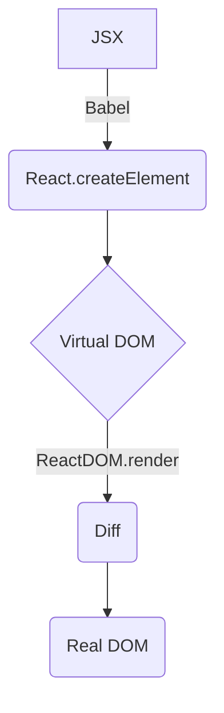

# React Fundamentals: Features, Virtual DOM, Lifecycle, Event System (React 基础：特性、虚拟 DOM、生命周期、事件系统)

## React Features Overview (React 特性概览)

- JSX Syntax (JSX 语法): Describe UI structure within JavaScript (在 JavaScript 中描述 UI 结构)
- Unidirectional Data Flow (单向数据流): Top-down data flow for easier reasoning (自上而下的数据流动，便于推理)
- Virtual DOM (虚拟 DOM): Efficient updates based on Diff algorithm (基于 Diff 算法的高效更新)
- Declarative Programming (声明式编程): Describe state, React handles rendering (描述状态，React 负责渲染)
- Component-Based (组件化): Reusability and composition (复用与组合)

---

## Virtual DOM and Diff Algorithm (虚拟 DOM 与 Diff 算法要点)

- Virtual DOM (虚拟 DOM) is a JavaScript object representation of the real DOM (是对真实 DOM 的 JS 对象描述), created uniformly by `React.createElement` (统一由 `React.createElement` 创建)
- Rendering Process (渲染流程): JSX → Babel transformation (Babel 转换) → Virtual DOM → Diff → Real DOM (真实 DOM)
- Key Diff Strategies (Diff 关键策略):
  - Same-level comparison (同层比较): Cross-level changes are treated as delete + create (跨层视为删除+创建)
  - Different component types (组件类型不同): Direct replacement (直接替换)
  - Same-level lists (同层列表): Use `key` for identification, moving/reusing nodes (用 `key` 识别、移动/复用节点)

Proper `key` selection (良好 `key` 选择) can significantly reduce unnecessary rebuilding and state confusion (可显著降低不必要的重建与状态错乱), avoid using array indices (避免用数组索引).

---

## Component Lifecycle (组件生命周期) (16.4+)

Phases (阶段): Creation (创建) → Update (更新) → Unmounting (卸载)

- **Creation (创建)**: `constructor` → `getDerivedStateFromProps` → `render` → `componentDidMount`
- **Update (更新)**: `getDerivedStateFromProps` → `shouldComponentUpdate` → `render` → `getSnapshotBeforeUpdate` → `componentDidUpdate`
- **Unmounting (卸载)**: `componentWillUnmount`

Key Points (要点):
- Never call `setState` inside `render` (在 `render` 内不要 `setState`)
- `getSnapshotBeforeUpdate` is used to read snapshots before DOM updates (用于在 DOM 更新前读取快照), with results passed to `componentDidUpdate` (结果传入 `componentDidUpdate`)

---

## Event System (事件系统) - Synthetic Events (合成事件)

- React implements cross-browser consistent synthetic events (React 实现跨浏览器一致的合成事件), uniformly mounted on the root node (统一挂载在根节点) (React 17+)
- Different execution order from native events (与原生事件执行顺序不同); stopping propagation requires distinguishing between `e.stopPropagation()` and `e.nativeEvent.stopImmediatePropagation()` use cases (阻止冒泡需区分 `e.stopPropagation()` 与 `e.nativeEvent.stopImmediatePropagation()` 的适用场景)

Event Binding Performance Impact (事件绑定方式对性能的影响):
- **Recommended (推荐)**: Constructor `bind` or class field arrow functions (构造器 `bind` 或类字段箭头函数) - created once (生成一次)
- **Avoid (避免)**: `bind/arrow functions` in `render` (在 `render` 中使用 `bind/箭头函数`) - recreated on every render (每次渲染重建函数)

---

## References (参考)

- React Official Documentation (React 官方文档): Lifecycle, Events, Virtual DOM and Diff (生命周期、事件、虚拟 DOM 与 Diff)

