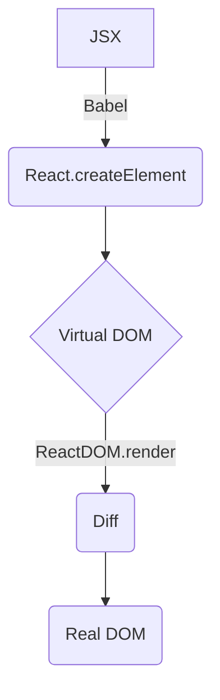

# React 基础：特性、虚拟 DOM、生命周期、事件系统

## React 特性（概览）

- JSX 语法：在 JavaScript 中描述 UI 结构
- 单向数据流：自上而下的数据流动，便于推理
- 虚拟 DOM：基于 Diff 的高效更新
- 声明式编程：描述状态，React 负责渲染
- 组件化：复用与组合

---

## 虚拟 DOM 与 Diff（要点）

- 虚拟 DOM 是对真实 DOM 的 JS 对象描述，统一由 `React.createElement` 创建
- 渲染流程：JSX → Babel 转换 → Virtual DOM → Diff → 真实 DOM
- Diff 关键策略：
  - 同层比较（跨层视为删除+创建）
  - 组件类型不同直接替换
  - 同层列表用 `key` 识别、移动/复用节点

良好 `key` 选择可显著降低不必要的重建与状态错乱，避免用数组索引。

---

## 生命周期（16.4+）

阶段：创建 → 更新 → 卸载

- 创建：`constructor` → `getDerivedStateFromProps` → `render` → `componentDidMount`
- 更新：`getDerivedStateFromProps` → `shouldComponentUpdate` → `render` → `getSnapshotBeforeUpdate` → `componentDidUpdate`
- 卸载：`componentWillUnmount`

要点：
- 在 `render` 内不要 `setState`
- `getSnapshotBeforeUpdate` 用于在 DOM 更新前读取快照，结果传入 `componentDidUpdate`

---

## 事件系统（合成事件）

- React 实现跨浏览器一致的合成事件，统一挂载在根节点（React 17+）
- 与原生事件执行顺序不同；阻止冒泡需区分 `e.stopPropagation()` 与 `e.nativeEvent.stopImmediatePropagation()` 的适用场景

事件绑定方式对性能的影响：
- 推荐：构造器 `bind` 或类字段箭头函数（生成一次）
- 避免：`render` 中 `bind/箭头函数`（每次渲染重建函数）

---

## 参考

- React 官方文档（生命周期、事件、虚拟 DOM 与 Diff）

