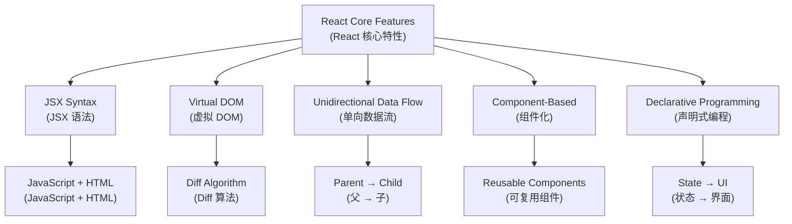
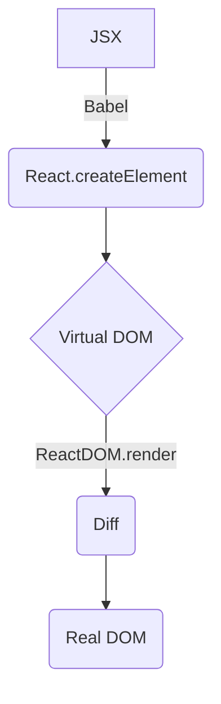
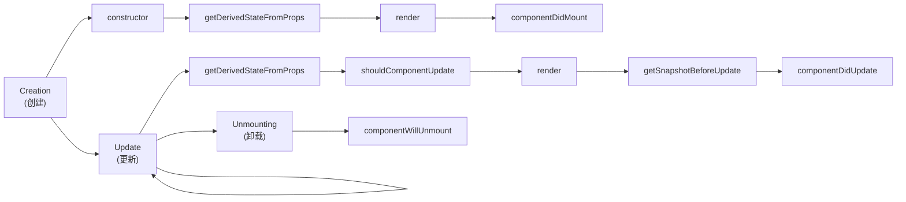
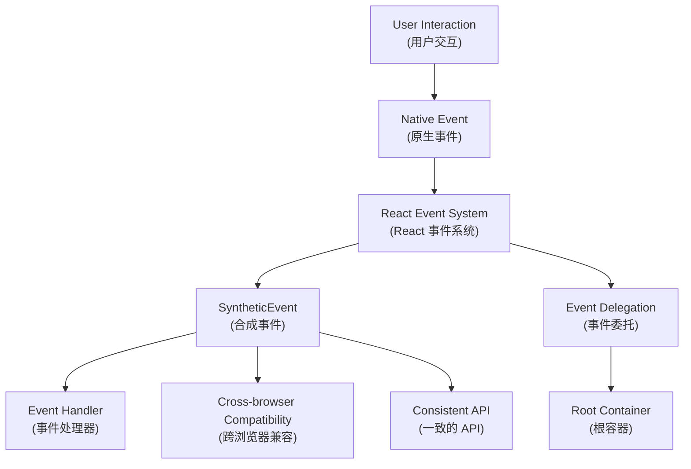
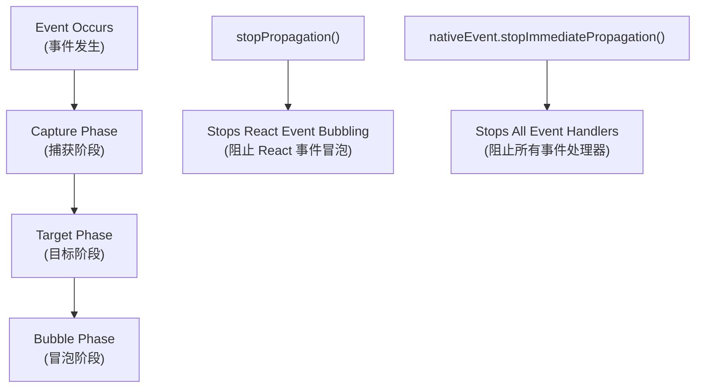

# React Fundamentals: Features, Virtual DOM, Lifecycle, Event System (React 基础：特性、虚拟 DOM、生命周期、事件系统)

## React Features Overview (React 特性概览)

| Feature (特性) | Description (描述) | Benefits (优势) |
|---|---|---|
| **JSX Syntax (JSX 语法)** | Describe UI structure within JavaScript (在 JavaScript 中描述 UI 结构) | Type safety, better tooling (类型安全，更好的工具支持) |
| **Unidirectional Data Flow (单向数据流)** | Top-down data flow for easier reasoning (自上而下的数据流动，便于推理) | Predictable state changes (可预测的状态变化) |
| **Virtual DOM (虚拟 DOM)** | Efficient updates based on Diff algorithm (基于 Diff 算法的高效更新) | Better performance (更好的性能) |
| **Declarative Programming (声明式编程)** | Describe state, React handles rendering (描述状态，React 负责渲染) | Easier to understand and debug (更容易理解和调试) |
| **Component-Based (组件化)** | Reusability and composition (复用与组合) | Modular development (模块化开发) |

---

## Virtual DOM and Diff Algorithm (虚拟 DOM 与 Diff 算法要点)

- Virtual DOM (虚拟 DOM) is a JavaScript object representation of the real DOM (是对真实 DOM 的 JS 对象描述), created uniformly by `React.createElement` (统一由 `React.createElement` 创建)
- Rendering Process (渲染流程): JSX → Babel transformation (Babel 转换) → Virtual DOM → Diff → Real DOM (真实 DOM)
- Key Diff Strategies (Diff 关键策略):
  - Same-level comparison (同层比较): Cross-level changes are treated as delete + create (跨层视为删除+创建)
  - Different component types (组件类型不同): Direct replacement (直接替换)
  - Same-level lists (同层列表): Use `key` for identification, moving/reusing nodes (用 `key` 识别、移动/复用节点)

Proper `key` selection (良好 `key` 选择) can significantly reduce unnecessary rebuilding and state confusion (可显著降低不必要的重建与状态错乱), avoid using array indices (避免用数组索引).

---

## Component Lifecycle (组件生命周期) (16.4+)

### Lifecycle Phases Overview (生命周期阶段概览)

### Lifecycle Methods Comparison (生命周期方法对比)

| Phase (阶段) | Method (方法) | Purpose (用途) | Can setState? | Common Use Cases (常见用例) |
|---|---|---|---|---|
| **Creation (创建)** | `constructor` | Initialize state and bind methods (初始化状态和绑定方法) | ✅ | Set initial state (设置初始状态) |
| | `getDerivedStateFromProps` | Sync state with props (同步状态与属性) | ❌ | Rare edge cases (罕见边缘情况) |
| | `render` | Return JSX (返回 JSX) | ❌ | Define UI structure (定义 UI 结构) |
| | `componentDidMount` | After first render (首次渲染后) | ✅ | API calls, DOM manipulation (API 调用，DOM 操作) |
| **Update (更新)** | `getDerivedStateFromProps` | Sync state with props (同步状态与属性) | ❌ | Rare edge cases (罕见边缘情况) |
| | `shouldComponentUpdate` | Control re-rendering (控制重新渲染) | ❌ | Performance optimization (性能优化) |
| | `render` | Return updated JSX (返回更新的 JSX) | ❌ | Define UI structure (定义 UI 结构) |
| | `getSnapshotBeforeUpdate` | Capture info before DOM update (DOM 更新前捕获信息) | ❌ | Scroll position (滚动位置) |
| | `componentDidUpdate` | After update (更新后) | ✅ | DOM operations, API calls (DOM 操作，API 调用) |
| **Unmounting (卸载)** | `componentWillUnmount` | Cleanup (清理) | ❌ | Remove listeners, cancel requests (移除监听器，取消请求) |

### Key Rules (关键规则)

| Rule (规则) | Explanation (解释) | Why? (为什么?) |
|---|---|---|
| Never call `setState` in `render` (render 中不要调用 setState) | Causes infinite re-render loop (导致无限重新渲染循环) | Performance and stability (性能和稳定性) |
| Use `getSnapshotBeforeUpdate` carefully (谨慎使用 getSnapshotBeforeUpdate) | Returns value passed to `componentDidUpdate` (返回值传递给 componentDidUpdate) | Maintain scroll position (维护滚动位置) |
| Clean up in `componentWillUnmount` (在 componentWillUnmount 中清理) | Prevent memory leaks (防止内存泄漏) | Resource management (资源管理) |

---

## Event System (事件系统) - Synthetic Events (合成事件)

### Event Architecture (事件架构)

### Synthetic vs Native Events Comparison (合成事件与原生事件对比)

| Aspect (方面) | Synthetic Events (合成事件) | Native Events (原生事件) |
|---|---|---|
| **Browser Compatibility (浏览器兼容性)** | Consistent across browsers (跨浏览器一致) | Browser-specific differences (浏览器特定差异) |
| **Event Delegation (事件委托)** | Automatic (自动) | Manual setup required (需要手动设置) |
| **Performance (性能)** | Optimized by React (React 优化) | Direct browser handling (浏览器直接处理) |
| **Memory Usage (内存使用)** | Event pooling (事件池化) | Individual event objects (独立事件对象) |
| **API Consistency (API 一致性)** | Standardized (标准化) | Varies by browser (因浏览器而异) |

### Event Binding Performance Comparison (事件绑定性能对比)

| Method (方法) | Performance (性能) | Memory Impact (内存影响) | Recommendation (推荐度) | Example (示例) |
|---|---|---|---|---|
| **Constructor Bind (构造器绑定)** | ✅ High (高) | ✅ Low (低) | ✅ Recommended (推荐) | `this.handleClick = this.handleClick.bind(this)` |
| **Class Field Arrow Function (类字段箭头函数)** | ✅ High (高) | ✅ Low (低) | ✅ Recommended (推荐) | `handleClick = () => {}` |
| **Render Method Bind (渲染方法绑定)** | ❌ Low (低) | ❌ High (高) | ❌ Avoid (避免) | `onClick={this.handleClick.bind(this)}` |
| **Render Arrow Function (渲染箭头函数)** | ❌ Low (低) | ❌ High (高) | ❌ Avoid (避免) | `onClick={() => this.handleClick()}` |

### Event Propagation Control (事件传播控制)

| Method (方法) | Scope (作用范围) | Use Case (使用场景) |
|---|---|---|
| `e.stopPropagation()` | React synthetic events only (仅 React 合成事件) | Prevent parent React handlers (阻止父级 React 处理器) |
| `e.nativeEvent.stopImmediatePropagation()` | All event handlers (所有事件处理器) | Prevent all handlers including native (阻止包括原生在内的所有处理器) |
| `e.preventDefault()` | Default browser behavior (默认浏览器行为) | Prevent form submission, link navigation (阻止表单提交，链接导航) |

---

## References (参考)

- React Official Documentation (React 官方文档): Lifecycle, Events, Virtual DOM and Diff (生命周期、事件、虚拟 DOM 与 Diff)

