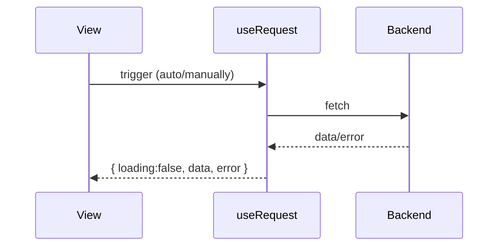

# Components and Hooks (组件与 Hooks) - Consolidated Version (合并版)

This document aggregates core component concepts (本篇聚合组件核心概念) - controlled/uncontrolled, class vs function, HOC, props vs state (受控/非受控、class vs function、HOC、props vs state) - and Hooks essentials (与 Hooks 要点) like useState/useEffect (useState/useEffect 等), reducing cross-document navigation (减少跨文跳转).

## Components Essentials (组件要点)

- **Controlled Components (受控组件)**: Form values controlled by state (表单值受 state 控制); **Uncontrolled (非受控)**: Read DOM values via ref (ref 读取 DOM 值)
- **Function components preferred (函数组件优先)**; class components for legacy and specific scenarios (类组件侧重历史与少量场景)
- **Higher-Order Components (HOC) (高阶组件)**: Reuse common logic (复用通用逻辑); pay attention to prop forwarding and forwardRef (注意透传 props 与 forwardRef)
- **Props vs State**: External input vs internal mutable data (外部输入 vs 内部可变数据); both trigger re-renders (二者皆触发渲染)

## Hooks Essentials (Hooks 要点)

- **useState**: Asynchronous/synchronous timing and dependent previous value patterns (异步/同步时机与依赖前值写法)
- **useEffect**: Side effects and cleanup (副作用与清理); equivalent lifecycle mental model (等价生命周期心智模型)
- **Other commonly used (其它常用)**: useReducer/useMemo/useCallback/useRef

### useRequest (ahooks) Minimal Pattern (useRequest（ahooks）最小范式)

- **Unified request state (统一请求状态)**: loading/data/error
- **Trigger methods (触发方式)**: Automatic/manual (自动/手动); retry on dependency changes (依赖变化重试)
- **Advanced features (高级特性)**: Debounce/throttle, polling, concurrency control (防抖/节流、轮询、并发控制)

**Recommendation (建议)**: Use `useRequest` extensively at the business component level (在业务组件层多用 `useRequest` 封装数据流) to encapsulate data flow and reduce event/state fragmentation (降低事件/状态分散度).

## Refs (Quick Notes) (refs 简记)

- **Access DOM or class instances (访问 DOM 或类实例)**; function components need `useRef` or `forwardRef` (函数组件需配合 `useRef` 或 `forwardRef`)
- **Use with caution (谨慎使用)**, prioritize data-driven approach (优先数据驱动)

## References (参考)

- React Official Documentation (React 官方文档)
- ahooks Documentation (ahooks 文档)

