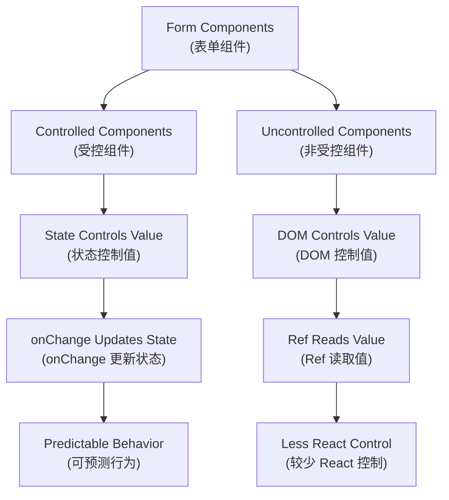
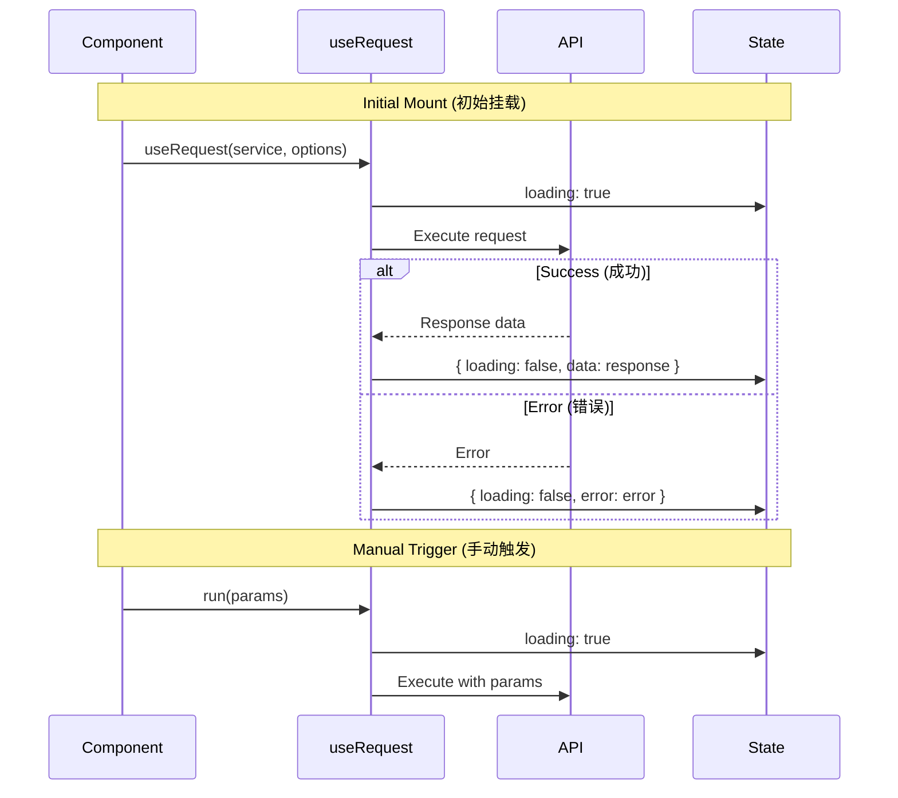

# Components and Hooks (组件与 Hooks) - Consolidated Version (合并版)

This document aggregates core component concepts (本篇聚合组件核心概念) - controlled/uncontrolled, class vs function, HOC, props vs state (受控/非受控、class vs function、HOC、props vs state) - and Hooks essentials (与 Hooks 要点) like useState/useEffect (useState/useEffect 等), reducing cross-document navigation (减少跨文跳转).

## Components Essentials (组件要点)

### Component Types Comparison (组件类型对比)

| Aspect (方面) | Function Components (函数组件) | Class Components (类组件) |
|---|---|---|
| **Syntax (语法)** | Simple function (简单函数) | ES6 class (ES6 类) |
| **State Management (状态管理)** | Hooks (useState, useReducer) (钩子) | this.state, this.setState |
| **Lifecycle (生命周期)** | useEffect and other hooks (useEffect 和其他钩子) | Lifecycle methods (生命周期方法) |
| **Performance (性能)** | Better optimization (更好的优化) | Requires manual optimization (需要手动优化) |
| **Bundle Size (包大小)** | Smaller (更小) | Larger (更大) |
| **Learning Curve (学习曲线)** | Easier (更容易) | Steeper (更陡峭) |
| **Future Support (未来支持)** | ✅ Recommended (推荐) | ⚠️ Legacy (遗留) |

### Controlled vs Uncontrolled Components (受控与非受控组件)

| Feature (特性) | Controlled (受控) | Uncontrolled (非受控) |
|---|---|---|
| **Data Source (数据源)** | React state (React 状态) | DOM element (DOM 元素) |
| **Value Access (值访问)** | Direct from state (直接从状态) | Via ref (通过 ref) |
| **Validation (验证)** | Real-time (实时) | On submit (提交时) |
| **Performance (性能)** | More re-renders (更多重新渲染) | Fewer re-renders (更少重新渲染) |
| **Use Case (使用场景)** | Dynamic forms (动态表单) | Simple forms (简单表单) |

### Props vs State Comparison (Props 与 State 对比)

| Aspect (方面) | Props | State |
|---|---|---|
| **Source (来源)** | Parent component (父组件) | Component itself (组件自身) |
| **Mutability (可变性)** | Immutable (不可变) | Mutable (可变) |
| **Purpose (目的)** | Configuration (配置) | Internal data (内部数据) |
| **Triggers Re-render (触发重新渲染)** | ✅ Yes (是) | ✅ Yes (是) |
| **Access Pattern (访问模式)** | `props.propName` | `state.stateName` |
| **Update Method (更新方法)** | Parent updates (父组件更新) | `setState` / `useState` |

## Hooks Essentials (Hooks 要点)

- **useState**: Asynchronous/synchronous timing and dependent previous value patterns (异步/同步时机与依赖前值写法)
- **useEffect**: Side effects and cleanup (副作用与清理); equivalent lifecycle mental model (等价生命周期心智模型)
- **Other commonly used (其它常用)**: useReducer/useMemo/useCallback/useRef

### useRequest (ahooks) Minimal Pattern (useRequest（ahooks）最小范式)

#### Core Features (核心特性)

| Feature (特性) | Description (描述) | Benefits (优势) |
|---|---|---|
| **Unified State (统一状态)** | `{ loading, data, error }` | Consistent API (一致的 API) |
| **Automatic Execution (自动执行)** | Runs on mount (挂载时运行) | Less boilerplate (更少样板代码) |
| **Manual Trigger (手动触发)** | `run()` method (run() 方法) | On-demand requests (按需请求) |
| **Dependency Refresh (依赖刷新)** | Auto-retry on deps change (依赖变化自动重试) | Reactive updates (响应式更新) |
| **Built-in Optimizations (内置优化)** | Debounce, throttle, polling (防抖、节流、轮询) | Better UX (更好的用户体验) |

#### Request Flow Diagram (请求流程图)

#### Usage Patterns (使用模式)

| Pattern (模式) | Code Example (代码示例) | Use Case (使用场景) |
|---|---|---|
| **Auto Request (自动请求)** | `useRequest(getUser)` | Page initialization (页面初始化) |
| **Manual Request (手动请求)** | `useRequest(getUser, { manual: true })` | Button click actions (按钮点击操作) |
| **Dependent Request (依赖请求)** | `useRequest(getUser, { refreshDeps: [userId] })` | Parameter-based refresh (基于参数刷新) |
| **Polling (轮询)** | `useRequest(getStatus, { pollingInterval: 1000 })` | Real-time updates (实时更新) |

**Recommendation (建议)**: Use `useRequest` extensively at the business component level (在业务组件层多用 `useRequest` 封装数据流) to encapsulate data flow and reduce event/state fragmentation (降低事件/状态分散度).

## Refs (Quick Notes) (refs 简记)

- **Access DOM or class instances (访问 DOM 或类实例)**; function components need `useRef` or `forwardRef` (函数组件需配合 `useRef` 或 `forwardRef`)
- **Use with caution (谨慎使用)**, prioritize data-driven approach (优先数据驱动)

## References (参考)

- React Official Documentation (React 官方文档)
- ahooks Documentation (ahooks 文档)

