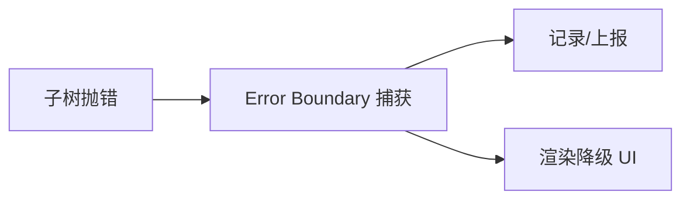

# 性能与错误处理（含动画）

## 性能优化（要点）

- 避免不必要渲染：`shouldComponentUpdate`/`PureComponent`/`React.memo`
- 缓存：`useMemo`/`useCallback`
- Fragments 避免额外标签
- 事件绑定避免在 `render` 中创建新函数
- 懒加载：`React.lazy` + `Suspense`
- 不可变数据（便于浅比较）

## 动画（react-transition-group 概览）

- 核心组件：`CSSTransition`/`SwitchTransition`/`TransitionGroup`
- className 钩子：`*-enter`、`*-enter-active`、`*-exit`、`*-exit-active`

## 错误边界（Error Boundary）

- 捕获渲染/生命周期/构造中的错误，降级 UI
- 关键 API：`static getDerivedStateFromError`、`componentDidCatch`

限制：无法捕获事件处理、异步、SSR、自身抛出的错误（需 try/catch 或全局 onerror）。

## 参考

- React 官方性能与错误边界文档
- react-transition-group 文档

