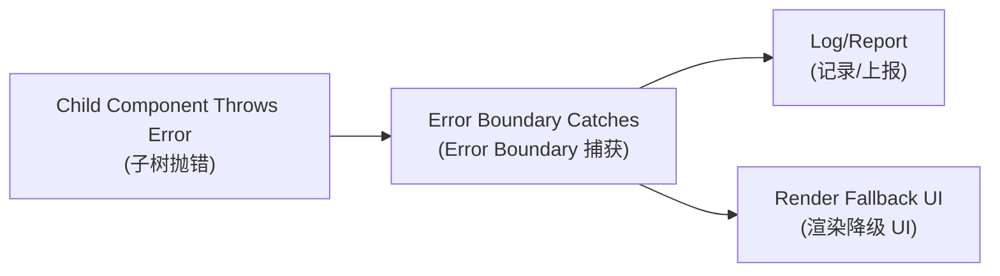

# Performance and Error Handling (性能与错误处理) - Including Animation (含动画)

## Performance Optimization Essentials (性能优化要点)

- **Avoid unnecessary renders (避免不必要渲染)**: `shouldComponentUpdate`/`PureComponent`/`React.memo`
- **Caching (缓存)**: `useMemo`/`useCallback`
- **Fragments**: Avoid extra wrapper elements (避免额外标签)
- **Event binding (事件绑定)**: Avoid creating new functions in `render` (避免在 `render` 中创建新函数)
- **Lazy loading (懒加载)**: `React.lazy` + `Suspense`
- **Immutable data (不可变数据)**: Facilitates shallow comparison (便于浅比较)

## Animation (动画) - react-transition-group Overview (概览)

- **Core components (核心组件)**: `CSSTransition`/`SwitchTransition`/`TransitionGroup`
- **className hooks (className 钩子)**: `*-enter`, `*-enter-active`, `*-exit`, `*-exit-active`

## Error Boundary (错误边界)

- **Catches errors (捕获错误)** in rendering/lifecycle/constructor (渲染/生命周期/构造中的错误), provides fallback UI (降级 UI)
- **Key APIs (关键 API)**: `static getDerivedStateFromError`, `componentDidCatch`



**Limitations (限制)**: Cannot catch errors in event handlers, async code, SSR, or errors thrown by the boundary itself (无法捕获事件处理、异步、SSR、自身抛出的错误) - these require try/catch or global onerror (需 try/catch 或全局 onerror).

### Example Error Boundary (错误边界示例)

```jsx
class ErrorBoundary extends React.Component {
  constructor(props) {
    super(props);
    this.state = { hasError: false };
  }

  static getDerivedStateFromError(error) {
    // Update state to show fallback UI
    return { hasError: true };
  }

  componentDidCatch(error, errorInfo) {
    // Log error to error reporting service
    console.error('Error caught by boundary:', error, errorInfo);
  }

  render() {
    if (this.state.hasError) {
      return <h1>Something went wrong.</h1>;
    }

    return this.props.children;
  }
}
```

## References (参考)

- React Official Performance and Error Boundary Documentation (React 官方性能与错误边界文档)
- react-transition-group Documentation (react-transition-group 文档)

