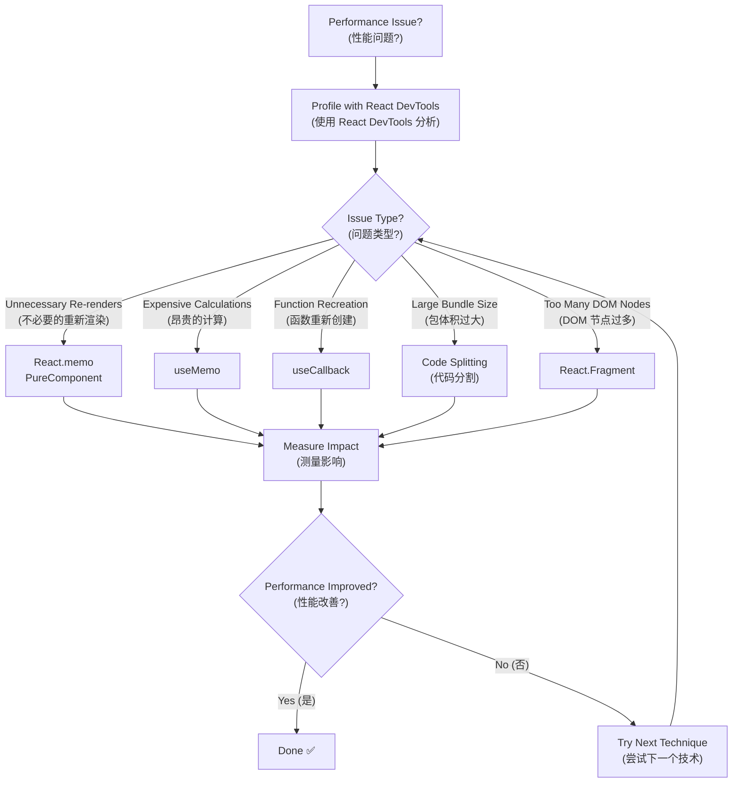
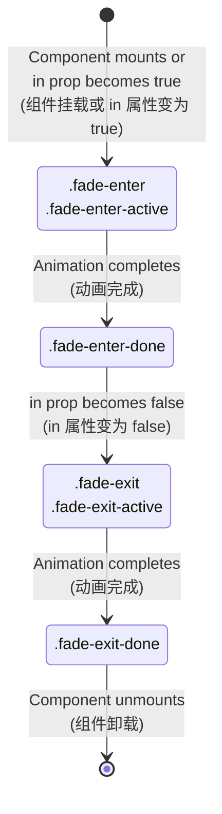
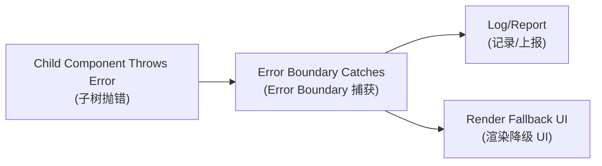

# Performance and Error Handling (性能与错误处理) - Including Animation (含动画)

## Performance Optimization Essentials (性能优化要点)

### Performance Optimization Techniques Comparison (性能优化技术对比)

| Technique (技术) | Impact (影响) | Complexity (复杂度) | Use Case (使用场景) | Example (示例) |
|---|---|---|---|---|
| **React.memo** | ⭐⭐⭐ High (高) | ⭐ Low (低) | Prevent unnecessary re-renders (防止不必要重新渲染) | `React.memo(Component)` |
| **useMemo** | ⭐⭐ Medium (中等) | ⭐⭐ Medium (中等) | Expensive calculations (昂贵计算) | `useMemo(() => expensiveCalc(), [deps])` |
| **useCallback** | ⭐⭐ Medium (中等) | ⭐⭐ Medium (中等) | Stable function references (稳定函数引用) | `useCallback(fn, [deps])` |
| **React.lazy** | ⭐⭐⭐ High (高) | ⭐⭐ Medium (中等) | Code splitting (代码分割) | `React.lazy(() => import('./Component'))` |
| **Fragments** | ⭐ Low (低) | ⭐ Low (低) | Reduce DOM nodes (减少 DOM 节点) | `<React.Fragment>` or `<>` |
| **Immutable Data** | ⭐⭐⭐ High (高) | ⭐⭐⭐ High (高) | Shallow comparison optimization (浅比较优化) | `const newState = {...oldState, updated: true}` |

### Performance Optimization Flow (性能优化流程)



### React.memo vs PureComponent vs shouldComponentUpdate (对比)

| Method (方法) | Component Type (组件类型) | Comparison Type (比较类型) | Customizable (可定制) |
|---|---|---|---|
| **React.memo** | Function Components (函数组件) | Shallow props comparison (浅层 props 比较) | ✅ Custom comparison function (自定义比较函数) |
| **PureComponent** | Class Components (类组件) | Shallow props + state comparison (浅层 props + state 比较) | ❌ Fixed behavior (固定行为) |
| **shouldComponentUpdate** | Class Components (类组件) | Custom logic (自定义逻辑) | ✅ Full control (完全控制) |

## Animation (动画) - react-transition-group Overview (概览)

### Animation Components Comparison (动画组件对比)

| Component (组件) | Use Case (使用场景) | Features (特性) | Example (示例) |
|---|---|---|---|
| **CSSTransition** | Single element transitions (单元素过渡) | CSS class-based animations (基于 CSS 类的动画) | Modal show/hide (模态框显示/隐藏) |
| **SwitchTransition** | Switching between elements (元素切换) | One element out, another in (一个元素出，另一个进) | Tab content switching (标签内容切换) |
| **TransitionGroup** | List animations (列表动画) | Multiple element transitions (多元素过渡) | Todo list items (待办事项列表) |

### CSS Transition Lifecycle (CSS 过渡生命周期)



### Animation Class Hooks Table (动画类钩子表格)

| Phase (阶段) | CSS Class (CSS 类) | Duration (持续时间) | Purpose (目的) |
|---|---|---|---|
| **Enter Start (进入开始)** | `.fade-enter` | 1 frame (1帧) | Set initial state (设置初始状态) |
| **Enter Active (进入激活)** | `.fade-enter-active` | Full transition (完整过渡) | Define transition properties (定义过渡属性) |
| **Enter Done (进入完成)** | `.fade-enter-done` | Persistent (持续) | Final state (最终状态) |
| **Exit Start (退出开始)** | `.fade-exit` | 1 frame (1帧) | Set exit initial state (设置退出初始状态) |
| **Exit Active (退出激活)** | `.fade-exit-active` | Full transition (完整过渡) | Define exit transition (定义退出过渡) |
| **Exit Done (退出完成)** | `.fade-exit-done` | Until unmount (直到卸载) | Hidden state (隐藏状态) |

## Error Boundary (错误边界)

### Error Boundary Capabilities (错误边界能力)

| Can Catch (可以捕获) | Cannot Catch (无法捕获) | Alternative Solution (替代方案) |
|---|---|---|
| **Rendering errors (渲染错误)** | **Event handlers (事件处理器)** | try/catch in handlers (在处理器中使用 try/catch) |
| **Lifecycle methods (生命周期方法)** | **Async code (异步代码)** | Promise.catch() or async/await try/catch |
| **Constructor errors (构造器错误)** | **setTimeout callbacks (setTimeout 回调)** | try/catch in callback (在回调中使用 try/catch) |
| **Child component errors (子组件错误)** | **Server-side rendering (服务端渲染)** | Server-side error handling (服务端错误处理) |
| | **Error boundary itself (错误边界自身)** | Parent error boundary (父级错误边界) |

### Error Boundary Methods Comparison (错误边界方法对比)

| Method (方法) | Purpose (目的) | Return Value (返回值) | When Called (何时调用) |
|---|---|---|---|
| **`getDerivedStateFromError`** | Update state for fallback UI (更新状态以显示降级 UI) | New state object (新状态对象) | During render phase (渲染阶段) |
| **`componentDidCatch`** | Log error information (记录错误信息) | void | After render phase (渲染阶段后) |



**Limitations (限制)**: Cannot catch errors in event handlers, async code, SSR, or errors thrown by the boundary itself (无法捕获事件处理、异步、SSR、自身抛出的错误) - these require try/catch or global onerror (需 try/catch 或全局 onerror).

### Example Error Boundary (错误边界示例)

```jsx
class ErrorBoundary extends React.Component {
  constructor(props) {
    super(props);
    this.state = { hasError: false };
  }

  static getDerivedStateFromError(error) {
    // Update state to show fallback UI
    return { hasError: true };
  }

  componentDidCatch(error, errorInfo) {
    // Log error to error reporting service
    console.error('Error caught by boundary:', error, errorInfo);
  }

  render() {
    if (this.state.hasError) {
      return <h1>Something went wrong.</h1>;
    }

    return this.props.children;
  }
}
```

## References (参考)

- React Official Performance and Error Boundary Documentation (React 官方性能与错误边界文档)
- react-transition-group Documentation (react-transition-group 文档)

