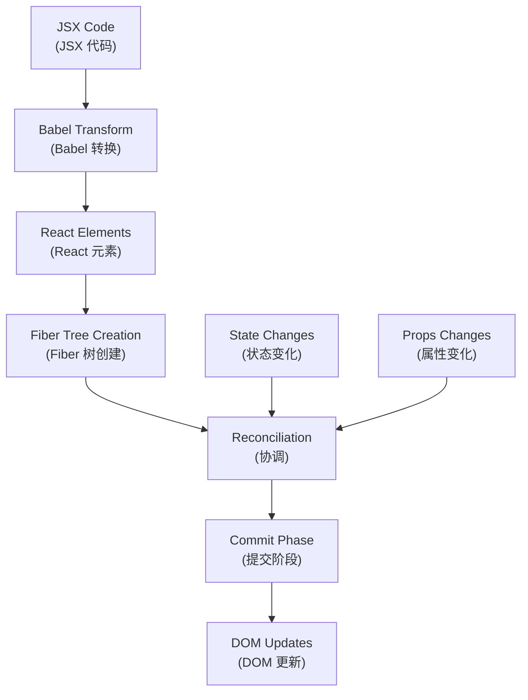
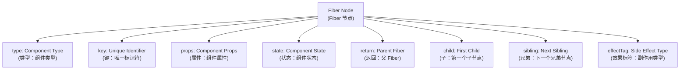
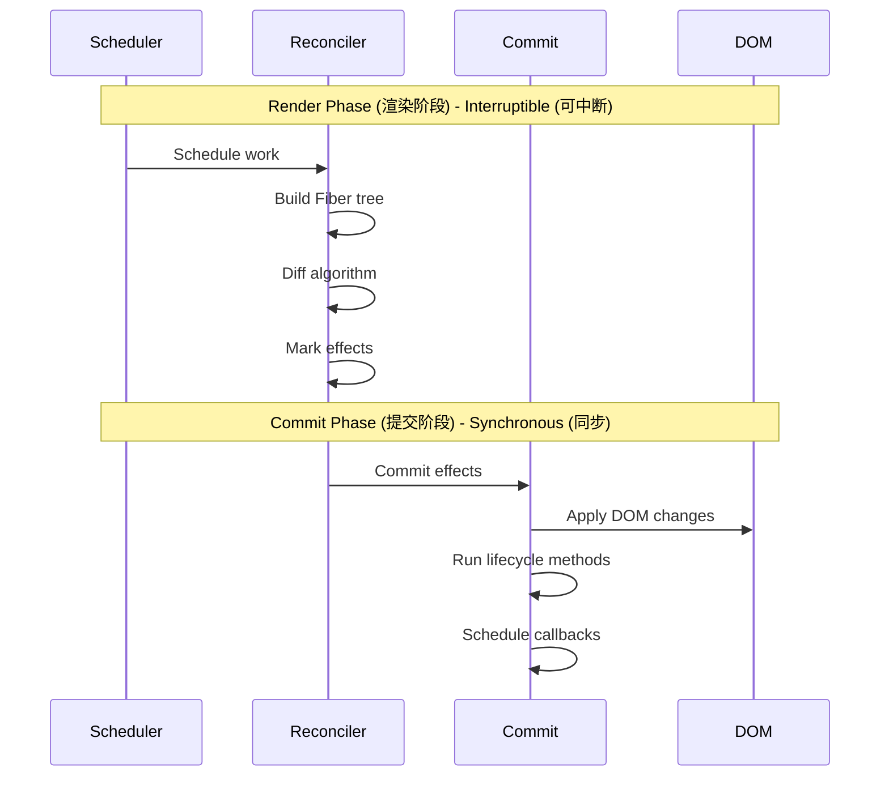
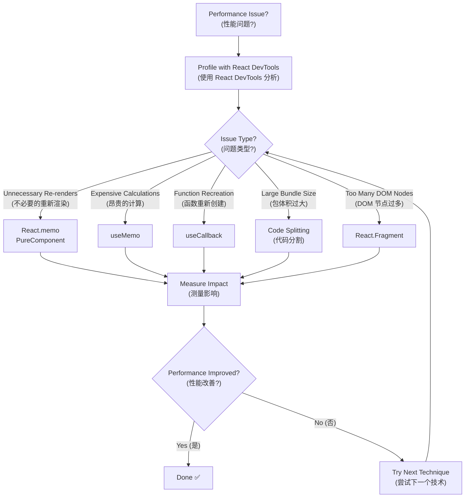
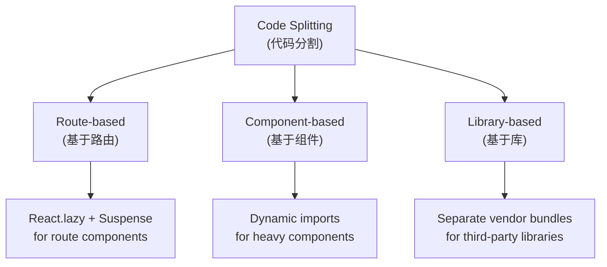
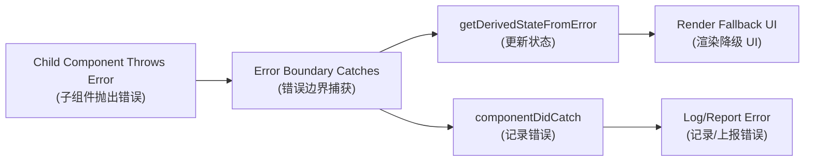
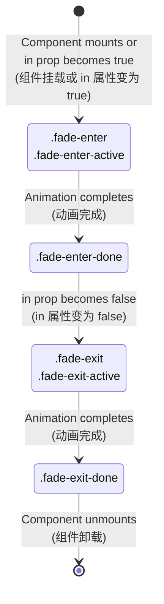

# React Advanced (React 进阶)
## Complete Guide to React Internal Architecture and Advanced Concepts (React 内部架构与高级概念完整指南)

This comprehensive document covers advanced React concepts (本综合文档涵盖 React 高级概念): internal architecture, Fiber, advanced components, performance optimization, and error handling (内部架构、Fiber、高级组件、性能优化和错误处理) in a single, well-structured guide (在一个结构良好的指南中).

---

## Table of Contents (目录)

1. [React Internal Architecture (React 内部架构)](#react-internal-architecture-react-内部架构)
2. [Fiber Architecture (Fiber 架构)](#fiber-architecture-fiber-架构)
3. [Advanced Component Patterns (高级组件模式)](#advanced-component-patterns-高级组件模式)
4. [Performance Optimization (性能优化)](#performance-optimization-性能优化)
5. [Error Handling and Boundaries (错误处理与边界)](#error-handling-and-boundaries-错误处理与边界)
6. [Animation and Transitions (动画与过渡)](#animation-and-transitions-动画与过渡)

---

## React Internal Architecture (React 内部架构)

### React Rendering Pipeline (React 渲染管道)



### React Architecture Layers (React 架构层次)

| Layer (层次) | Responsibility (职责) | Key Components (关键组件) |
|---|---|---|
| **React Core (React 核心)** | Component definition and lifecycle (组件定义和生命周期) | Components, Hooks, Context |
| **React Reconciler (React 协调器)** | Diff algorithm and Fiber management (Diff 算法和 Fiber 管理) | Fiber, Scheduler, Reconciler |
| **React Renderer (React 渲染器)** | Platform-specific rendering (平台特定渲染) | ReactDOM, React Native |

---

## Fiber Architecture (Fiber 架构)

### What is Fiber? (什么是 Fiber?)

**Fiber** is a JavaScript object that represents a unit of work (Fiber 是一个代表工作单元的 JavaScript 对象). It corresponds to a component instance, DOM node, or any other element in the React tree (它对应组件实例、DOM 节点或 React 树中的任何其他元素).

### Fiber Node Structure (Fiber 节点结构)



### Fiber Tree Traversal (Fiber 树遍历)

| Pointer (指针) | Purpose (用途) | Navigation (导航) |
|---|---|---|
| **`return`** | Points to parent Fiber (指向父 Fiber) | Up the tree (向上遍历) |
| **`child`** | Points to first child Fiber (指向第一个子 Fiber) | Down the tree (向下遍历) |
| **`sibling`** | Points to next sibling Fiber (指向下一个兄弟 Fiber) | Horizontal traversal (水平遍历) |

### Why Fiber? Benefits (为什么使用 Fiber？优势)

| Problem (问题) | Solution (解决方案) | Benefit (优势) |
|---|---|---|
| **Blocking Rendering (阻塞渲染)** | Interruptible work (可中断工作) | Smooth user experience (流畅用户体验) |
| **No Prioritization (无优先级)** | Priority-based scheduling (基于优先级的调度) | Important updates first (重要更新优先) |
| **Synchronous Updates (同步更新)** | Time-slicing (时间切片) | Better performance (更好的性能) |

### React Rendering Phases (React 渲染阶段)



### Render vs Commit Phase Comparison (渲染阶段与提交阶段对比)

| Aspect (方面) | Render Phase (渲染阶段) | Commit Phase (提交阶段) |
|---|---|---|
| **Interruptibility (可中断性)** | ✅ Interruptible (可中断) | ❌ Synchronous (同步) |
| **Side Effects (副作用)** | ❌ No side effects (无副作用) | ✅ Side effects allowed (允许副作用) |
| **DOM Access (DOM 访问)** | ❌ No DOM mutations (不修改 DOM) | ✅ DOM mutations (修改 DOM) |
| **Lifecycle Methods (生命周期方法)** | Some methods (部分方法) | Most methods (大部分方法) |

---

## Advanced Component Patterns (高级组件模式)

### Controlled vs Uncontrolled Components (受控与非受控组件)

#### Controlled Components (受控组件)

Components where form data is handled by React state (表单数据由 React 状态处理的组件).

```jsx
// Controlled Component Example
function ControlledInput() {
  const [value, setValue] = useState('');
  
  return (
    <input
      value={value}
      onChange={(e) => setValue(e.target.value)}
    />
  );
}
```

#### Uncontrolled Components (非受控组件)

Components where form data is handled by the DOM itself (表单数据由 DOM 自身处理的组件).

```jsx
// Uncontrolled Component Example
function UncontrolledInput() {
  const inputRef = useRef();
  
  const handleSubmit = () => {
    console.log(inputRef.current.value);
  };
  
  return (
    <input ref={inputRef} defaultValue="Hello" />
  );
}
```

#### Component Control Comparison (组件控制对比)

| Aspect (方面) | Controlled (受控) | Uncontrolled (非受控) |
|---|---|---|
| **Data Source (数据源)** | React state (React 状态) | DOM element (DOM 元素) |
| **Value Access (值访问)** | Direct from state (直接从状态) | Via ref (通过 ref) |
| **Validation (验证)** | Real-time (实时) | On submit (提交时) |
| **Performance (性能)** | More re-renders (更多重新渲染) | Fewer re-renders (更少重新渲染) |
| **Use Case (使用场景)** | Dynamic forms (动态表单) | Simple forms (简单表单) |

### Higher-Order Components (HOC) (高阶组件)

#### HOC Pattern (HOC 模式)

```jsx
// HOC Example
function withLoading(WrappedComponent) {
  return function WithLoadingComponent(props) {
    if (props.isLoading) {
      return <div>Loading...</div>;
    }
    return <WrappedComponent {...props} />;
  };
}

// Usage
const EnhancedComponent = withLoading(MyComponent);
```

#### HOC vs Hooks Comparison (HOC 与 Hooks 对比)

| Aspect (方面) | HOC | Hooks |
|---|---|---|
| **Reusability (复用性)** | ✅ High (高) | ✅ High (高) |
| **Composition (组合)** | Wrapper hell (包装地狱) | ✅ Clean (清洁) |
| **Props Drilling (属性钻取)** | ❌ Can cause issues (可能导致问题) | ✅ No issues (无问题) |
| **Type Safety (类型安全)** | ❌ Complex (复杂) | ✅ Better (更好) |
| **Performance (性能)** | ❌ Extra components (额外组件) | ✅ Direct (直接) |

### Render Props Pattern (渲染属性模式)

```jsx
// Render Props Example
function DataProvider({ render }) {
  const [data, setData] = useState(null);
  
  useEffect(() => {
    fetchData().then(setData);
  }, []);
  
  return render(data);
}

// Usage
<DataProvider
  render={(data) => (
    <div>{data ? data.name : 'Loading...'}</div>
  )}
/>
```

### Compound Components Pattern (复合组件模式)

```jsx
// Compound Components Example
function Tabs({ children, defaultTab }) {
  const [activeTab, setActiveTab] = useState(defaultTab);
  
  return (
    <div className="tabs">
      {React.Children.map(children, (child) =>
        React.cloneElement(child, { activeTab, setActiveTab })
      )}
    </div>
  );
}

Tabs.Tab = function Tab({ label, children, activeTab, setActiveTab }) {
  return (
    <div
      className={activeTab === label ? 'active' : ''}
      onClick={() => setActiveTab(label)}
    >
      {children}
    </div>
  );
};
```

---

## Performance Optimization (性能优化)

### Performance Optimization Techniques (性能优化技术)

| Technique (技术) | Impact (影响) | Complexity (复杂度) | Use Case (使用场景) | Example (示例) |
|---|---|---|---|---|
| **React.memo** | ⭐⭐⭐ High (高) | ⭐ Low (低) | Prevent unnecessary re-renders (防止不必要重新渲染) | `React.memo(Component)` |
| **useMemo** | ⭐⭐ Medium (中等) | ⭐⭐ Medium (中等) | Expensive calculations (昂贵计算) | `useMemo(() => expensiveCalc(), [deps])` |
| **useCallback** | ⭐⭐ Medium (中等) | ⭐⭐ Medium (中等) | Stable function references (稳定函数引用) | `useCallback(fn, [deps])` |
| **React.lazy** | ⭐⭐⭐ High (高) | ⭐⭐ Medium (中等) | Code splitting (代码分割) | `React.lazy(() => import('./Component'))` |
| **Fragments** | ⭐ Low (低) | ⭐ Low (低) | Reduce DOM nodes (减少 DOM 节点) | `<React.Fragment>` or `<>` |
| **Immutable Data** | ⭐⭐⭐ High (高) | ⭐⭐⭐ High (高) | Shallow comparison optimization (浅比较优化) | `const newState = {...oldState, updated: true}` |

### Performance Optimization Flow (性能优化流程)



### React.memo vs PureComponent vs shouldComponentUpdate (对比)

| Method (方法) | Component Type (组件类型) | Comparison Type (比较类型) | Customizable (可定制) |
|---|---|---|---|
| **React.memo** | Function Components (函数组件) | Shallow props comparison (浅层 props 比较) | ✅ Custom comparison function (自定义比较函数) |
| **PureComponent** | Class Components (类组件) | Shallow props + state comparison (浅层 props + state 比较) | ❌ Fixed behavior (固定行为) |
| **shouldComponentUpdate** | Class Components (类组件) | Custom logic (自定义逻辑) | ✅ Full control (完全控制) |

### Code Splitting Strategies (代码分割策略)



### Bundle Optimization Techniques (包优化技术)

| Technique (技术) | Bundle Size Impact (包大小影响) | Performance Impact (性能影响) | Implementation (实现) |
|---|---|---|---|
| **Tree Shaking (摇树优化)** | ⭐⭐⭐ High (高) | ⭐⭐⭐ High (高) | ES6 modules + webpack |
| **Code Splitting (代码分割)** | ⭐⭐⭐ High (高) | ⭐⭐⭐ High (高) | Dynamic imports |
| **Lazy Loading (懒加载)** | ⭐⭐ Medium (中等) | ⭐⭐⭐ High (高) | React.lazy + Suspense |
| **Bundle Analysis (包分析)** | ⭐⭐ Medium (中等) | ⭐⭐ Medium (中等) | webpack-bundle-analyzer |

---

## Error Handling and Boundaries (错误处理与边界)

### Error Boundary Capabilities (错误边界能力)

| Can Catch (可以捕获) | Cannot Catch (无法捕获) | Alternative Solution (替代方案) |
|---|---|---|
| **Rendering errors (渲染错误)** | **Event handlers (事件处理器)** | try/catch in handlers (在处理器中使用 try/catch) |
| **Lifecycle methods (生命周期方法)** | **Async code (异步代码)** | Promise.catch() or async/await try/catch |
| **Constructor errors (构造器错误)** | **setTimeout callbacks (setTimeout 回调)** | try/catch in callback (在回调中使用 try/catch) |
| **Child component errors (子组件错误)** | **Server-side rendering (服务端渲染)** | Server-side error handling (服务端错误处理) |
| | **Error boundary itself (错误边界自身)** | Parent error boundary (父级错误边界) |

### Error Boundary Methods Comparison (错误边界方法对比)

| Method (方法) | Purpose (目的) | Return Value (返回值) | When Called (何时调用) |
|---|---|---|---|
| **`getDerivedStateFromError`** | Update state for fallback UI (更新状态以显示降级 UI) | New state object (新状态对象) | During render phase (渲染阶段) |
| **`componentDidCatch`** | Log error information (记录错误信息) | void | After render phase (渲染阶段后) |

### Error Boundary Flow (错误边界流程)



### Error Boundary Implementation (错误边界实现)

```jsx
class ErrorBoundary extends React.Component {
  constructor(props) {
    super(props);
    this.state = { hasError: false, error: null };
  }

  static getDerivedStateFromError(error) {
    // Update state to show fallback UI
    return { hasError: true, error };
  }

  componentDidCatch(error, errorInfo) {
    // Log error to error reporting service
    console.error('Error caught by boundary:', error, errorInfo);
    // You can also log the error to an error reporting service
    // logErrorToService(error, errorInfo);
  }

  render() {
    if (this.state.hasError) {
      return (
        <div className="error-fallback">
          <h2>Something went wrong.</h2>
          <details style={{ whiteSpace: 'pre-wrap' }}>
            {this.state.error && this.state.error.toString()}
          </details>
        </div>
      );
    }

    return this.props.children;
  }
}
```

### Error Handling Best Practices (错误处理最佳实践)

| Practice (实践) | Description (描述) | Benefits (优势) |
|---|---|---|
| **Granular Error Boundaries (细粒度错误边界)** | Place boundaries around specific features (在特定功能周围放置边界) | Isolate failures (隔离故障) |
| **Fallback UI Design (降级 UI 设计)** | Provide meaningful error messages (提供有意义的错误信息) | Better user experience (更好的用户体验) |
| **Error Reporting (错误报告)** | Log errors to monitoring services (将错误记录到监控服务) | Production debugging (生产环境调试) |
| **Recovery Mechanisms (恢复机制)** | Allow users to retry or reset (允许用户重试或重置) | Graceful degradation (优雅降级) |

---

## Animation and Transitions (动画与过渡)

### Animation Libraries Comparison (动画库对比)

| Library (库) | Bundle Size (包大小) | Learning Curve (学习曲线) | Performance (性能) | Use Case (使用场景) |
|---|---|---|---|---|
| **react-transition-group** | ⭐⭐ Small (小) | ⭐⭐ Easy (简单) | ⭐⭐⭐ Good (良好) | CSS-based transitions (基于 CSS 的过渡) |
| **Framer Motion** | ⭐ Large (大) | ⭐⭐ Medium (中等) | ⭐⭐⭐ Excellent (优秀) | Complex animations (复杂动画) |
| **React Spring** | ⭐⭐ Medium (中等) | ⭐⭐⭐ Complex (复杂) | ⭐⭐⭐ Excellent (优秀) | Physics-based animations (基于物理的动画) |
| **Lottie React** | ⭐⭐ Medium (中等) | ⭐ Easy (简单) | ⭐⭐ Good (良好) | After Effects animations (After Effects 动画) |

### CSS Transition Lifecycle (CSS 过渡生命周期)



### Animation Class Hooks (动画类钩子)

| Phase (阶段) | CSS Class (CSS 类) | Duration (持续时间) | Purpose (目的) |
|---|---|---|---|
| **Enter Start (进入开始)** | `.fade-enter` | 1 frame (1帧) | Set initial state (设置初始状态) |
| **Enter Active (进入激活)** | `.fade-enter-active` | Full transition (完整过渡) | Define transition properties (定义过渡属性) |
| **Enter Done (进入完成)** | `.fade-enter-done` | Persistent (持续) | Final state (最终状态) |
| **Exit Start (退出开始)** | `.fade-exit` | 1 frame (1帧) | Set exit initial state (设置退出初始状态) |
| **Exit Active (退出激活)** | `.fade-exit-active` | Full transition (完整过渡) | Define exit transition (定义退出过渡) |
| **Exit Done (退出完成)** | `.fade-exit-done` | Until unmount (直到卸载) | Hidden state (隐藏状态) |

### Animation Performance Tips (动画性能提示)

| Tip (提示) | Description (描述) | Impact (影响) |
|---|---|---|
| **Use CSS transforms (使用 CSS 变换)** | Prefer transform over changing layout properties (优先使用 transform 而不是改变布局属性) | ⭐⭐⭐ High (高) |
| **Enable GPU acceleration (启用 GPU 加速)** | Use `will-change` or `transform3d` (使用 `will-change` 或 `transform3d`) | ⭐⭐⭐ High (高) |
| **Minimize reflows (最小化重排)** | Avoid animating width, height, padding (避免动画化宽度、高度、内边距) | ⭐⭐⭐ High (高) |
| **Use requestAnimationFrame** | For JavaScript-based animations (用于基于 JavaScript 的动画) | ⭐⭐ Medium (中等) |

---

## References (参考)

### Official Documentation (官方文档)
- [React Official Documentation (React 官方文档)](https://reactjs.org/)
- [React Fiber Architecture (React Fiber 架构)](https://github.com/acdlite/react-fiber-architecture)
- [React DevTools Profiler (React DevTools 分析器)](https://reactjs.org/blog/2018/09/10/introducing-the-react-profiler.html)

### Performance Resources (性能资源)
- [React Performance Optimization (React 性能优化)](https://reactjs.org/docs/optimizing-performance.html)
- [Web Vitals (Web 核心指标)](https://web.dev/vitals/)
- [Bundle Analysis Tools (包分析工具)](https://webpack.js.org/guides/code-splitting/)

### Animation Resources (动画资源)
- [react-transition-group Documentation](https://reactcommunity.org/react-transition-group/)
- [Framer Motion Documentation](https://www.framer.com/motion/)
- [React Spring Documentation](https://react-spring.io/)

---

*This document provides comprehensive coverage of advanced React concepts (本文档全面涵盖了 React 高级概念). For fundamental concepts, see the React Fundamentals guide (基础概念请参见 React 基础指南).*
