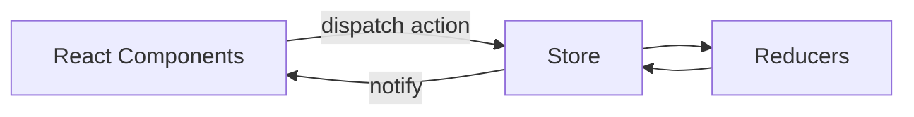

# State and Communication (状态与通信) - Context/Redux/Component Communication

## Component Communication (组件通信)

- **Parent → Child (父→子)**: props
- **Child → Parent (子→父)**: Callbacks/event bubbling (回调/事件上抛)
- **Sibling Components (兄弟组件)**: Lift state up to common parent (提升到共同父级)
- **Cross-level (跨层)**: Context (Provider/Consumer or useContext)
- **More complex sharing (更复杂共享)**: Centralized state management (集中式状态) like Redux/Zustand (Redux/Zustand 等)

## Context - When to Use (Context 何时用)

- **Global configuration/light sharing (全局配置/轻共享)**: Themes, internationalization, user sessions (主题、国际化、用户会话等)
- **Local scope Provider (局部范围 Provider)**: Avoid global pollution (避免全局污染)

## Redux Essentials (Redux 要点)

- **Three Principles (三原则)**: Single source of truth (单一数据源), read-only state (只读 state), pure function modifications (纯函数修改)
- **react-redux**: Provider + connect/hooks (useSelector/useDispatch)
- **Middleware (中间件)**: thunk, logger; chain-enhanced dispatch (链式增强 dispatch)

## Directory Organization Suggestions (目录组织建议)

- **By feature modules (按功能模块拆分)**: actions/reducer/views in the same directory (actions/reducer/views 同目录), or by role (或按角色) like actions/reducers/...
- **Unified export entry (导出统一入口)**: index.ts for convenient on-demand imports (便于按需引入)

## Selection Guidelines (选择建议) - Decision Tree (文字决策树)

- **Only themes/language/light user info (仅主题/语言/用户轻信息)**: Prioritize Context (优先 Context)
- **Local complex async/cache reuse (局部复杂异步/缓存复用)**: Use `ahooks` with component-local state (可用 `ahooks` 与组件内局部 state) like useRequest
- **Cross-page complex sharing/trackable/debuggable (跨页面复杂共享/可追踪/调试)**: Redux (or Zustand, Jotai based on team preference) (Redux（或 Zustand、Jotai 视团队习惯）)

## References (参考)

- React/Redux Official Documentation (React/Redux 官方文档)

