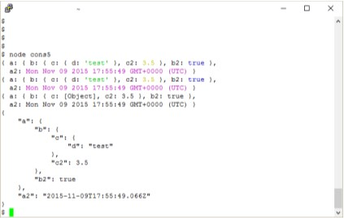

# CHAPTER 4

CHAPTER 4: Interactive Node with REPL and More on the Console

REPL is very simple to use. Just start typing in your JavaScript, like you’d add it to a file:

> a = 2;

2

The tool prints out the result of whatever expression you just typed. In this session excerpt, the value of the expression is 2 . In the following, the expression result is an array with three elements:

> b = ['a','b','c'];

[ 'a', 'b', 'c' ]

To access the last expression, use the underscore/underline special vari-able (_). In the following, a is set to 2 , and the resulting expression is incremen-ted by 1, and then 1 again:

> a = 2;

2

> ++_;

3

> ++_;

4

You can even access properties or call methods on the underscored expres-sion:

> ['apple','orange','lime']

[ 'apple', 'orange', 'lime' ]

> _.length

3

> 3 + 4

7

> _.toString();

'7'

You can use the var keyword with REPL in order to access an expression or value at a later time, but you might get an unexpected result. For instance, con-sider the following line in REPL:

var a = 2;

It doesn’t return the value 2 , it returns a value of undefined . The reason is that the result of the expression is undefined since variable assignment doesn’t return a result when evaluated.

Benefits of REPL: Getting a Closer Understanding of JavaScript Under the Hood Consider the following instead, which is what’s happening, more or less, un-

der the hood in REPL:

console.log(eval('a = 2'));

console.log(eval('var a = 2'));

Typing the preceding line into a file and running that file using Node returns: 2

undefined

There is no result from the second call to eval , hence the value returned is undefined . REPL is a read-eval-print loop, with emphasis on the *eval* .

You can use the variable in REPL, just as you would in a Node application: > var a = 2;

undefined

> a++;

2

> a++;

3

The latter two command lines do have results, which are printed out by REPL.

I’ll demonstrate how to create your own custom REPL—one that doesn’t output undefined —in the section **“Custom REPL”** .

To end the REPL session, either press Ctrl-C twice, or Ctrl-D once. We’ll cover other ways to end the session later, in **“REPL Commands”** .

Benefits of REPL: Getting a Closer Understanding of JavaScript Under the Hood

Here’s a typical demonstration of REPL:

> 3 > 2 > 1;

false

This code snippet is a good example of how REPL can be useful. At first glance, we might expect the expression just typed to evaluate to true , since 3 is greater than 2, which is greater than 1. However, in JavaScript, relational opera-

CHAPTER 4: Interactive Node with REPL and More on the Console

tors are evaluated lef to right, and each expression’s result is returned for the next evaluation.

A better way of looking at what’s happening with the preceding code snippet is this REPL session:

> 3 > 2 > 1;

false

> 3 > 2;

true

> true > 1;

false

Now the result makes more sense. What’s happening is that the expression 3 > 2 is evaluated, returning true . But then the value of true is compared to the numeric 1. JavaScript provides automatic data type conversion, afer which true and 1 are equivalent values. Hence, true is not greater than 1, and the result is false .

REPL’s helpfulness is in enabling us to discover these little interesting quirks in JavaScript and our code. Hopefully, afer testing our code in REPL, we don’t have unexpected side efects in our applications (such as expecting a result of true but getting a result of false ).

Multiline and More Complex JavaScript

You can type the same JavaScript into REPL just like you’d type it into a file, including require statements to import modules. A session to try out the Query String ( qs ) module is repeated in the following text:

$ node

> qs = require('querystring');

{ unescapeBuffer: [Function],

unescape: [Function],

escape: [Function],

encode: [Function],

stringify: [Function],

decode: [Function],

parse: [Function] }

> val = qs.parse('file=main&file=secondary&test=one').file; [ 'main', 'secondary' ]

Since we didn’t use the var keyword, the expression result is printed out—in this instance, the interface for the querystring object. How’s that for a bonus? Not only are you getting access to the object, but you’re also learning more

Multiline and More Complex JavaScript

about the object’s interface while you’re at it. However, if you want to forgo the potentially lengthy output of text, use the var keyword:

> var qs = require('querystring');

You’ll be able to access the querystring object with the qs variable with either approach.

In addition to being able to incorporate external modules, REPL gracefully handles multiline expressions, providing a textual indicator of code that’s nes-ted following an opening curly brace ({):

> var test = function (x, y) {

... var val = x * y;

... return val;

... };

undefined

> test(3,4);

12

REPL displays repeating dots to indicate that everything that’s being typed follows an open curly brace and hence the command isn’t finished yet. It does the same for an open parenthesis, too:

> test(4,

... 5);

20

Increasing levels of nesting generates more dots; this is necessary in an in-teractive environment, where you might lose track of where you are as you type:

> var test = function (x, y) {

... var test2 = function (x, y) {

..... return x * y;

..... }

... return test2(x,y);

... }

undefined

> test(3,4);

12

>

You can type in, or copy and paste in, an entire Node application and run it from REPL:

CHAPTER 4: Interactive Node with REPL and More on the Console

> var http = require('http');

undefined

> http.createServer(function (req, res) {

...

... // content header

... res.writeHead(200, {'Content-Type': 'text/plain'}); ...

... res.end("Hello person\n");

... }).listen(8124);

{ domain:

{ domain: null,

_events: { error: [Function] },

_maxListeners: undefined,

members: [] },

_

...

httpAllowHalfOpen: false,

timeout: 120000,

_pendingResponseData: 0,

_connectionKey: '6:null:8124' }

> console.log('Server running at http://127.0.0.1:8124/'); Server running at http://127.0.0.1:8124/

Undefined

I trimmed the actual display values for the Server, shown in bold, both be-cause they’re so long, and because they’ll most likely change by the time you read this. You can access this application from a browser no diferently than if you had typed the text into a file and run it using Node.

The ‘downside’ of not assigning an expression to the variable is you are go-ing to get a what could be long object display in the midst of your application. However, one of my favorite uses of REPL is to get a quick look at objects. For instance, the Node core object global is sparsely documented at the Node.js website. To get a better look, I opened up a REPL session and passed the object to the console.log method like so:

> console.log(global)

I could have done the following, which has a similar result, with the addition of the gl variable (trimmed, for space):

> gl = global;

...

_: [Circular],

gl: [Circular] }

Just printing out global also provides the same information:

Multiline and More Complex JavaScript

> global

I’m not replicating what was displayed in REPL; I’ll leave that for you to try on your own installation, since the interface for global is so large. The impor-tant point to take away from this exercise is that we can, at any time, quickly and easily get a quick look at an object’s interface. It’s a handy way of remem-bering what a method is called, or what properties are available.

There’s more on global in Chapter 2.

You can use the up and down arrow keys to traverse through the commands you’ve typed into REPL. This can be a handy way of reviewing what you’ve done, as well as a way of editing what you’ve typed, though in a somewhat limi-ted capacity.

Consider the following session in REPL:

> var myFruit = function(fruitArray,pickOne) {

... return fruitArray[pickOne - 1];

... }

undefined

> fruit = ['apples','oranges','limes','cherries'];

[ 'apples', 'oranges', 'limes', 'cherries' ]

> myFruit(fruit,2);

'oranges'

> myFruit(fruit,0);

undefined

> var myFruit = function(fruitArray,pickOne) {

... if (pickOne <= 0) return 'invalid number';

... return fruitArray[pickOne - 1];

... };

undefined

> myFruit(fruit,0);

'invalid number'

> myFruit(fruit,1);

'apples'

Though it’s not demonstrated in this printout, when I modified the function to check the input value, I actually arrowed up through the content to the be-ginning function declaration, and then hit Enter to restart the function. I added the new line, and then again used the arrow keys to repeat previously typed en-tries until the function was finished. I also used the up arrow key to repeat the function call that resulted in an undefined result.

It seems like a lot of work just to avoid retyping something so simple, but consider working with regular expressions, such as the following:

CHAPTER 4: Interactive Node with REPL and More on the Console

> var ssRe = /^\d{3}-\d{2}-\d{4}$/;

undefined

> ssRe.test('555-55-5555');

true

> var decRe = /^\s*(\+|-)?((\d+(\.\d+)?)|(\.\d+))\s*$/;

undefined

> decRe.test(56.5);

true

I’m absolutely useless when it comes to regular expressions, and have to tweak them several times before they’re just right. Using REPL to test regular expressions is very attractive. However, retyping long regular expressions would be a monstrous amount of work.

Luckily, all we have to do with REPL is arrow up to find the line where the regular expression was created, tweak it, hit Enter, and continue with the next test.

In addition to the arrow keys, you can also use the Tab key to get *autocom-plete* a command, if there’s no confusion as to what you’re completing.. As an example, type **va at the command line and then press Tab; REPL lists out both** var and valueOf , both of which can complete the typing. However, type querys and hitting Tab returns the only available option, querystring . You can also use the Tab key to autocomplete any global or local variable. **Table 4-1** ofers a quick summary of keyboard commands that work with REPL. TABLE 4-1. *Keyboard control in REPL*

Keyboard entry What it does

Ctrl-C Terminates current command. Pressing Ctrl-C twice forces anexit. Ctrl-D Exits REPL.

Tab Autocompletes global or local variable.

Up arrow Traverses up through command history.

Down arrow Traverses down through command history.

Underscore (_) References result of last expression.

If you’re concerned about spending a lot of time coding in REPL with nothing to show for it when you’re done, no worries: you can save the results of the cur-rent context with the .save command. It and the other REPL commands are covered in the next section.

Multiline and More Complex JavaScript

REPL Commands

REPL has a simple interface with a small set of useful commands. In the preced-ing section, I mentioned .save . The .save command saves your inputs in the current object context into a file. Unless you specifically created a new object context or used the .clear command, the context should comprise all of the input in the current REPL session:

> .save ./dir/session/save.js

Only your inputs are saved, as if you had typed them directly into a file using a text editor.

Here is the complete list of REPL commands and their purposes: .break

If you get lost during a multiline entry, typing .break will start you over again. You’ll lose the multiline content, though.

.clear

Resets the context object and clears any multiline expression. This com-mand basically starts you over again.

.exit

Exits REPL.

.help

Displays all available REPL commands.

.save

Saves the current REPL session to a file.

.load

Loads a file into the current session ( .load /path/to/file.js ). If you’re working on an application using REPL as an editor, here’s a hint:

save your work ofen using .save . Though current commands are persisted to history, trying to recreate your code from history would be a painful exercise.

Speaking of persistence and history, now let’s go over how to customize both with REPL.

CHAPTER 4: Interactive Node with REPL and More on the Console

REPL and rlwrap

The Node.js website documentation for REPL mentions setting up an environ-mental variable so you can use REPL with rlwrap . What is rlwrap , and why would you use it with REPL?

The rlwrap utility is a wrapper that adds GNU readline library functionali-ty to command lines that allow increased flexibility with keyboard input. It in-tercepts keyboard input and provides additional functionality, such as en-hanced line editing, as well as a persistent history of commands.

You’ll need to install rlwrap and readline to use this facility with REPL, and most flavors of Unix provide an easy package installation. For instance, in my own Ubuntu system, installing rlwrap was this simple:

apt-get install rlwrap

Mac users should use the appropriate installer for these applications. Win-dows users have to use a Unix environmental emulator, such as Cygwin.

Here’s a quick and visual demonstration of using REPL with rlwrap to change the REPL prompt to purple:

NODE_NO_READLINE=1 rlwrap -ppurple node

If I always want my REPL prompt to be purple, I can add an alias to my *bashrc file:*

alias node="NODE_NO_READLINE=1 rlwrap -ppurple node"

To change both the prompt and the color, I’d use the following:

NODE_NO_READLINE=1 rlwrap -ppurple -S "::> " node

Now my prompt would be:

::>

But in purple.

The especially useful component of rlwrap is its ability to persist history across REPL sessions. By default, we have access to command-line history only within a REPL session. By using rlwrap , the next time we access REPL, not only will we have access to a history of commands within the current session, but also a history of commands in past sessions (and other command-line entries). In the following session output, the commands shown were not typed in, but

Multiline and More Complex JavaScript

were instead pulled from history with the up arrow key, *afer I had exited REPL* and then re-entered it:

::> e = ['a','b'];

[ 'a', 'b' ]

::> 3 > 2 > 1;

false

As helpful as rlwrap is, we still end up with undefined every time we type in an expression that doesn’t return a value. However, we can adjust this, and other functionality, just by creating our own custom REPL, discussed next. **Custom REPL**

Node provides an API we can use to create a custom REPL. To do so, first we need to include the REPL module ( repl ):

var repl = require("repl");

To create a new REPL, we call the start method on the repl object. The syntax for this method is:

repl.start(options);

The options object takes several values, the ones I want to focus on are: prompt

Default is > .

input

Readable stream, default is process.stdin

output

writable stream, default is process.stdout

eval

Default is an async wrapper for eval .

useGlobal

Default is false to start a new context rather than use the global object. useColors

Whether writer function should use colors. Defaults to repl’s terminal val-ue.

CHAPTER 4: Interactive Node with REPL and More on the Console

ignoreUndefined

Default is false ; don’t ignore the undefined responses.

terminal

Set to true if stream should be treated like a tty (terminal) including sup-port for ANSI/VT100 escape codes

writer

Function to evaluate each command, and return formatting. Defaults to util.inspect.

replMode

Whether REPL runs in strict mode, default, or hybrid

I find the undefined expression result in REPL to be unedifying, so I created my own REPL. I also redefined the prompt, and set the mode to being strict, which means each line executed is done so under ‘use strict' .

var repl = require('repl');

repl.start( {

prompt: 'my repl> ',

replMode: repl.REPL_MODE_STRICT,

ignoreUndefined: true,

});

I ran the file, *repl.js* , using Node:

node repl

I can use the custom REPL just like I use the built-in version, except now I have a diferent prompt and no longer get the annoying undefined afer the first variable assignment. I do still get the other responses that aren’t unde-fined :

my repl> let ct = 0;

my repl> ct++;

0

my repl> console.log(ct);

1

my repl> ++ct;

2

my repl> console.log(ct);

2

Multiline and More Complex JavaScript

In my code, I wanted the defaults used for all but the listed properties. Not listing any other property in the options object causes each to use the default.

You can replace the eval function with your custom REPL. The only require-ment is that it has a specific format:

function eval(cmd, callback) {

callback(null, result);

}

The input and output options are interesting. You can run multiple ver-sions of REPL, taking input from both the standard input (the default), as well as sockets. The documentation for REPL at the Node.js site provides an exam-ple of a REPL listening in on a TCP socket, using the following code:

var net = require("net"),

repl = require("repl");

connections = 0;

repl.start({

prompt: "node via stdin> ",

input: process.stdin,

output: process.stdout

});

net.createServer(function (socket) {

connections += 1;

repl.start({

prompt: "node via Unix socket> ",

input: socket,

output: socket

}).on('exit', function() {

socket.end();

})

}).listen("/tmp/node-repl-sock");

net.createServer(function (socket) {

connections += 1;

repl.start({

prompt: "node via TCP socket> ",

input: socket,

output: socket

}).on('exit', function() {

socket.end();

});

}).listen(5001);

CHAPTER 4: Interactive Node with REPL and More on the Console

When you run the application, you get the standard input prompt where the Node application is running. However, you can also access REPL via TCP. I used PuTTY as a Telnet client to access this TCP-enabled version of REPL. It does work…to a point. I had to issue a .clear first, the formatting is of, and when I tried to use the underscore to reference the last expression Node didn’t know what I was talking about. I also tried with the Windows Telnet client, and the response was even worse. However, using my Linux Telnet client worked without a hitch.

The problem here, as you might expect, is Telnet client settings. However, I didn’t pursue it further, because running REPL from an exposed Telnet socket is not something I plan to implement, and not something I would recommend, ei-ther—at least, not without heavy security. It’s like using eval() in your client-side code, and not scrubbing the text your users send you to run—but worse.

You could keep a running REPL and communicate via a Unix socket with something like the GNU Netcat utility:

nc -U /tmp/node-repl-sock

You can type in commands no diferently than typing them in using stdin . Be aware, though, if you’re using either a TCP or Unix socket, that any con-sole.log commands are printed out to the server console, not to the client:

console.log(someVariable); // actually printed out to server An application option that I consider to be more useful is to create a REPL

application that preloads modules. In the application in **Example 4-1** , afer the REPL is started, the third-party modules of Request (powerful HTTP client), Un-derscore (utility library), and Q (promise management) modules are loaded and assigned to context properties.

EXAMPLE 4-1. Creating a custom REPL that preloads modules

var repl = require('repl');

var context = repl.start({prompt: '>> ',

ignoreUndefined: true,

replMode: repl.REPL_MODE_STRICT}).context;

// preload in modules

context.request = require('request');

context.underscore = require('underscore');

context.q = require('q');

Running the application with Node brings up the REPL prompt, where we can then access the modules:

Stuf Happens—Save Ofen

>> request('http://blipdebit.com/phoenix5a.png')

.pipe(fs.createWriteStream('bird.png'))

The core Node modules don’t need to be specifically included, just access them by their module name directly.

If you want to run the REPL application like an executable in Linux, add the following line as the first line in the application:

#!/usr/local/bin/node

Modify the file to be an executable and run it:

$ chmod u+x replcontext.js

$ ./replcontext.js

>>

Stuff Happens—Save Often

Node’s REPL is a handy interactive tool that can make our development tasks a little easier. REPL allows us not only to try out JavaScript before including it in our files, but also to actually create our applications interactively and then save the results when we’re finished.

Another useful REPL feature is that it enables us to create a custom REPL so that we can eliminate the unhelpful undefined responses, preload modules, change the prompt or the eval routine we use, and more.

I also strongly recommend that you look into using REPL with rlwrap in or-der to persist commands across sessions. This could end up being a major time saver. Plus, who among us doesn’t like additional editing capability?

As you explore REPL further, there’s one very important thing to keep in mind from this chapter:

Stuf happens. Save ofen.

If you’ll be spending a lot of time developing in REPL, even with the use of rlwrap to persist history, you’re going to want to frequently save your work. Working in REPL is no diferent than working in other editing environments, so I’ll repeat: *stuf happens—save ofen* .

CHAPTER 4: Interactive Node with REPL and More on the Console

The Necessity of Console

There are few examples in this book that don’t make use of the console . The console is a way of printing out values, checking operations, verifying the asynchronous nature of an application, and just a helpful way of providing some kind of feedback.

For the most part, we’re using console.log() and just printing out mes-sages. But there’s more to the console than a server-version of the alert box in the browser.

**Console Message Types, Console Class, and Blocking** In most of the examples in the book, we’re using console.log() because we’re only interested in feedback while we’re experimenting around with Node. This function outputs the message to stdout , typically the terminal. When you start putting together Node applications for a production environment, though, you’re going to want to make use of other console messaging functions.

The console.info() function is equivalent to console.log() . Both write to stdout , both output a newline character as part of the message. The con-sole.error() function difers, in that it outputs the message (again, with newline character) to stderr , rather than stdout :

console.error("An error occurred...");

The console.warn() function does the same.

Both types of messaging appear in the terminal, so you might wonder what’s the diference. In actuality, there really is no diference. To understand that, we need to need to look more closely at what the console object is.

U S I N G A L O G G I N G M O D U L E

You’re not limited to the built-in console object for logging. There are more sophisticated tools available, such as the **Bunyon** and **Winston** modules.

First of all, the console object is a global object instantiated from the Con-sole class. We can, if we wish, actually create our own version of the console using this same class. And we can do so, two diferent ways.

To create a new instance of Console, we either need to import the Console class, or access it via the global console object. Both of the following result in a new console-like object:

The Necessity of Console

// using require

var Console = require('console').Console;

var cons = new Console(process.stdout, process.stderr);

cons.log('testing');

// using existing console object

var cons2 = new console.Console(process.stdout, process.stderr); cons2.error('test');

Notice how in both instances, the process.stdout and process.stderr properties are passed as writable stream instances for writing log messages and error messages, respectively. The console global object is created in just this manner.

I covered process.stdout and process.stderror in Chapter 2. What we know about both is that they map to the stdout and stderr file descriptors in the environment, and that they’re diferent from most streams in Node in that they typically block—they’re synchronous. the only time they’re not, is when the streams are directed at a *pipe* . So, for the most part, the console ob-ject blocks for both console.log() and console.error() . However, this isn’t an issue unless you’re directing a large amount of data at the stream.

So why use console.error() when an error occurs? Because in environ-ments where the two streams are diferent, you want to ensure the proper be-havior. If you’re in an environment where log messages don’t block but and er-ror does, you want to ensure a Node error does block. In addition, when you run a Node application, you can direct the output for console.log() and console.error() to diferent files using command-line redirection. The fol-lowing directs the console.log() messages to a log file, the errors to an error file:

node app.js 1> app.log 2> error.log

The following Node application:

// log messages

console.log('this is informative');

console.info('this is more information');

// error messages

console.error('this is an error');

console.warn('but this is only a warning');

Directs the first two lines to app.log, the second two to error.log. CHAPTER 4: Interactive Node with REPL and More on the Console

To return to the Console class, you can duplicate the functionality of the global console object by using the Console class and passing in pro-cess.stdou t and process.stderr . You can also create a new console-like ob-ject that directs the output to diferent streams, such as log and error files. The Console documentation provided by the Node Foundation provides just such an example:

var output = fs.createWriteStream('./stdout.log');

var errorOutput = fs.createWriteStream('./stderr.log');

// custom simple logger

var logger = new Console(output, errorOutput);

// use it like console

var count = 5;

logger.log('count: %d', count);

// in stdout.log: count 5

The advantage to using this type of object is that you can use the global console for general feedback, reserving the newly created object for more for-mal reporting.

P R O C E S S A N D S T R E A M S

As noted, the process object is covered in Chapter 2, and streams are covered in Chapter 6.

Formatting the Message, with Help From util.format() and util.inspect()

All four console functions, log() , warn() , error() , and info() , can take any data type, including an object. Non-object values that aren’t a string are co-erced to a string. If object, be aware that Node only prints out two levels of nesting. If you wish more, you should use JSON.stringify() on the object, which then prints out a more readable indented tree:

var test = {

a : {

b : {

c : {

d : 'test'

}

}

}

}

// only two levels of nesting are printed out

The Necessity of Console

console.log(test);

// three levels of nesting are printed

var str = JSON.stringify(test, null, 3);

console.log(str);

The output of the application is:

{ a: { b: { c: [Object] } } }

{

"a": {

"b": {

"c": {

"d": "test"

}

}

}

}

If you use a string, instead, you can use printf-like formatting with the string for all four functions:

var val = 10.5;

var str = 'a string';

console.log('The value is %d and the string is %s', val, str); This approach is advantageous if you’re working with data passed as func-

tion arguments, or collected from a web request. The type of formatting al-lowed is based on the formatting supported for the util.format() utilities mod-ule, which you could also use directly to create the string:

var util = require('util');

var val = 10.5,

str = 'a string';

var msg = util.format('The value is %d and the string is %s',val,str); console.log(msg);

Though if you’re only using the one function, it’s simpler to just use the for-matting in console.log() . Allowable format values are:

- %s - string
- %d - number (bother integer and float)

CHAPTER 4: Interactive Node with REPL and More on the Console

- %j - JSON. Replaced with ['circular'] if the argument contains circular ref-erences
- %% - to use a literal percentage sign (%)

Extra arguments are converted to strings and concatenated to the output. If there are too few arguments, the placeholder, itself, is printed out:

var val = 3;

// results in 'val is 3 and str is %s'

console.log('val is %d and str is %s', val);

The four functions covered are not the only ones used to provide feedback. There’s also console.dir() .

The console.dir() function difers from the other feedback functions, in that whatever object is passed to it is passed, in turn, to util.inspect() . This Utilities module function provides more finite control over how an object is dis-played via a secondary options object. Like util.format() , it can also be used directly. An example is:

var test = {

a : {

b : {

c : {

d : 'test'

}

}

}

}

var str = require('util').inspect(test, {showHidden: true, depth: 4 }); console.log(str);

The object is inspected and the result returned as a string, based on what’s passed in the options object. Options are:

- showHidden : to display non-enumerable or symbolic properties (default is false)
- depth : how many times to recurse to inspect object (default is 2) • colors : if true, output is styled with ANSI color codes (default is false) • customInspect : if false, then custom inspect functions defined on the

objects being inspected won’t be called (default is true)

The Necessity of Console

The color mapping can be defined globally using the util.in-spect.styles object. You can also modify the global colors, too. Use con-sole.log() to print out the object properties:

var util = require('util');

console.log(util.inspect.styles);

console.log(util.inspect.colors);

The application in Example 4-1 modifies the object being printed to add a date, a number, and a boolean. In addition, the color value for the boolean is changed from yellow to blue, to diferentiate it from the number (by default, they’re both yellow). The object is printed out using various methods: afer pro-cessing with util.inspect() , using console.dir() with same options, us-ing the basic console.log() function, and using the JSON.stringify() function on the object.

EXAMPLE 4-2. Diferent formatting options for printing out object

var util = require('util');

var today = new Date();

var test = {

a : {

b : {

c : {

d : 'test'

},

c2 : 3.50

},

b2 : true

},

a2: today

}

util.inspect.styles.boolean = 'blue';

// output with util.inspect direct formatting

var str = util.inspect(test, {depth: 4, colors: true });

console.log(str);

// output using console.dir and options

console.dir(test, {depth: 4, colors: true});

// output using basic console.log

console.log(test);

CHAPTER 4: Interactive Node with REPL and More on the Console

// and JSON stringify

console.log(JSON.stringify(test, null, 4));

The result is show in Figure 4-1, so you can see the color efects. I use a white background for my terminal window, with black text.

FIGURE 4-1

Capture of terminal

window showing

diferent formats for

string output

The console.dir() function supports three of the four util.inspect() op-tions: showHidden , depth , and colors . It doesn’t support customInspect . If set to true , this option indicates that the object is actually supplying its own inspection function.

**Providing Richer Feedback with console and a Timer** Returning back to the console object, one additional piece of information that can provide a more in-depth picture of what’s happening with an application, is to add a timer and then output a begin and end time.

The two console functions we’re using for this functionality are con-sole.time() and console.timeEnd() , passing a timer name to both.

In the following code snippet, the code is using a longer-lasting loop so that enough time is past for the timer functions to register a time diference.

The Necessity of Console

console.time('the-loop');

for (var i = 0; i < 10000; i++) {

;

}

console.timeEnd('the-loop');

Even with a largish loop, the time involved will barely register. How long de-pends on the load in the machine, as well as the process. But the timer func-tionality isn’t limited to synchronous events. Being able to use a specific name with the timer means we can use the functionality with asynchronous events.

I modified the Hello World application from Chapter 1, adding in a start to the timer at the beginning of the application, ending it for each web request, and then re-starting it. It times the gaps in time between each request. Sure, we could use a Date function to do a more representative timer, but what’s the fun of that?

var http = require('http');

console.time('hello-timer');

http.createServer(function (request, response) {

response.writeHead(200, {'Content-Type': 'text/plain'}); response.end('Hello World\n');

console.timeEnd('hello-timer');

console.time('hello-timer');

}).listen(8124);

console.log('Server running at http://127.0.0.1:8124/'); In all seriousness, what the code demonstrates is that you can incorporate

the timer into asynchronous operations, thanks to the ability to individually name the timers.

Node and the Web 5

Node isn’t at a point where it can replace the fairly ubiquitous Apache/PHP kill-er combination, but it is gaining in popularity; especially considering the ease in creating cross-platform applications, and support among the big tech compa-nies.

In this chapter, we’ll explore Node’s webby roots, including a more in-depth look the HTTP module, as well as trying our hand at creating a very simple stat-ic web server. We’ll also look at core Node modules that simplify the web devel-opment experience.

The HTTP Module: Server and Client

Don’t expect to use the HTTP module to re-create a web server with the sophis-tication of Apache or Nginx. As the Node documentation notes, it’s low-level, fo-cusing on stream handling and message parsing. Still, it provides the founda-tional support for more sophisticated functionality, such as Express, covered in Chapter 10.

The HTTP module supports several objects, including http.Server , which is what’s returned when you use the http.createServer() function demon-strated in Chapter 1. In that example, we embedded a callback function to han-dle the web request, but we can also use separate events, since http.Server inherits from EventEmitter .

var http = require('http');

var server = http.createServer().listen(8124);

server.on('request', function(request,response) {

console.log('request');

response.writeHead(200, {'Content-Type': 'text/plain'}); response.end('Hello World\n');

});