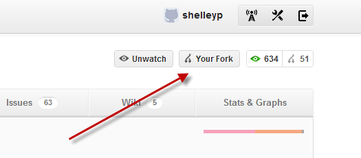
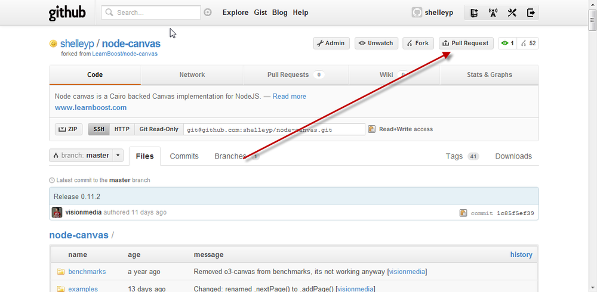

# Appendix A

Appendix A. Node, Git, and GitHub

Git is a version control system, similar to CVS (Concurrent Versioning System) or Subversion. Where Git differs from the other, more conventional version control systems is how it maintains the source as you make modifications. A version control system like CVS stores version changes as differences from a base file. Git, on the other hand, stores snapshots of the code at a specific point in time. If a file isn’t changed, Git just links to the previous snapshot.

To begin using Git, you first need to install it on your system. There are binaries for Windows and Mac OS X, as well as source code for various flavors of Unix. Installing it on my Linux (Ubuntu 10.04) server required only one command:

sudo apt-get install git

All dependencies are automatically downloaded and installed.

### Note

The commands from this point on assume you’re using a Unix-based terminal to enter them. There is a graphical interface for Git on Windows. You’ll need to follow the documentation that comes with the interface to set up your system, but the general procedures are the same in all environments.

Once Git is installed, it needs to be configured. You’ll need to provide a Git username (typically, your first and last name) and an email address. These form the two components of the *commit author*, used to mark your edits:

git config --global user.name "

*your name*"
git config --global user.email "*your email*"

Since you’re going to be working with GitHub, the hosting service that houses most (if not all) Node modules, you’re also going to need to set up a GitHub account. You can use whatever GitHub username you want—it doesn’t have to match the username you just specified. You’ll also need to generate an SSH (secure shell) key to provide GitHub, following the documentation outlined in the GitHub help documentation.

Most Git tutorials start you out by creating a simple *repository* (or *repo* to use common terminology) of your own work. Since we’re interested mainly in Git with Node, we’ll start out by cloning an existing repository rather than creating our own. Before you can clone the source, though, you must first *fork* (obtain a working snapshot) the repository at the GitHub website by clicking the Fork button located on the upper-right side of the repository’s main GitHub web page, as shown in Figure A-1.

Figure A-1. Forking an existing Node module in GitHub

Then you can access the forked repository in your profile. You’ll also access the Git URL in the newly forked repository web page. For instance, when I forked the node-canvas module (covered in Chapter 12), the URL was git@github.com:shelleyp/node-canvas.git. The command to clone the forked repository is git clone URL:

git clone git@github.com:shelleyp/node-canvas.git

You can also clone over HTTP, though the GitHub folks don’t recommend it. However, it is a good approach to use if you want a read-only copy of the repository source because you want examples and other material that may not be included when you install the module with npm (or if you want to access a copy of the module in work that hasn’t yet been pushed out to npm).

Access the HTTP read-only URL from each repository’s web page, such as the following for node-canvas:

git clone https://github.com/

*username*/node-*whatever*.git

### Note

You can also install a module by specifying a Git URL:

npm install git://github.com/

*username*/node-*whatever*.git

Now you have a copy of the node-canvas repository (or whatever repository you want to access). You can make changes in any of the source files if you wish. You add new or changed files by issuing the command git add, and then commit those changes by issuing git commit (using the –m flag to provide a brief comment about the change made):

git add

somefile

.js

git commit -m '

note about what this change is

'

If you want to see if the file is staged and ready to commit, you can type the git status command:

git status

If you want to submit the changes to be included back as part of the original repository, you’ll issue a *pull request*. To do so, open the forked repository on which you want to issue the request in your browser, and look for the button labeled Pull Request, as shown in Figure A-2.

Figure A-2. Click the Pull Request button at GitHub to initiate a pull request

Clicking the Pull Request link opens up a Pull Request preview pane, where you can enter your name and a description of the change, as well as preview exactly what’s going to be committed. You can change the commit range and destination repository at this time.

Once satisfied, send the request. This puts the item in the Pull Request queue for the repository owner to merge. The repository owner can review the change; have a discussion about the change; and, if he decides to merge the request, do a fetch and merge of the change, a patch and apply, or an automerge.

### Note

GitHub has documentation on how to merge in changes, as well as other aspects of using Git with the hosting site.

If you create your own Node module and want to share it with others, you’ll want to create a repository. You can do this through GitHub, too, by clicking the New Repository button from your main GitHub web page and providing information about the module, including whether it is private or public.

Initialize an empty repository using the git init command:

mkdir ~/mybeautiful-module

cd ~/mybeautiful-module

git init

Provide a README for the repository, using your favorite text editor. This is the file that is displayed when a user clicks Read More in a module page at GitHub. Once the file is created, add it and commit it:

git add README

git commit -m 'readme commit'

To connect your repository to GitHub, you’ll need to establish a remote repository for the module and push the commits to it:

git remote add origin git@github.com:

*username*/MyBeautiful-Module.git
git push -u origin master

Once you’ve pushed your new module to GitHub, you can begin the fun of promoting it by ensuring that it gets listed in the Node module listings as well as the npm registry.

This is a quick run-through of the documentation that you can find at the GitHub website, under the Help link.