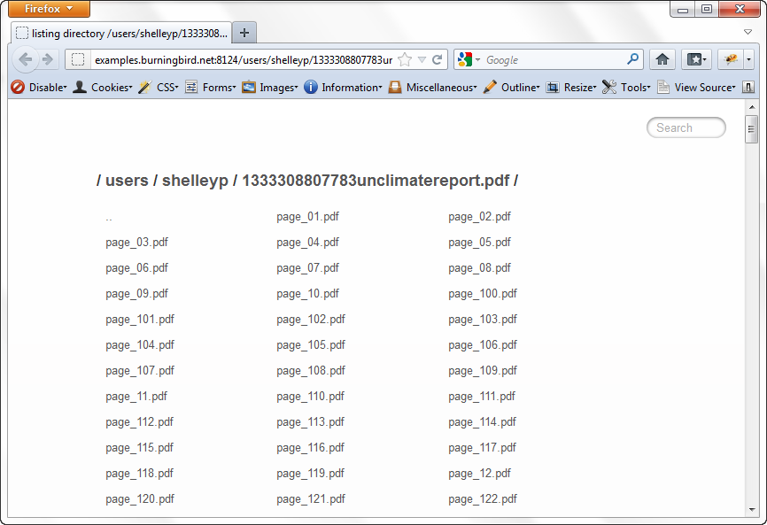
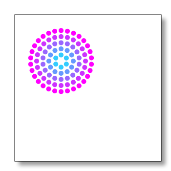

# Chapter 12

Chapter 12. Graphics and HTML5 Video

Node provides numerous opportunities to work with several different graphics applications and libraries. Since it’s a server technology, your applications can make use of any server-based graphics software, such as ImageMagick or GD. However, since it’s also based on the same JavaScript engine that runs the Chrome browser, you can work with client-side graphics applications, such as Canvas and WebGL, too.

Node also has some support for serving up audio and video files via the new HTML5 media capabilities present in all modern browsers. Though we have limited capabilities with working directly with video and audio, we can serve files of both types, as we’ve seen in previous chapters. We can also make use of server-based technologies, such as FFmpeg.

No chapter on web graphics would be complete without mentioning PDFs at least once. Happily for those of us who make use of PDF documents in our websites, we have access to a very nice PDF generation Node module, as well as access to various helpful PDF tools and libraries installed on the server.

I’m not going to exhaustively cover every form of graphics or media implementation and management capability from Node. For one, I’m not familiar with all of them, and for another, some of the support is still very primitive, or the technologies can be extremely resource intensive. Instead, I’ll focus on more stable technologies that make sense for a Node application: basic photo manipulation with ImageMagick, HTML5 video, working with and creating PDFs, and creating/streaming images created with Canvas.

# Creating and Working with PDFs

Operating systems, versions of HTML, and development technologies may come and go, but one constant is the ubiquitous PDF. Regardless of the type of application or service you’re creating, there’s a good chance you’ll need to provide PDF documents. And as Doctor Who would say, *PDFs are cool*.

You have a couple of options for working with PDFs from a Node application. One approach is to use a Node child process to access an operating system tool, such as the PDF Toolkit or wkhtmltopdf directly on Linux. Another approach is to use a module, such as the popular PDFKit. Or you can use always use both.

## Accessing PDF Tools with Child Processes

Though there are few command-line tools to manipulate PDFs in the Windows world, there are several available for Linux and OS X. Fortunately, two I’ve worked with, PDF Toolkit and wkhtmltopdf, can be installed and accessed in all three environments.

Taking page snapshots with wkhtmltopdf

The wkhtmltopdf utility is a way of converting HTML into a PDF file using the WebKit rendering engine. It’s a particularly handy way of taking a snapshot of a website, graphics and all. Some sites provide the ability to generate a PDF of content, but frequently do so by stripping out all the graphics. The wkhtmltopdf tool preserves the appearance of the page.

There are installation versions of this utility for OS X and Windows, and you can also download the source code for building in a Unix environment. If you’re running the application on your server, you’ll need to do some tweaks first, because of its X Windows dependency.

To work with wkhtmltopdf in my system (Ubuntu), I had to install supporting libraries:

apt-get install openssl build-essential xorg libssl-dev

Then I had to install a tool (xvfb) that allows wkhtmltopdf to run headless in a virtual X server (bypassing the X Windows dependency):

apt-get install xvfb

Next, I created a shell script, named *wkhtmltopdf.sh*, to wrap the wkhtmltopdf in xvfb. It contains one line:

xvfb-run -a -s "-screen 0 640x480x16" wkhtmltopdf $*

I then moved the shell script to */usr/bin*, and changed permissions with chmod a+x. Now I’m ready to access wkhtmltopdf from my Node applications.

The wkhtmltopdf tool supports a large number of options, but I’m going to demonstrate how to use the tool simply from a Node application. On the command line, the following takes a URL to a remote web page and then generates a PDF using all default settings (using the shell script version):

wkhtmltopdf.sh http://remoteweb.com/page1.html page1.pdf

To implement this in Node, we need to use a child process. For extensibility, the application should also take the name of the input URL, as well as the output file. The entire application is in Example 12-1.

Example 12-1. Simple Node application that wraps wkhtmltopdf

var spawn = require('child_process').spawn;

// command line arguments

var url = process.argv[2];

var output = process.argv[3];

if (url && output) {

var wkhtmltopdf = spawn('wkhtmltopdf.sh', [url, output]);

wkhtmltopdf.stdout.setEncoding('utf8');

wkhtmltopdf.stdout.on('data', function (data) {

console.log(data);

});

wkhtmltopdf.stderr.on('data', function (data) {

console.log('stderr: ' + data);

});

wkhtmltopdf.on('exit', function (code) {

console.log('child process exited with code ' + code);

});

} else {

console.log('You need to provide a URL and output file name');

}

You typically wouldn’t use wkhtmltopdf in a Node application by itself, but it can be a handy addition to any website or application that wants to provide a way to create a persistent PDF of a web page.

Accessing data about a PDF file with PDF Toolkit

PDF Toolkit, or pdftk, provides functionality to split apart (*burst*) a PDF document or merge several documents into one. It can also be used to fill a PDF form, apply a watermark, rotate a PDF document, apply or remove compression, or uncompress a PDF stream for editing. There are installers for both Mac and Windows, and simple-to-follow instructions for installing in most flavors of Unix.

PDF Toolkit can be accessed via Node child processes. As an example, the following code creates a child process that invokes PDF Toolkit’s dump_data comment to discover information about a PDF, such as how many pages it contains:

var spawn = require('child_process').spawn;

var pdftk = spawn('pdftk', [__dirname + '/pdfs/datasheet-node.pdf', 'dump_data']);

pdftk.stdout.on('data', function (data) {

// convert results to an object

var array = data.toString().split('\n');

var obj = {};

array.forEach(function(line) {

var tmp = line.split(':');

obj[tmp[0]] = tmp[1];

});

// print out number of pages

console.log(obj['NumberOfPages']);

});

pdftk.stderr.on('data', function (data) {

console.log('stderr: ' + data);

});

pdftk.on('exit', function (code) {

console.log('child process exited with code ' + code);

});

The PDF Toolkit data_dump returns results similar to the following:

stdout: InfoKey: Creator

InfoValue: PrintServer150&#0;

InfoKey: Title

InfoValue: &#0;

InfoKey: Producer

InfoValue: Corel PDF Engine Version 15.0.0.431

InfoKey: ModDate

InfoValue: D:20110914223152Z

InfoKey: CreationDate

InfoValue: D:20110914223152Z

PdfID0: 7fbe73224e44cb152328ed693290b51a

PdfID1: 7fbe73224e44cb152328ed693290b51a

NumberOfPages: 3

The format is easily converted into an object for simpler access of the individual properties.

PDF Toolkit is a reasonably responsive tool, but you’ll want to use caution when holding up a web response waiting for it to finish. To demonstrate how to access PDF Toolkit from a Node web application, and how to deal with the expected lag time that working with a computationally expensive graphics application can cause, we’ll build a simple PDF uploader.

Creating a PDF uploader and dealing with graphics lag time

PDF Toolkit’s ability to burst a PDF or merge several PDFs into one is functionality that can be helpful at a website that allows users to upload and download PDF documents, and then provides individual access of each PDF page. Think of Google Docs, or a website such as Scribd, which allows PDF sharing.

The components to this type of application are:

- A form to select which PDF tool to upload
- A web service to receive the PDF document and then initiate the PDF processing
- A child process wrapper around PDF Toolkit to burst the PDF document into separate pages
- A response to the user providing links to the uploaded document and access to the individual pages

The component that bursts the PDF must first create a location for the pages and then determine what the pages will be named before it can perform the splitting action. This will require accessing the Node File System module to create the directory for the split files. Since larger files can take some time, rather than hold the web response waiting for PDF Toolkit to finish, the application sends an email to the user with URLs for the newly uploaded files. This requires the use of a module we’ve not used in previous chapters, Emailjs. This module provides basic email functionality.

You can install the Emailjs module via npm:

npm install emailjs

The form to upload the PDF is basic, needing little explanation. It uses a file input field in addition to a field for the person’s name and email address, and sets the method to POST and the action to the web service. Since we’re uploading a file, the enctype field must be set to multipart/form-data. The finished form page can be seen in Example 12-2.

Example 12-2. Form to upload a PDF file

<!doctype html>

<html lang="en">

<head>

<meta charset="utf-8" />

<title>Upload PDF</title>

</head>

<body>

<form id="upload" method="POST" action="http://localhost:8124"

enctype="multipart/form-data">

<label for="username">User Name:</label>

<input id="username" name="username" type="text" size="20" required />

<label for="email">Email:</label>

<input id="email" name="email" type="text" size="20" required />

<label for="pdffile">PDF File:</label>

<input type="file" name="pdffile" id="pdffile" required />

<input type="submit" name="submit" id="submit" value="Submit"/>

</form>

</body>

We have a chance to brush up on our client-side JavaScript skills by disabling the submit button when the form is submitted. The form makes use of the HTML5 required attribute, which ensures that the proper data is provided.

The web service application that processes both the request for the form and the PDF upload uses the Connect middleware, this time without the Express framework.

In the service, the Connect static middleware is used to serve up static files, and the directory middleware is used to pretty-print a directory listing when a directory is accessed. The only other functionality that’s needed is the process to parse out both the PDF file and the form data from the upload. The application uses the Connect parseBody method, which is capable of processing any type of posted data:

connect()

.use(connect.bodyParser({uploadDir: __dirname + '/pdfs'}))

.use(connect.static(__dirname + '/public'))

.use(connect.directory(__dirname + '/public'))

.listen(8124);

The data is then made available to a custom middleware named upload, which handles both the data and the PDF—invoking a custom module to process the PDF file. The bodyParser middleware makes the username and email available on the request.body object, and the uploaded file on the request.files object. If a file is uploaded, it’s uploaded as an object named pdffile because that’s the name of the file upload field. You’ll need an additional test on the file type to ensure that the file uploaded is a PDF.

Example 12-3 has the complete code for the PDF service application.

Example 12-3. PDF upload web service application

var connect = require('connect');

var pdfprocess = require('./pdfprocess');

// if POST

// upload file, kick off PDF burst, respond with ack

function upload(req, res, next){

if ('POST' != req.method) return next();

res.setHeader('Content-Type', 'text/html');

if (req.files.pdffile && req.files.pdffile.type === 'application/pdf') {

res.write('
Thanks ' + req.body.username +

' for uploading ' + req.files.pdffile.name + '
');

res.end("
You'll receive an email with file links when processed.
");

// post upload processing

pdfprocess.processFile(req.body.username, req.body.email,

req.files.pdffile.path, req.files.pdffile.name);

} else {

res.end('The file you uploaded was not a PDF');

}

}

// in order

// static files

// POST - upload file

// otherwise, directory listing

connect()

.use(connect.bodyParser({uploadDir: __dirname + '/pdfs'}))

.use(connect.static(__dirname + '/public'))

.use(upload)

.use(connect.directory(__dirname + '/public'))

.listen(8124);

console.log('Server started on port 8124');

The custom module *pdfprocess* is where the application performs the following steps to process the PDF file:

1. A directory is created for the user under the public *pdfs* subdirectory if none exists.
2. A timestamp value is used with the file to create a unique name for the current uploaded PDF.
3. The timestamp is used with the PDF filename to create a new subdirectory for the PDFs under the user’s subdirectory.
4. The PDF is moved from the temporary upload directory to this new directory, and renamed the original PDF filename.
5. The PDF Toolkit burst operation is performed on this file, with all the individual PDFs placed in the *pdfs* directory.
6. An email is sent to the user providing a URL/link where he can access the new directory containing the original uploaded PDF and the individual PDF pages.

The filesystem functionality is provided by the Node File System module, the email functionality is handled by Emailjs, and the PDF Toolkit functionality is managed in a child process. There is no data returned from this child process, so the only events captured are child process exit and error events. Example 12-4 contains the code for this final piece of the application.

Example 12-4. Module to process PDF file and send user email with location of processed files

var fs = require('fs');

var spawn = require('child_process').spawn;

var emailjs = require('emailjs');

module.exports.processFile = function(username, email, path, filename) {

// first, create user directory if doesn't exist

fs.mkdir(__dirname + '/public/users/' + username, function(err) {

// next create file directory if doesn't exist

var dt = Date.now();

// url for message later

var url = 'http://examples.burningbird.net:8124/users/' +

username + '/' + dt + filename;

// directory for file

var dir = __dirname + '/public/users/' + username + '/' +

dt + filename;

fs.mkdir(dir, function(err) {

if (err)

return console.log(err);

// now, rename file to new location

var newfile = dir + '/' + filename;

fs.rename(path, newfile, function(err) {

if (err)

return console.log(err);

//burst pdf

**var pdftk = spawn('pdftk', [newfile, 'burst', 'output',dir + '/page_%02d.pdf' ]);**
pdftk.on('exit', function (code) {
console.log('child process ended with ' + code);
if (code != 0)
return;
console.log('sending email');
// send email
var server = emailjs.server.connect({
user : 'gmail.account.name',
password : 'gmail.account.passwod',
host : 'smtp.gmail.com',
port : 587,
tls : true
});
var headers = {
text : 'You can find your split PDF at ' + url,
from : 'youremail',
to : email,
subject: 'split pdf'
};
var message = emailjs.message.create(headers);
message.attach({data:"
You can find your split PDF at " +
"<a href='" + url + "'>" + url + "</a>
",
alternative: true});
server.send(message, function(err, message) {
console.log(err || message);
});
pdftk.kill();
});
pdftk.stderr.on('data', function (data) {
console.log('stderr: ' + data);
});
});
});
});
};

The actual child process call to PDF Toolkit is in bold text in the code. The command-line syntax used is the following:

pdftk

*filename*.pdf burst output /home/location/page_%02d.pdf

The filename is given first, then the operation, and then an output directive. The operation is, as mentioned earlier, the burst operation, which splits the PDF into separate pages. The output directive instructs PDF Toolkit to place the newly split PDF pages in a specific directory, and provides formatting for the page names—the first page would be *page_01.pdf*, the second *page_02.pdf*, and so on. I could have used Node’s process.chdir to change the process to the directory, but it really wasn’t necessary since I can make the PDF Toolkit operation place the files in a specified directory.

The email is sent using the Gmail SMTP server, which utilizes TLS (transport layer security), over port 587 and with a given Gmail username and password. You could, of course, use your own SMTP server. The message is sent both in plain text and with a given HTML-formatted attachment (for those folks who use an email reader capable of processing HTML).

The end result of the application is a link sent to the user that takes her to the directory where she’ll find the uploaded PDF and the split pages. The Connect directory middleware ensures that the contents of the directory are attractively displayed. Figure 12-1 shows the results of uploading one very large PDF file on global warming.

With this approach—providing acknowledgment to the user in an email—the user doesn’t have to wait around for (and the Node service isn’t hung up waiting on) the PDF processing.

### Note

Of course, the user still has to spend time uploading the PDF file—this application doesn’t touch on the issues associated with large file uploads.

Figure 12-1. End result of running PDF Toolkit burst on large uploaded PDF

## Creating PDFs with PDFKit

If using a child process and command-line tools isn’t for you, or if you need to be able to create a PDF as well as manipulate existing PDFs, there are Node modules that provide PDF capability. Chief among them is PDFKit.

PDFKit is written in CoffeeScript, but you don’t have to know CoffeeScript to use the module because the API is exposed to JavaScript. The module provides functionality to create a PDF document, add pages to it, incorporate text and graphics, and embed images. Future additions to the module should add other functionality, such as PDF outlines, gradients, tables, and other nice features.

Install PDFKit using npm like so:

npm install pdfkit

In your application, you start by creating a new PDF document:

var doc = new PDFDocument();

You can then add a font, a new web page, and graphics, all with the exposed API. The API methods can all be chained to simplify development.

To demonstrate how to use the module from JavaScript, I converted one of the CoffeeScript examples from the module developer into JavaScript. From the top, after the PDF document is created, a TrueType font is added to the document, the font size is set to 25 pixels, and text is drawn at *(x*,*y)* coordinates of 100, 100:

doc.font('fonts/GoodDog-webfont.ttf')

.fontSize(25)

.text('Some text with an embedded font!', 100, 100);

The application then adds a new PDF page, again changes the font size to 25 pixels, and draws new text at 100, 100:

doc.addPage()

.fontSize(25)

.text('Here is some vector graphics...', 100, 100);

The document coordinate system is saved, and the vector graphics functionality is used to draw a red triangle:

doc.save()

.moveTo(100, 150)

.lineTo(100, 250)

.lineTo(200, 250)

.fill("#FF3300");

The next section of code scales the coordinate system to 0.6, translates the origin, draws a path in the shape of a star, fills it with red, and then restores the document back to the original coordinate system and scale:

doc.scale(0.6)

.translate(470, −380)

.path('M 250,75 L 323,301 131,161 369,161 177,301 z')

.fill('red', 'even-odd')

.restore();

If you’ve worked with other vector graphics systems, such as Canvas, much of this should seem familiar. If you haven’t, then you might want to check out the Canvas examples later in the book and then return to this example.

Another page is added, the fill color is changed to blue, and a link is added to the page. The document is then written out to a file named *output.pdf*:

doc.addPage()

.fillColor("blue")

.text('Here is a link!', 100, 100)

.underline(100, 100, 160, 27, {color: "#0000FF"})

.link(100, 100, 160, 27, 'http://google.com/');

doc.write('output.pdf');

It’s tedious to create a PDF document manually. However, we can easily program the PDFKit API to take content from a data store and generate a PDF on the fly. We could also use PDFKit to generate a PDF document of web page content on demand, or to provide a persistent snapshot of data.

Be aware, though, that many of the module’s methods are not asynchronous. You’ll most likely be blocking as you’re building the PDF, so plan accordingly.

# Accessing ImageMagick from a Child Process

ImageMagick is a powerful command-line graphics tool available in the Mac, Windows, and Unix environments. It can be used to crop or resize an image, access image metadata, animate a sequence of images, and add any number of special effects. It’s also very resource intensive, and depending on the size of the image and what you’re doing with it, can take a noticeable amount of time.

There are ImageMagick Node modules. One of the first is imagemagick, which provides a wrapper for ImageMagick functionality. However, it hasn’t been updated for some time. Another module is gm, which provides a set of predefined functions that work with ImageMagick in the background. You may find, though, that it’s just as simple to work with ImageMagick directly. All you need to work with ImageMagick directly from a Node application is for ImageMagick to be installed, and a Node child process.

ImageMagick provides several different tools you can use to perform different functions:

animate

Animates a sequence over an X server

compare

Provides a mathematical and visual annotation of differences between an image and a reconstruction of the image after modification

composite

Overlaps two images

conjure

Executes scripts written in the Magick Scripting Language (MSL)

convert

Converts an image using any number of possible conversions such as cropping, resizing, or adding an effect

display

Displays an image on an X server

identify

Describes the format and other characteristics of an image file or several image files

import

Creates a screenshot of any visible window on an X server and saves to a file

mogrify

Modifies an image in place (resizes, crops, dithers, etc.) and saves the effects in the existing image

montage

Creates a composite image from several

stream

Streams an image to storage, one pixel at a time

Several of the tools are related to an X server and make little sense from a Node application perspective. However, the convert, mogrify, montage, identify, and stream tools can have interesting uses in a Node application. In this section and the next, we’ll focus on one: convert.

### Note

Though we’re focusing on convert, be aware that everything in this section also applies to mogrify, except that mogrify overwrites the original file.

The convert tool is the ImageMagick workhorse. With it, you can perform some pretty amazing transformations on an image and then save the results to a separate file. You can provide an adaptive blur, sharpen the image, annotate the image with text, position it on a backdrop, crop it, resize it, and even replace every pixel in the image with its color complement. There is little you can’t do to an image with ImageMagick. Of course, not every operation is equal, especially if you’re concerned about how long it will take. Some of the image conversions occur quickly, while others can take considerable time.

To demonstrate how to use convert from a Node application, the small, self-contained application in Example 12-5 specifies an image filename on the command line and scales that image so it fits into a space no more than 150 pixels wide. The image is also transformed into a PNG, regardless of its original type.

The command-line version of this process is:

convert photo.jpg -resize '150' photo.jpg.png

We’ll need to capture four command arguments in the array for the child process: the original photo, the -resize flag, the value for the -resize flag, and the name of the new image.

Example 12-5. Node application to use a child process to scale an image with the ImageMagick convert tool

var spawn = require('child_process').spawn;

// get photo

var photo = process.argv[2];

// conversion array

var opts = [

photo,

'-resize',

'150',

photo + ".png"];

// convert

var im = spawn('convert', opts);

im.stderr.on('data', function (data) {

console.log('stderr: ' + data);

});

im.on('exit', function (code) {

if (code === 0)

console.log('photo has been converted and is accessible at '

+ photo + '.png');

});

The ImageMagick convert tool processes the image silently, so there is no child process data event to process. The only events we’re interested in are the error and the exit, when the image processing is finished.

Where an application like ImageMagick can get tricky is when you’re interested in doing a much more involved process. One of the more popular effects people have applied to images using ImageMagick is the *Polaroid effect*: rotating the image slightly around its center and adding a border and a shadow to make the image look like a Polaroid photo. The effect is now so popular that there’s a predefined setting for it, but prior to this new setting, we had to use a command similar to the following (from the ImageMagick usage examples):

convert thumbnail.gif \

-bordercolor white -border 6 \

-bordercolor grey60 -border 1 \

-background none -rotate 6 \

-background black \( +clone -shadow 60x4+4+4 \) +swap \

-background none -flatten \

polaroid.png

This is a lot of arguments, and the arguments are in a format you may not have seen previously. So how does this get converted into a child process arguments array?

Minutely.

What looks like a single argument on the command line (\(+clone -shadow 60x4+4+4 \)) is anything but to the Node child process. Example 12-6 is a variation of the conversion tool in Example 12-5, except now a Polaroid effect is being applied rather than the image being scaled. Pay particular attention to the line in bold text.

Example 12-6. Applying a Polaroid effect to a photo using ImageMagick from a Node application

var spawn = require('child_process').spawn;

// get photo

var photo = process.argv[2];

// conversion array

var opts = [

photo,

"-bordercolor", "snow",

"-border", "6",

"-background","grey60",

"-background", "none",

"-rotate", "6",

"-background", "black",

**"(", "+clone", "-shadow", "60x4+4+4", ")",**
"+swap",
"-background", "none",
"-flatten",
photo + ".png"];
var im = spawn('convert', opts);

The bolded code in the example demonstrates how what appears to be a single argument on the command line becomes five arguments to the child process. The end result of running the application is shown in Figure 12-2.

Figure 12-2. Result of running Node application to apply a Polaroid effect to a photo

It’s unlikely that you’ll use the Node application with an ImageMagick child process directly on the command line. After all, you can just run ImageMagick’s tools directly. However, you can use the combined child process/ImageMagick tool to run several different conversions on a single image, or to provide services from a website (such as allowing a person to resize a photo to use as an avatar, or add annotations to uploaded images at a shared resource site).

The key to creating a web application that uses ImageMagick is the same as with the PDF demonstration applications from earlier in the chapter: if the process is going to be slow (especially with a larger number of concurrent users), you need to consider providing functionality that allows the individual to upload the image file and then provide a link to the finished project (either at a site, or via email) rather than block, waiting for everything to finish.

We can adapt the code in Example 12-3 and Example 12-4 to apply the Polaroid effect to any uploaded image. In particular, we can convert Example 12-3 into a module that can be applied for the same pattern of use: a file process that creates a new subdirectory for an uploaded file, runs a process, and deposits the resulting files in the same directory.

# Properly Serving HTML5 Video with HTTP

In Chapter 6, we created a simple HTTP server that served static files and provided some basic directory and 404 handling. One of the web pages we tested with the server included an embedded HTML5 video. The web page also had a custom toolbar that allowed the user to click anywhere on a timeline to start the video at an intermediate position.

The HTML5 video application worked with the Connect module’s static web server, but not the homemade web server. The reason is that the homemade web server didn’t handle the concept of *HTTP ranges*. HTTP servers such as Apache and IIS have support for ranges, as does the Connect model; our static server did not.

In this section, we’ll add support for ranges to the minimal web server we created back in Example 6-2.

### Note

Support for ranges extends beyond serving HTML5 video. Ranges can also be used to download larger files.

Ranges are an HTTP header that provides a start and end position for loading a resource, such as a video file. Here are the steps we need to take to add support for HTTP ranges:

1. Signal willingness to accept range requests with response header Accept-Ranges: bytes.
2. Look for a range request in the request header.
3. If a range request is found, parse out the start and end values.
4. Validate that the start and end values are numbers, and that neither exceeds the length of the resource being accessed.
5. If no end value is provided, set it to the resource length; if no start value is provided, set it to zero (0).
6. Create a Content-Range response header consisting of start, end, and resource length values.
7. Create a Content-Length response header with a value calculated from subtracting the start value from the end value.
8. Change the status code from 200 to 206 (Partial).
9. Pass an object consisting of the start and end values to the createReadStream method.

When a web client accesses a resource from a web server, the web server can signal to the client that it supports ranges, and provide a range unit, with the following header:

Accept-Ranges: bytes

The first modification necessary for the minimal web server is to add the new header:

res.setHeader('Accept-Ranges','bytes');

The client will then send through range requests of the following format:

bytes=

startnum

-

endnum

Where the *startnum*/*endnum* values are the starting and end numbers for the range. Several of these requests can be sent during playback. For example, the following are actual range requests sent from the web page with the HTML5 video after starting the video and then clicking around on the timeline during playback:

bytes=0-

bytes=7751445-53195861

bytes=18414853-53195861

bytes=15596601-18415615

bytes=29172188-53195861

bytes=39327650-53195861

bytes=4987620-7751679

bytes=17251881-18415615

bytes=17845749-18415615

bytes=24307069-29172735

bytes=33073712-39327743

bytes=52468462-53195861

bytes=35020844-39327743

bytes=42247622-52468735

The next addition to the minimal web server is to check to see if a range request has been sent, and if so, to parse out the start and end values. The code to check for a range request is:

if (req.headers.range) {...}

To parse the range start and end values, I created a function, processRange, that splits the string on the dash (-) and then extracts the numbers out of the two returned strings. The function also double-checks to ensure that a start value is provided and is a number, and isn’t beyond the file length (returning a status code 416, Requested Range Not Satisfiable, if it is). It also checks to ensure that the end value is a number, and sets it to the video length if the value isn’t provided. An object containing both start and end is returned by the function:

function processRange(res,ranges,len) {

var start, end;

// extract start and stop range

var rangearray = ranges.split('-');

start = parseInt(rangearray[0].substr(6));

end = parseInt(rangearray[1]);

if (isNaN(start)) start = 0;

if (isNaN(end)) end = len −1;

// start beyond end of file length

if (start > len - 1) {

res.setHeader('Content-Range', 'bytes */' + len);

res.writeHead(416);

res.end();

}

// end can't be beyond file length

if (end > len - 1)

end = len - 1;

return {start:start, end:end};

}

The next component of the functionality is to prepare a Content-Range response header, providing the start and end values for the range, as well as the length of the resource, in the following format:

Content-Range bytes 44040192-44062881/44062882

The content length (Content-Length) response is also prepared, calculated as the end value minus the start value. In addition, the HTTP status code is set to 206, for Partial Content.

Last, the start and end values are also sent as an option to the createReadStream method call. This ensures that the stream is properly repositioned for streaming.

Example 12-7 pulls all of these pieces together into a modified minimal web server that can now serve HTML5 video (or other resource) ranges.

Example 12-7. The minimal web server, now with support for ranges

var http = require('http'),

url = require('url'),

fs = require('fs'),

mime = require('mime');

function processRange(res,ranges,len) {

var start, end;

// extract start and stop range

var rangearray = ranges.split('-');

start = parseInt(rangearray[0].substr(6));

end = parseInt(rangearray[1]);

if (isNaN(start)) start = 0;

if (isNaN(end)) end = len −1;

// start beyond end of file length

if (start > len - 1) {

res.setHeader('Content-Range', 'bytes */' + len);

res.writeHead(416);

res.end();

}

// end can't be beyond file length

if (end > len - 1)

end = len - 1;

return {start:start, end:end};

}

http.createServer(function (req, res) {

pathname = __dirname + '/public' + req.url;

fs.stat(pathname, function(err, stats) {

if (err) {

res.writeHead(404);

res.write('Bad request 404\n');

res.end();

} else if (stats.isFile()) {

var opt={};

// assume no range

res.statusCode = 200;

var len = stats.size;

// we have a Range request

if (req.headers.range) {

opt = processRange(res,req.headers.range,len);

// adjust length

len = opt.end - opt.start + 1;

// change status code to partial

res.statusCode = 206;

// set header

var ctstr = 'bytes ' + opt.start + '-' +

opt.end + '/' + stats.size;

res.setHeader('Content-Range', ctstr);

}

console.log('len ' + len);

res.setHeader('Content-Length', len);

// content type

var type = mime.lookup(pathname);

res.setHeader('Content-Type', type);

res.setHeader('Accept-Ranges','bytes');

// create and pipe readable stream

var file = fs.createReadStream(pathname,opt);

file.on("open", function() {

file.pipe(res);

});

file.on("error", function(err) {

console.log(err);

});

} else {

res.writeHead(403);

res.write('Directory access is forbidden');

res.end();

}

});

}).listen(8124);

console.log('Server running at 8124/');

Modifying the minimal web server demonstrates that HTTP and other network functionality isn’t necessarily complicated—just tedious. The key is to break down each task into separate tasks, and then add code to manage each subtask one at a time (testing after each).

Now the web page (included in the examples) that allows the user to click around on a timeline works correctly.

# Creating and Streaming Canvas Content

The canvas element has become a favorite of game developers, graphic artists, and statisticians because of the capability it provides for creating dynamic and interactive graphics in client web pages. The canvas element is also supported in a Node environment via modules, such as the one covered in this section: node-canvas, or just plain canvas (we’ll use “node-canvas” here). The node-canvas module is based on Cairo, a cross-platform vector graphics library that’s long been popular with developers.

To use node-canvas, install it via npm:

npm install canvas

All of the standard Canvas functionality you have in a client page is available via the node-canvas module. You create a Canvas object and then a context, do all your drawing in the context, and then either display the result or save the result in a file as a JPEG or PNG.

Warning

Be aware that some of the functionality in Canvas, such as working with an image, requires a version of Cairo greater than 1.10.

There are also a couple of additional methods available on the server that you wouldn’t have on the client. These allow us to stream a Canvas object to a file (either as a PNG or JPEG), persisting the results for later access (or serving in a web page). You can also convert the Canvas object to a data URI and include an img element in a generated HTML web page, or read an image from an external source (such as a file or a Redis database) and use it directly in the Canvas object.

Jumping right in to demonstrate how to use the node-canvas module, Example 12-8 creates a canvas drawing and then streams it to a PNG file for later access. The example uses a rotated graphic image from an example at the Mozilla Developer Network, and adds a border and shadow to it. Once finished, it’s streamed to a PNG file for later access. Most of the functionality could be used in a client application as well as the Node application. The only real Node-specific component is persisting the graphic as a file in the end.

Example 12-8. Creating a graphic using node-canvas and persisting the result to a PNG file

var Canvas = require('canvas');

var fs = require('fs');

// new canvas and context

var canvas = new Canvas(350,350);

var ctx = canvas.getContext('2d');

// create filled rectangle with shadow

// save context for later restore

ctx.save();

ctx.shadowOffsetX = 10;

ctx.shadowOffsetY = 10;

ctx.shadowBlur = 5;

ctx.shadowColor='rgba(0,0,0,0.4)';

ctx.fillStyle = '#fff';

ctx.fillRect(30,30,300,300);

// done with shadow

ctx.restore();

ctx.strokeRect(30,30,300,300);

// MDN example: pretty graphic, inserted offset into

// previously created square

ctx.translate(125,125);

for (i=1;i<6;i++){

ctx.save();

ctx.fillStyle = 'rgb('+(51*i)+','+(255-51*i)+',255)';

for (j=0;j<i*6;j++){

ctx.rotate(Math.PI*2/(i*6));

ctx.beginPath();

ctx.arc(0,i*12.5,5,0,Math.PI*2,true);

ctx.fill();

}

ctx.restore();

}

// stream to PNG file

var out = fs.createWriteStream(__dirname + '/shadow.png');

var stream = canvas.createPNGStream();

stream.on('data', function(chunk){

out.write(chunk);

});

stream.on('end', function(){

console.log('saved png');

});

Once you’ve run the Node application, access the *shadow.png* file from your favorite browser. Figure 12-3 shows the generated image.

Figure 12-3. Image generated using node-canvas

You’re not going to use the Canvas object in a Node application as you would a canvas element in a web page. One of the examples included with node-canvas is a dynamic clock that requires constant HTTP refreshes. If you want an active clock in the client, you should use the canvas element in the client.

Where canvas makes sense on the server is as a way of providing a graphical representation of a server activity, such as a database query, data in a Redis database, a logfile, or other data that originates on the server. By generating the graphic on the server, you not only can persist the graphic for multiple accesses, but you can also limit how much data flows to the client by being able to process a graphic on the server, rather than having to send the data to the client and then create the graphic.

Using canvas in a Node application also makes sense if you’re generating game components that may need to adapt to user actions, particularly if the graphics need to be persisted for later access.