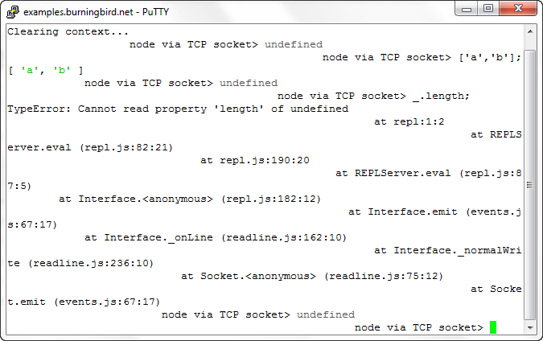

# Chapter 2. Interactive Node with REPL

While you’re exploring the use of Node and figuring out the code for your custom module or Node application, you don’t have to type JavaScript into a file and run it with Node to test your code. Node also comes with an interactive component known as *REPL*, or *read-eval-print loop*, which is the subject of this chapter.

REPL (pronounced “repple”) supports a simplified Emacs style of line editing and a small set of basic commands. Whatever you type into REPL is processed no differently than if you had typed the JavaScript into a file and run the file using Node. You can actually use REPL to code your entire application—literally testing the application on the fly.

In this chapter, I’ll also cover some interesting quirks of REPL, along with some ways you can work around them. These workarounds include replacing the underlying mechanism that persists commands, as well as using some command-line editing.

Lastly, if the built-in REPL doesn’t provide exactly what you need for an interactive environment, there’s also an API to create your own custom REPL, which I’ll demonstrate in the latter part of the chapter.

### Note

You’ll find a handy guide for using REPL at http://docs.nodejitsu.com/articles/REPL/how-to-use-nodejs-repl. The Nodejitsu site also provides a nice tutorial on how to create a custom REPL at http://docs.nodejitsu.com/articles/REPL/how-to-create-a-custom-repl.

# REPL: First Looks and Undefined Expressions

To begin REPL, simply type **node** without providing any Node application file, like so:

$ node

REPL then provides a command-line prompt—an angle bracket (>)—by default. Anything you type from this point on is processed by the underlying V8 JavaScript engine.

REPL is very simple to use. Just start typing in your JavaScript, like you’d add it to a file:

> a = 2;

2

The tool prints out the result of whatever expression you just typed. In this session excerpt, the value of the expression is 2. In the following, the expression result is an array with three elements:

> b = ['a','b','c'];

[ 'a', 'b', 'c' ]

To access the last expression, use the underscore/underline character (_). In the following, a is set to 2, and the resulting expression is incremented by 1, and then 1 again:

> a = 2;

2

> _ ++;

3

> _ ++;

4

You can even access properties or call methods on the underscored expression:

> ['apple','orange','lime']

[ 'apple', 'orange', 'lime' ]

> _.length

3

> 3 + 4

7

> _.toString();

'7'

You can use the var keyword with REPL in order to access an expression or value at a later time, but you might get an unexpected result. For instance, the following line in REPL:

var a = 2;

doesn’t return the value 2, it returns a value of undefined. The reason is that the result of the expression is undefined, since variable assignment doesn’t return a result when evaluated.

Consider the following instead, which is what’s happening, more or less, under the hood in REPL:

console.log(eval('a = 2'));

console.log(eval('var a = 2'));

Typing the preceding lines into a file and running that file using Node returns:

2

undefined

There is no result from the second call to eval, and hence the value returned is undefined. Remember, REPL is a read-eval-print loop, with emphasis on the *eval*.

Still, you can use the variable in REPL, just as you would in a Node application:

> var a = 2;

undefined

> a++;

2

> a++;

3

The latter two command lines do have results, which are printed out by REPL.

### Note

I’ll demonstrate how to create your own custom REPL—one that doesn’t output undefined—in the section Custom REPL.

To end the REPL session, either press Ctrl-C twice, or Ctrl-D once. We’ll cover other ways to end the session later, in REPL Commands.

# Benefits of REPL: Getting a Closer Understanding of JavaScript Under the Hood

Here’s a typical demonstration of REPL:

> 3 > 2 > 1;

false

This code snippet is a good example of how REPL can be useful. At first glance, we might expect the expression we typed to evaluate to true, since 3 is greater than 2, which is greater than 1. However, in JavaScript, expressions are evaluated left to right, and each expression’s result is returned for the next evaluation.

A better way of looking at what’s happening with the preceding code snippet is this REPL session:

> 3 > 2 > 1;

false

> 3 > 2;

true

> true > 1;

false

Now the result makes more sense. What’s happening is that the expression 3 > 2 is evaluated, returning true. But then the value of true is compared to the numeric 1. JavaScript provides automatic data type conversion, after which true and 1 are equivalent values. Hence, true is not greater than 1, and the result is false.

REPL’s helpfulness is in enabling us to discover these little interesting quirks in JavaScript. Hopefully, after testing our code in REPL, we don’t have unexpected side effects in our applications (such as expecting a result of true but getting a result of false).

# Multiline and More Complex JavaScript

You can type the same JavaScript into REPL just like you’d type it into a file, including require statements to import modules. A session to try out the Query String (qs) module is repeated in the following text:

$ node

> qs = require('querystring');

{ unescapeBuffer: [Function],

unescape: [Function],

escape: [Function],

encode: [Function],

stringify: [Function],

decode: [Function],

parse: [Function] }

> val = qs.parse('file=main&file=secondary&test=one').file;

[ 'main', 'secondary' ]

Since you didn’t use the var keyword, the expression result is printed out—in this instance, the interface for the querystring object. How’s that for a bonus? Not only are you getting access to the object, but you’re also learning more about the object’s interface while you’re at it. However, if you want to forgo the potentially lengthy output of text, use the var keyword:

> var qs = require('querystring');

You’ll be able to access the querystring object with the qs variable with either approach.

In addition to being able to incorporate external modules, REPL gracefully handles multiline expressions, providing a textual indicator of code that’s nested following an opening curly brace ({):

> var test = function (x, y) {

... var val = x * y;

... return val;

... };

undefined

> test(3,4);

12

REPL provides repeating dots to indicate that everything that’s being typed follows an open curly brace and hence the command isn’t finished yet. It does the same for an open parenthesis, too:

> test(4,

... 5);

20

Increasing levels of nesting generates more dots; this is necessary in an interactive environment, where you might lose track of where you are, as you type:

> var test = function (x, y) {

... var test2 = function (x, y) {

..... return x * y;

..... }

... return test2(x,y);

... }

undefined

> test(3,4);

12

>

You can type in, or copy and paste in, an entire Node application and run it from REPL:

> var http = require('http');

undefined

> http.createServer(function (req, res) {

...

... // content header

... res.writeHead(200, {'Content-Type': 'text/plain'});

...

... res.end("Hello person\n");

... }).listen(8124);

{ connections: 0,

**allowHalfOpen: true,_handle:{ writeQueueSize: 0,onconnection: [Function: onconnection],socket: [Circular] },_events:{ request: [Function],connection: [Function: connectionListener] },httpAllowHalfOpen: false }>**
undefined
> console.log('Server running at http://127.0.0.1:8124/');
Server running at http://127.0.0.1:8124/
Undefined

You can access this application from a browser no differently than if you had typed the text into a file and run it using Node. And again, the responses back from REPL can provide an interesting look at the code, as shown in the boldfaced text.

In fact, my favorite use of REPL is to get a quick look at objects. For instance, the Node core object global is sparsely documented at the Node.js website. To get a better look, I opened up a REPL session and passed the object to the console.log method like so:

> console.log(global)

I could have done the following, which has the same result:

> gl = global;

I’m not replicating what was displayed in REPL; I’ll leave that for you to try on your own installation, since the interface for global is so large. The important point to take away from this exercise is that we can, at any time, quickly and easily get a quick look at an object’s interface. It’s a handy way of remembering what a method is called, or what properties are available.

### Note

There’s more on global in Chapter 3.

You can use the up and down arrow keys to traverse through the commands you’ve typed into REPL. This can be a handy way of reviewing what you’ve done, as well as a way of editing what you’ve done, though in a somewhat limited capacity.

Consider the following session in REPL:

> var myFruit = function(fruitArray,pickOne) {

... return fruitArray[pickOne - 1];

... }

undefined

> fruit = ['apples','oranges','limes','cherries'];

[ 'apples',

'oranges',

'limes',

'cherries' ]

> myFruit(fruit,2);

'oranges'

> myFruit(fruit,0);

undefined

> var myFruit = function(fruitArray,pickOne) {

... if (pickOne <= 0) return 'invalid number';

... return fruitArray[pickOne - 1];

... };

undefined

> myFruit(fruit,0);

'invalid number'

> myFruit(fruit,1);

'apples'

Though it’s not demonstrated in this printout, when I modified the function to check the input value, I actually arrowed up through the content to the beginning function declaration, and then hit Enter to restart the function. I added the new line, and then again used the arrow keys to repeat previously typed entries until the function was finished. I also used the up arrow key to repeat the function call that resulted in an undefined result.

It seems like a lot of work just to avoid retyping something so simple, but consider working with regular expressions, such as the following:

> var ssRe = /^\d{3}-\d{2}-\d{4}$/;

undefined

> ssRe.test('555-55-5555');

true

> var decRe = /^\s*(\+|-)?((\d+(\.\d+)?)|(\.\d+))\s*$/;

undefined

> decRe.test(56.5);

true

I’m absolutely useless when it comes to regular expressions, and have to tweak them several times before they’re just right. Using REPL to test regular expressions is very attractive. However, retyping long regular expressions would be a monstrous amount of work.

Luckily, all we have to do with REPL is arrow up to find the line where the regular expression was created, tweak it, hit Enter, and continue with the next test.

In addition to the arrow keys, you can also use the Tab key to *autocomplete* text. As an example, type **va** at the command line and then press Tab; REPL will autocomplete *var*. You can also use the Tab key to autocomplete any global or local variable. Table 2-1 offers a quick summary of keyboard commands that work with REPL.

Table 2-1. Keyboard control in REPL

| Keyboard entry | What it does |
| --- | --- |
| Ctrl-C | Terminates current command. Pressing Ctrl-C twice forces an exit. |
| Ctrl-D | Exits REPL. |
| Tab | Autocompletes global or local variable. |
| Up arrow | Traverses up through command history. |
| Down arrow | Traverses down through command history. |
| Underscore (_) | References result of last expression. |

If you’re concerned about spending a lot of time coding in REPL with nothing to show for it when you’re done, no worries: you can save the results of the current context with the .save command. It and the other REPL commands are covered in the next section.

## REPL Commands

REPL has a simple interface with a small set of useful commands. In the preceding section, I mentioned .save. The .save command saves your inputs in the current object context into a file. Unless you specifically created a new object context or used the .clear command, the context should comprise all of the input in the current REPL session:

> .save ./dir/session/save.js

Only your inputs are saved, as if you had typed them directly into a file using a text editor.

Here is the complete list of REPL commands and their purposes:

.break

If you get lost during a multiline entry, typing .break will start you over again. You’ll lose the multiline content, though.

.clear

Resets the context object and clears any multiline expression. This command basically starts you over again.

.exit

Exits REPL.

.help

Displays all available REPL commands.

.save

Saves the current REPL session to a file.

.load

Loads a file into the current session (.load /path/to/file.js).

If you’re working on an application using REPL as an editor, here’s a hint: save your work often using .save. Though current commands are persisted to history, trying to recreate your code from history would be a painful exercise.

Speaking of persistence and history, now let’s go over how to customize both with REPL.

## REPL and rlwrap

The Node.js website documentation for REPL mentions setting up an environmental variable so you can use REPL with rlwrap. What is rlwrap, and why would you use it with REPL?

The rlwrap utility is a wrapper that adds GNU readline library functionality to command lines that allow increased flexibility with keyboard input. It intercepts keyboard input and provides additional functionality, such as enhanced line editing, as well as a persistent history of commands.

You’ll need to install rlwrap and readline to use this facility with REPL, though most flavors of Unix provide an easy package installation. For instance, in my own Ubuntu system, installing rlwrap was this simple:

apt-get install rlwrap

Mac users should use the appropriate installer for these applications. Windows users have to use a Unix environmental emulator, such as Cygwin.

Here’s a quick and visual demonstration of using REPL with rlwrap to change the REPL prompt to purple:

env NODE_NO_READLINE=1 rlwrap -ppurple node

If I always want my REPL prompt to be purple, I can add an alias to my *bashrc* file:

alias node="env NODE_NO_READLINE=1 rlwrap -ppurple node"

To change both the prompt and the color, I’d use the following:

env NODE_NO_READLINE=1 rlwrap -ppurple -S "::>" node

Now my prompt would be:

::>

in purple.

The especially useful component of rlwrap is its ability to persist history across REPL sessions. By default, we have access to command-line history only within a REPL session. By using rlwrap, the next time we access REPL, not only will we have access to a history of commands within the current session, but also a history of commands in past sessions (and other command-line entries). In the following session output, the commands shown were not typed in, but were instead pulled from history with the up arrow key:

# env NODE_NO_READLINE=1 rlwrap -ppurple -S "::>" node

::>e = ['a','b'];

[ 'a', 'b' ]

::>3 > 2 > 1;

false

As helpful as rlwrap is, we still end up with undefined every time we type in an expression that doesn’t return a value. However, we can adjust this, and other functionality, just by creating our own custom REPL, discussed next.

## Custom REPL

Node provides us access to creating our own custom REPL. To do so, first we need to include the REPL module (repl):

var repl = require("repl");

To create a new REPL, we call the start method on the repl object. The syntax for this method is:

repl.start([prompt], [stream], [eval], [useGlobal], [ignoreUndefined]);

All of the parameters are optional. If not provided, default values will be used for each as follows:

prompt

Default is >.

stream

Default is process.stdin.

eval

Default is the async wrapper for eval.

useGlobal

Default is false to start a new context rather than use the global object.

ignoreUndefined

Default is false; don’t ignore the undefined responses.

I find the undefined expression result in REPL to be unedifying, so I created my own REPL. It took exactly two lines of code (not including the comment):

repl = require("repl");

// start REPL with ignoreUndefined set to true

repl.start("node via stdin> ", null, null, null, true);

I ran the file, *repl.js*, using Node:

node repl.js

Then I used the custom REPL just like I use the built-in version, except now I have a different prompt and no longer get the annoying undefined after the first variable assignment. I do still get the other responses that aren’t undefined:

node via stdin> var ct = 0;

node via stdin> ct++;

0

node via stdin> console.log(ct);

1

node via stdin> ++ct;

2

node via stdin> console.log(ct);

2

In my code, I wanted the defaults for all but prompt and ignoreUndefined. Setting the other parameters to null triggers Node to use the default values for each.

You can replace the eval function with your custom REPL. The only requirement is that it has a specific format:

function eval(cmd, callback) {

callback(null, result);

}

The stream option is interesting. You can run multiple versions of REPL, taking input from both the standard input (the default), as well as sockets. The documentation for REPL at the Node.js site provides an example of a REPL listening in on a TCP socket, using code similar to the following:

var repl = require("repl"),

net = require("net");

// start REPL with ignoreUndefined set to true

repl.start("node via stdin> ", null, null, null, true);

net.createServer(function (socket) {

repl.start("node via TCP socket> ", socket);

}).listen(8124);

When you run the application, you get the standard input prompt where the Node application is running. However, you can also access REPL via TCP. I used PuTTY as a Telnet client to access this TCP-enabled version of REPL. It does work...to a point. I had to issue a .clear first, the formatting is off, and when I tried to use the underscore to reference the last expression, Node didn’t know what I was talking about, as shown in Figure 2-1.

Figure 2-1. PuTTY and REPL via TCP don’t exactly like each other

I also tried with the Windows 7 Telnet client, and the response was even worse. However, using my Linux Telnet client worked without a hitch.

The problem here, as you might expect, is Telnet client settings. However, I didn’t pursue it further, because running REPL from an exposed Telnet socket is not something I plan to implement, and not something I would recommend, either—at least, not without heavy security. It’s like using eval() in your client-side code, and not scrubbing the text your users send you to run—but worse.

You could keep a running REPL and communicate via a Unix socket with something like the GNU Netcat utility:

nc -U /tmp/node-repl-sock

You can type in commands no differently than typing them in using stdin. Be aware, though, if you’re using either a TCP or Unix socket, that any console.log commands are printed out to the server console, not to the client:

console.log(someVariable); // actually printed out to server

An application option that I consider to be more useful is to create a REPL application that preloads modules. In the application in Example 2-1, after the REPL is started, the http, os, and util modules are loaded and assigned to context properties.

Example 2-1. Creating a custom REPL that preloads modules

var repl = require('repl');

var context = repl.start(">>", null, null, null, true).context;

// preload in modules

context.http = require('http');

context.util = require('util');

context.os = require('os');

Running the application with Node brings up the REPL prompt, where we can then access the modules:

>>os.hostname();

'einstein'

>>util.log('message');

5 Feb 11:33:15 - message

>>

If you want to run the REPL application like an executable in Linux, add the following line as the first line in the application:

#!/usr/local/bin/node

Modify the file to be an executable and run it:

# chmod u+x replcontext.js

# ./replcontext.js

>>

# Stuff Happens—Save Often

Node’s REPL is a handy interactive tool that can make our development tasks a little easier. REPL allows us not only to try out JavaScript before including it in our files, but also to actually create our applications interactively and then save the results when we’re finished.

Another useful REPL feature is that it enables us to create a custom REPL so that we can eliminate the unhelpful undefined responses, preload modules, change the prompt or the eval routine we use, and more.

I also strongly recommend that you look into using REPL with rlwrap in order to persist commands across sessions. This could end up being a major time saver. Plus, who among us doesn’t like additional editing capability?

As you explore REPL further, there’s one very important thing to keep in mind from this chapter:

Stuff happens. Save often.

If you’ll be spending a lot of time developing in REPL, even with the use of rlwrap to persist history, you’re going to want to frequently save your work. Working in REPL is no different than working in other editing environments, so I’ll repeat: *stuff happens—save often*.

### Note

REPL has had a major facelift in Node 0.8. For instance, just typing the built-in module name, such as fs, loads the module now. Other improvements are noted in the new REPL documentation at the primary Node.js website.