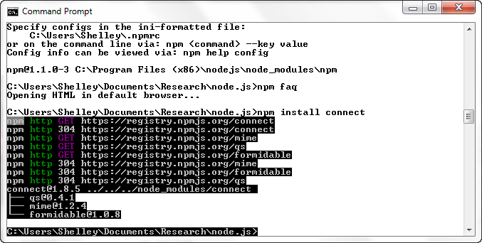

# Chapter 4

Chapter 4. The Node Module System

Node’s basic implementation is kept as streamlined as possible. Rather than incorporate every possible component of use directly into Node, developers offer additional functionality via Node’s modules.

Node’s module system is patterned after the *CommonJS module system*, a way of creating modules so that they’re interoperable. The core of the system is a contract that developers adhere to in order to ensure that their modules play well with others.

Among the CommonJS module system requirements implemented with Node are:

- Support is included for a require function that takes the module identifier and returns the exported API.
- The module name is a string of characters, and may include forward slashes (for identification of path).
- The module must specifically export that which is to be exposed outside the module.
- Variables are private to the module.

In the next several sections, we’ll see how Node adheres to these requirements.

# Loading a Module with require and Default Paths

Node supports a simple module loading system: there is a one-to-one correspondence between the file and module.

To include a module within a Node application, use the require statement, passing in a string with the identifier for the module:

var http = require ('http');

You can also just include a specific object, rather than all objects, from a module:

var spawn = require('child_process').spawn;

You can load core modules—i.e., those native to Node—or modules from the *node_modules* folder just by providing the module identifier, such as http for the HTTP module. Modules not part of core, or not included in the *node_modules* folder, should include forward slashes to indicate the path. As an example, Node expects to find the module named *mymodule.js* in the same directory as the Node application in the following require statement:

require ('./mymodule');

Or you can use the full path:

require ('/home/myname/myapp/mymodule.js');

Module files can have either a *.js*, *.node*, or *.json* file extension. The *.node* extension assumes that the file is a compiled binary, not a text file containing JavaScript.

Node core modules have higher priority than external modules. If you’re trying to load a custom module named http, Node loads the core version of the HTTP module. You’ll have to provide either a different module identifier, or you’ll need to provide the full path.

Earlier I mentioned the *node_modules* folder. If you specify the node identifier without providing a path, and the module isn’t a core module, Node first looks for a *node_modules* folder local to the application, and searches for the module in this folder. If it doesn’t find the module, Node then looks in the parent subdirectory for a *node_modules* folder and the node, and so on.

If the module is named mymodule, and the application is located in a subdirectory with the following path:

/home/myname/myprojects/myapp

then Node looks for the module using the following searches, in turn:

- /home/myname/myprojects/myapp/node_modules/mymodule.js
- /home/myname/myprojects/node_modules/mymodule.js
- /home/myname/node_modules/mymodule.js
- /node_modules/mymodule.js

Node can optimize the search depending on where the file issuing the require statement resides. For instance, if the file making the require statement is itself a module in a subdirectory of the *node_modules* folder, Node begins the search for the required module in the topmost *node_modules* folder.

There are two additional variations of require: require.resolve and require.cache. The require.resolve method performs the lookup for the given module but, rather than load the module, just returns the resolved filename. The resolve.cache object contains a cached version of all loaded modules. When you try to load the module again in the same context, it’s loaded from the cache. If you want to force a new load, delete the item from the cache.

If the item’s path is:

var circle = require('./circle.js');

delete it with:

delete require.cache('./circle.js');

This code forces a reload of the module the next time a require is called on it.

# External Modules and the Node Package Manager

As mentioned earlier, much of the rich functionality associated with Node comes in via third-party modules. There are router modules, modules for working with relational or document database systems, template modules, testing modules, and even modules for payment gateways.

Though there is no formal Node module developer system, developers are encouraged to upload their modules to GitHub. Following are good resources for finding Node modules:

- npm registry (http://search.npmjs.org/)
- Node module wiki (https://github.com/joyent/node/wiki/modules)
- The node-toolbox (http://toolbox.no.de/)
- Nipster! (http://eirikb.github.com/nipster/)

The modules are roughly categorized into different types such as the aforementioned routers, database, templating, payment gateway, and so on.

To use a module, you can download the source from GitHub (or wherever the source is located), and then install it manually into your application environment. Most modules provide basic installation instructions, or, at a minimum, you can deduce the installation requirements by examining the files and directories included in the module. However, there is a far easier way to install a Node module: using the Node Package Manager (npm).

### Note

The npm site is at http://npmjs.org/. You can find basic instructions on npm at http://npmjs.org/doc/README.html. Essential reading for Node module developers is the Developers section of the npm manual, found at http://npmjs.org/doc/developers.html. For a useful post explaining the differences between local and global installation, see http://blog.nodejs.org/2011/03/23/npm-1-0-global-vs-local-installation/.

Modern installations include npm, but you can double-check for its existence by typing **npm** at the command line in the same environment that you use to access Node.

To get an overview of npm commands, use the following:

$ npm help npm

Modules can be installed globally or locally. The local installation is the best approach if you’re working on a project and not everyone sharing the system needs access to this module. A local installation, which is the default, installs the module in the current location in the *node_modules* directory.

$ npm install

*modulename*

As an example, to install Connect, a very popular middleware framework, use the following:

$ npm install connect

npm not only installs Connect, it also discovers its module dependencies and installs them, too, as shown in Figure 4-1.

Once it’s installed, you can find the module in your local directory’s *node_modules* directory. Any dependencies are installed in that module’s *node_modules* directory.

If you want to install the package globally, use the -g or --global option:

$ npm -g install connect

These examples install packages that are registered at the npm site. You can also install a module that’s in a folder on the filesystem, or a tarball that’s either local or fetched via a URL:

npm install http://

*somecompany*.com/*somemodule*.tgz

If the package has versions, you can install a specific version:

npm install

*modulename*@0.1

### Note

npm can also work with Git, as demonstrated in the Appendix A.

You can even install an old friend, jQuery:

npm install jquery

Now you can make use of a familiar syntax in your Node application development.

If you’re no longer using a module, you can uninstall it:

npm uninstall

*modulename*

The following command tells npm to check for new modules, and perform an update if any are found:

npm update

Or you can update a single module:

npm update

*modulename*

If you just want to check to see if any packages are outdated, use the following:

npm outdated

Again, you can run this command against a single module.

List installed packages and dependencies with list, ls, la, or ll:

npm ls

The la and ll options provide extended descriptions. The following is the text I get running npm ll in my Windows 7 machine:

C:\Users\Shelley>npm ls ll

npm WARN jsdom >= 0.2.0 Unmet dependency in C:\Users\Shelley\node_modules\html5

C:\Users\Shelley

├── async@0.1.15

├── colors@0.6.0-1

├── commander@0.5.2

├─┬ connect@1.8.5

│ ├── formidable@1.0.8

│ ├── mime@1.2.4

│ └── qs@0.4.1

├─┬ html5@v0.3.5

│ ├── UNMET DEPENDENCY jsdom >= 0.2.0

│ ├── opts@1.2.2

│ └─┬ tap@0.0.13

│ ├── inherits@1.0.0

│ ├── tap-assert@0.0.10

│ ├── tap-consumer@0.0.1

│ ├── tap-global-harness@0.0.1

│ ├── tap-harness@0.0.3

│ ├── tap-producer@0.0.1

│ ├── tap-results@0.0.2

│ ├─┬ tap-runner@0.0.7

│ │ ├── inherits@1.0.0

│ │ ├── slide@1.1.3

│ │ ├── tap-assert@0.0.10

│ │ ├── tap-consumer@0.0.1

│ │ ├── tap-producer@0.0.1

│ │ ├── tap-results@0.0.2

│ │ └── yamlish@0.0.3

│ ├── tap-test@0.0.2

│ └── yamlish@0.0.2

└─┬ optimist@0.3.1

└── wordwrap@0.0.2

Figure 4-1. Installing Connect in Windows 7 using npm

Note the warning about an unmet dependency for the HTML5 module. The HTML5 module requires an older version of the JSDOM library. To correct this, I installed the necessary version of the module:

npm install jsdom@0.2.0

You can also directly install all dependencies with the -d flag. For instance, in the directory for the module, type the following:

npm install -d

If you want to install a version of the module that hasn’t yet been uploaded to the npm registry, you can install directly from the Git repository:

npm install https://github.com/visionmedia/express/tarball/master

Use caution, though, as I’ve found that when you install a not-yet-released version of a module, and you do an npm update, the npm registry version can overwrite the version you’re using.

To see which modules are installed globally, use:

npm ls -g

You can learn more about your npm installation using the config command. The following lists the npm configuration settings:

npm config list

You can get a more in-depth look at all configuration settings with:

npm config ls -l

You can modify or remove configuration settings either by using a command line:

npm config delete

*keyname*
npm config set*keynamevalue*

or by directly editing the configuration file:

$ npm config edit

Warning

I would strongly recommend you leave your npm configuration settings alone, unless you’re very sure of a change’s effect.

You can also search for a module using whatever terms you think might return the best selection:

npm search html5 parser

The first time you do a search, npm builds an index, which can take a few minutes. When it’s finished, though, you’ll get a list of possible modules that match the term or terms you provided. The search terms *html5* and *parser* returned just two modules: HTML5, an HTML parser that includes support for SVG and MathML; and Fabric, an object model with support for HTML5 Canvas and an SVG-to-Canvas parser.

The npm website provides a registry of modules you can browse through, and an up-to-date listing of modules most depended on—that is, modules most used by other modules or by Node applications. In the next section, I’ll cover a sampling of these modules.

### Note

I’ll cover other npm commands later in this chapter, in the section Creating Your Own Custom Module.

# Finding Modules

Though Node.js has been active only for a few years, it’s already attracted a large body of work. When you look at the Node.js modules wiki page, you’ll find a significant number of modules. The good thing is, you can find a lot of useful modules that implement the functionality you need. The bad news is, it’s difficult to determine which module to use—in other words, which modules are “best of breed.”

Using a search tool like Google can give you a fair idea of which modules are popular. For example, it quickly became apparent when I was exploring middleware and framework modules that Connect and Express were very popular.

In addition, when you look at the GitHub registry for the item, you can see if it’s actively supported and up to date with the current Node installation. As another example, I was checking out a tool named Apricot, which does HTML parsing and is recommended in the Node documentation, but then I noticed it hadn’t been updated for some time, and when I tried to use the module, I found it didn’t work with my installation of Node (at least, not when this book was written).

### Note

Many of the modules provide example applications, and a quick test of these will let you know if you can use the module in your current environment.

As mentioned, the Node documentation site does provide a listing of recommended third-party modules, starting with the npm, which is now incorporated into the Node installation. However, the npm website and its module registry provide us with a better view of what modules are used in most applications.

At the npm registry page, you can search for modules, but you can also review a list of the “most depended on” modules, which are modules used either in other modules or in Node applications. At the time of this writing, the top modules were:

Underscore

Provides general JavaScript utility functions

Coffee-script

Enables use of CoffeeScript, a language that compiles to JavaScript

Request

A simplified HTTP request client

Express

A framework

Optimist

Offers lightweight option parsing

Async

Provides functions and patterns for asynchronous code

Connect

Middleware

Colors

Adds colors to the console

Uglify-js

A parser and compressor/beautifier

Socket.IO

Enables real-time client/server communication

Redis

A Redis client

Jade

A templating engine

Commander

For command-line programs

Mime

Offers support for file extensions and MIME mapping

JSDOM

Implements the W3C DOM

I’ll cover several of these modules in future chapters, but I want to cover three now—both because they give us a chance to better understand how Node works, and because they are especially useful. They are:

- Colors
- Optimist
- Underscore

## Colors: Simple Is Best

Colors is one of the simpler modules. You can use it to provide different color and style effects to the console.log output, and that’s it. However, it’s also a good demonstration of an effective module because it is simple to use, focuses on providing one service, and does a good job with that one service.

Testing how a module works is a great reason for using REPL. To try Colors, install it using npm like so:

$ npm install colors

Open a new REPL session and include the colors library:

> var colors = require('colors');

Because the Colors module is included in the current location’s *node_modules* subdirectory, Node is able to find it rather quickly.

Now try something out, such as the following:

console.log('This Node kicks it!'.rainbow.underline);

The result is a colorful, underlined rendering of your message. The style applies only for the one message—you’ll need to apply another style for another message.

If you’ve worked with jQuery, you recognize the chaining used to combine effects. The example makes use of two: a font effect, underlined, and a font color, rainbow.

Try another, this time zebra and bold:

console.log('We be Nodin'.zebra.bold);

You can change the style for sections of the console message:

console.log('rainbow'.rainbow, 'zebra'.zebra);

Why would something like Colors be useful? One reason is that it enables us to specify formatting for various events, such as displaying one color for errors in one module, another color or effect for warnings in a second module, and so on. To do this, you can use the Colors presets or create a custom theme:

> colors.setTheme({

....... mod1_warn: 'cyan',

....... mod1_error: 'red',

....... mod2_note: 'yellow'

....... });

> console.log("This is a helpful message".mod2_note);

This is a helpful message

> console.log("This is a bad message".mod1_error);

This is a bad message

### Note

Find more on Colors at https://github.com/Marak/colors.js.

## Optimist: Another Short and Simple Module

Optimist is another module focused on solving a specific problem: parsing command options. That’s it, that’s all it does—but it does it very well.

As an example, this simple application uses the Optimist module to print command-line options to the console.

#!/usr/local/bin/node

var argv = require('optimist').argv;

console.log(argv.o + " " + argv.t);

You can run the application with short options. The following prints the values of 1 and 2 out to the console:

./app.js -o 1 -t 2

You can also process long options:

#!/usr/local/bin/node

var argv = require('optimist').argv;

console.log(argv.one + " " + argv.two);

and test with the following, resulting in a printout of My Name:

./app2.js --one="My" --two="Name"

You can also use the Optimist module to process Boolean and unhyphenated options.

### Note

Read more about Optimist at https://github.com/substack/node-optimist.

### Running a Node App as a Standalone Application

Most of the examples in this book are run using the following syntax:

node

*appname*.js

However, you can also run the Node application as a standalone application with a couple of modifications.

First, add the following as the first line in the application:

#!/usr/local/bin/node

The location should be the location of your Node installation.

Next, change the permissions on the file:

chmod a+x

*appname*.js

Now you can run the application with:

./

appname

.js

## Underscore

Install the Underscore module with:

npm install underscore

According to the developers, Underscore is a utility-belt library for Node. It provides a lot of extended JavaScript functionality we’re used to with third-party libraries, such as jQuery or Prototype.js.

Underscore is so named because, traditionally, its functionality is accessed with an underscore (_), similar to jQuery’s $. Here’s an example:

var _ = require('underscore');

_.each(['apple','cherry'], function (fruit) { console.log(fruit); });

Of course, the problem with the underscore is that this character has a specific meaning in REPL. No worries, though—we can just use another variable, us:

var us = require('underscore');

us.each(['apple','cherry'], function(fruit) { console.log(fruit); });

Underscore provides expanded functionality for arrays, collections, functions, objects, chaining, and general utility. Fortunately, there’s also excellent documentation for all of its functionality, so I’ll forgo detailing any of it here.

However, I do want to mention one nice capability: a controlled way to extend Underscore with your own utility functions, via the mixin function. We can quickly try this method, and the others, in a REPL session:

> var us = require('underscore');

undefined

> us.mixin({

... betterWithNode: function(str) {

..... return str + ' is better with Node';

..... }

... });

> console.log(us.betterWithNode('chocolate'));

chocolate is better with Node

### Note

You’ll see the term *mixin* used in several Node modules. It’s based on a pattern where properties of one object are added (“mixed in”) to another.

Of course, it makes more sense to extend Underscore from a module that we can reuse in our applications, which leads us to our next topic—creating our own custom modules.

# Creating Your Own Custom Module

Just as you do for your client-side JavaScript, you’ll want to split off reusable JavaScript into its own libraries. The only difference is that you need to take a couple of extra steps to convert your JavaScript library into a module for use with Node.

Let’s say you have a JavaScript library function, concatArray, that takes a string and an array of strings, and concatenates the first string to each string in the array:

function concatArray(str, array) {

return array.map(function(element) {

return str + ' ' + element;

});

}

You want to use this function, as well as others, in your Node applications.

To convert your JavaScript library for use in Node, you’ll need to export all of your exposed functions using the exports object, as shown in the following code:

exports.concatArray = function(str, array) {

return array.map(function(element) {

return str + ' ' + element;

});

};

To use concatArray in a Node application, import the library using require, assigning the library to a variable name. Once the library is assigned, you can call any of the exposed functions in your code:

var newArray = require ('./arrayfunctions.js');

console.log(newArray.concatArray('hello', ['test1','test2']));

It’s not very complicated, as long as you remember two things:

- Use the exports object to export the function.
- Treat the library as a single imported object, assigned to a variable, in order to access the functions.

## Packaging an Entire Directory

You can split your module into separate JavaScript files, all located within a directory. Node can load the directory contents, as long as you organize the contents in one of two ways.

The first way is to provide a JSON file named *package.json* with information about the directory. The structure can contain other information, but the only entries relevant to Node are:

{ "name" : "mylibrary",

"main" : "./mymodule/mylibrary.js" }

The first property, name, is the name of the module. The second, main, indicates the entry point for the module.

The second way is to include either an *index.js* or *index.node* file in the directory to serve as the main module entry point.

Why would you provide a directory rather than just a single module? The most likely reason is that you’re making use of existing JavaScript libraries, and just providing a “wrapper” file that wraps the exposed functions with exports statements. Another reason is that your library is so large that you want to break it down to make it easier to modify.

Regardless of the reason, be aware that all of the exported objects must be in the one main file that Node loads.

## Preparing Your Module for Publication

If you want to make your package available to others, you can promote it on your website, but you’ll be missing out on a significant audience. When you’re ready to publish a module, you’re going to want to add it to the list of modules at the Node.js website, and you’ll also want to publish it to the npm registry.

Earlier I mentioned the *package.json* file. It’s actually based on the CommonJS module system recommendations, which you can find at http://wiki.commonjs.org/wiki/Packages/1.0#Package_Descriptor_File (though check to see if there’s a more up-to-date version).

Among the required fields for the *package.json* file are:

name

The name of the package

description

The package description

version

The current version conforming to semantic version requirements

keywords

An array of search terms

maintainers

An array of package maintainers (includes name, email, and website)

contributors

An array of package contributors (includes name, email, and website)

bugs

The URL where bugs can be submitted

licenses

An array of licenses

repositories

An array of repositories where the package can be found

dependencies

Prerequisite packages and their version numbers

The other fields are optional. Still, that’s a lot of fields. Thankfully, npm makes it easier to create this file. If you type the following at the command line:

npm init

the tool will run through the required fields, prompting you for each. When it’s done, it generates a *package.json* file.

In Chapter 3, Example 3-13, I started an object called inputChecker that checks incoming data for commands and then processes the command. The example demonstrated how to incorporate EventEmitter. Now we’re going to modify this simple object to make it usable by other applications and modules.

First, we’ll create a subdirectory in *node_modules* and name it *inputcheck*, and then move the existing inputChecker code file to it. We need to rename the file to *index.js*. Next, we need to modify the code to pull out the part that implements the new object. We’ll save it for a future test file. The last modification we’ll do is add the exports object, resulting in the code shown in Example 4-1.

Example 4-1. Application from Example 3-13 modified to be a module object

var util = require('util');

var eventEmitter = require('events').EventEmitter;

var fs = require('fs');

exports.inputChecker = inputChecker;

function inputChecker(name, file) {

this.name = name;

this.writeStream = fs.createWriteStream('./' + file + '.txt',

{'flags' : 'a',

'encoding' : 'utf8',

'mode' : 0666});

};

util.inherits(inputChecker,eventEmitter);

inputChecker.prototype.check = function check(input) {

var self = this;

var command = input.toString().trim().substr(0,3);

if (command == 'wr:') {

self.emit('write',input.substr(3,input.length));

} else if (command == 'en:') {

self.emit('end');

} else {

self.emit('echo',input);

}

};

We can’t export the object function directly, because util.inherits expects an object to exist in the file named inputChecker. We’re also modifying the inputChecker object’s prototype later in the file. We could have changed these code references to use exports.inputChecker, but that’s *kludgy*. It’s just as easy to assign the object in a separate statement.

To create the *package.json* file, I ran npm init and answered each of the prompts. The resulting file is shown in Example 4-2.

Example 4-2. Generated package.json for inputChecker module

{

"author": "Shelley Powers <shelleyp@burningbird.net> (http://burningbird.net)",

"name": "inputcheck",

"description": "Looks for commands within the string and implements the commands",

"version": "0.0.1",

"homepage": "http://inputcheck.burningbird.net",

"repository": {

"url": "

},

"main": "inputcheck.js",

"engines": {

"node": "~0.6.10"

},

"dependencies": {},

"devDependencies": {},

"optionalDependencies": {}

}

The npm init command doesn’t prompt for dependencies, so we need to add them directly to the file. However, the inputChecker module isn’t dependent on any external modules, so we can leave these fields blank in this case.

### Note

Chapter 16 has a more in-depth look at the *package.json* file.

At this point, we can test the new module to make sure it actually works as a module. Example 4-3 is the portion of the previously existing inputChecker application that tested the new object, now pulled out into a separate test application.

Example 4-3. InputChecker test application

var inputChecker = require('inputcheck').inputChecker;

// testing new object and event handling

var ic = new inputChecker('Shelley','output');

ic.on('write', function(data) {

this.writeStream.write(data, 'utf8');

});

ic.addListener('echo', function( data) {

console.log(this.name + ' wrote ' + data);

});

ic.on('end', function() {

process.exit();

});

process.stdin.resume();

process.stdin.setEncoding('utf8');

process.stdin.on('data', function(input) {

ic.check(input);

});

We can now move the test application into a new *examples* subdirectory within the module directory to be packaged with the module as an example. Good practice demands that we also provide a *test* directory with one or more testing applications, as well as a *doc* directory with documentation. For a module this small, a *README* file should be sufficient. Lastly, we create a gzipped tarball of the module.

Once we’ve provided all we need to provide, we can publish the module.

## Publishing the Module

The folks who brought us npm also provide a really great source for Node developers: the Developer Guide. It outlines everything we need to know about how to publish our modules.

The Guide specifies some additional requirements for the *package.json* file. In addition to the fields already created, we also need to add in a directories field with a hash of folders, such as the previously mentioned *test* and *doc*:

"directories" : {

"doc" : ".",

"test" : "test",

"example" : "examples"

}

Before publishing, the Guide recommends we test that the module can cleanly install. To test for this, type the following in the root directory for the module:

npm install . -g

At this point, we’ve tested the inputChecker module, modified the *package.json* package to add directories, and confirmed that the package successfully installs.

Next, we need to add ourselves as npm users if we haven’t done so already. We do this by typing:

npm adduser

and following the prompts to add a username, a password, and an email address.

There’s one last thing to do:

npm publish

We can provide the path to the tarball or the directory. As the Guide warns us, everything in the directory is exposed unless we use a .npmignore list in the *package.json* file to ignore material. It’s better, though, just to remove anything that’s not needed before publishing the module.

Once published—and once the source is also uploaded to GitHub (if that’s the repository you’re using)—the module is now officially ready for others to use. Promote the module on Twitter, Google+, Facebook, your website, and wherever else you think people would want to know about the module. This type of promotion isn’t bragging—it’s *sharing*.