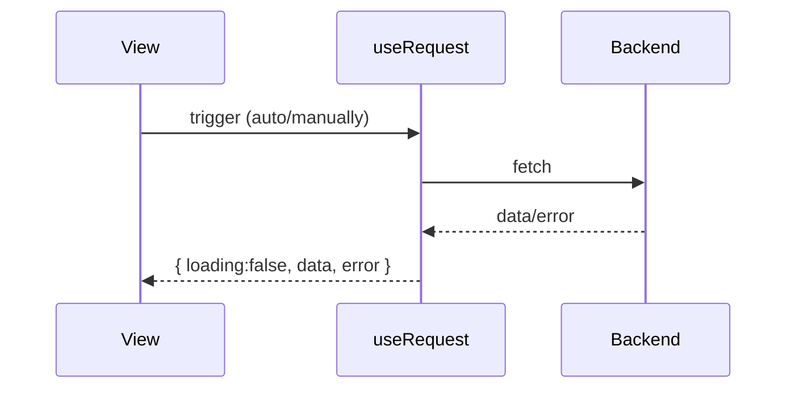

# 组件与 Hooks（合并版）

本篇聚合组件核心概念（受控/非受控、class vs function、HOC、props vs state）与 Hooks 要点（useState/useEffect 等），减少跨文跳转。

## 组件（要点）

- 受控组件：表单值受 state 控制；非受控：ref 读取 DOM 值
- 函数组件优先；类组件侧重历史与少量场景
- 高阶组件（HOC）：复用通用逻辑；注意透传 props 与 forwardRef
- props vs state：外部输入 vs 内部可变数据；二者皆触发渲染

## Hooks（要点）

- useState：异步/同步时机与依赖前值写法
- useEffect：副作用与清理；等价生命周期心智模型
- 其它常用：useReducer/useMemo/useCallback/useRef

### useRequest（ahooks）最小范式

- 统一请求状态：loading/data/error
- 触发方式：自动/手动；依赖变化重试
- 防抖/节流、轮询、并发控制

建议在业务组件层多用 `useRequest` 封装数据流，降低事件/状态分散度。

## refs（简记）

- 访问 DOM 或类实例；函数组件需配合 `useRef` 或 `forwardRef`
- 谨慎使用，优先数据驱动

## 参考

- React 官方文档、ahooks 文档

