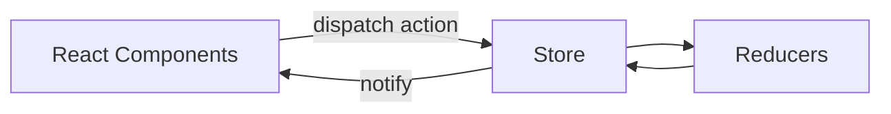

# 状态与通信（Context/Redux/组件通信）

## 组件通信

- 父→子：props
- 子→父：回调/事件上抛
- 兄弟：提升到共同父级
- 跨层：Context（Provider/Consumer 或 useContext）
- 更复杂共享：集中式状态（Redux/Zustand 等）

## Context（何时用）

- 主题、国际化、用户会话等“全局配置/轻共享”
- 局部范围 Provider，避免全局污染

## Redux（要点）

- 三原则：单一数据源、只读 state、纯函数修改
- react-redux：Provider + connect/hooks（useSelector/useDispatch）
- 中间件：thunk、logger；链式增强 dispatch

## 目录组织建议

- 按功能模块拆分（actions/reducer/views 同目录），或按角色（actions/reducers/...）
- 导出统一入口（index.ts）便于按需引入

## 选择建议（文字决策树）

- 仅主题/语言/用户轻信息：优先 Context
- 局部复杂异步/缓存复用：可用 `ahooks` 与组件内局部 state（useRequest）
- 跨页面复杂共享/可追踪/调试：Redux（或 Zustand、Jotai 视团队习惯）

## 参考

- React/Redux 官方文档

